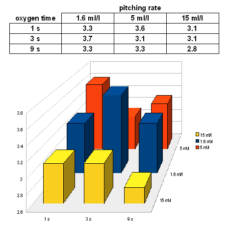
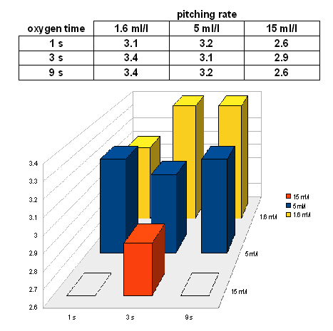

# Experiment: Pitching Rate and Oxygenation

*From German brewing and more — Braukaiser.com*

---

## Contents

1. [Abstract](#abstract)
2. [Introduction](#introduction)
3. [Materials and Methods](#materials-and-methods)
4. [Results and Discussion](#results-and-discussion)
5. [Taste Test](#taste-test)
6. [Conclusion](#conclusion)
7. [Sources](#sources)

---

## Abstract

Esters are an important component of the aroma of German wheat beers. Common home brewing knowledge holds that lower pitching rates result in higher ester levels; however, the literature reports that **increased pitching rates lead to higher ester levels**. This experiment was designed to evaluate the effect of oxygen levels and yeast pitching rate on ester production.

While differences could be shown in the fermentation performance of the various samples, the taste and aroma of all samples were remarkably similar — rendering this experiment inconclusive.

---

## Introduction

Esters are formed through a condensation reaction between an alcohol and an acid. In brewing, two major processes produce esters:

1. **Intracellular ester formation** — enzymatic reactions within yeast metabolism; the primary driver during fermentation
2. **Condensation during aging** — slow non-enzymatic reaction producing dark fruit notes after extended aging (12+ weeks)

During fermentation, **pyruvic acid** (an intermediate in the alcohol production pathway) is reduced to oxaloacetate and then to **acetyl CoA**. Acetyl CoA is the basis for sterols (for cell wall construction) and for esters. All authors agree that increased biomass production (cell wall synthesis) reduces the acetyl CoA available for ester production [Narziss 2005, Clone, Walsh, Noonan 1996, Fix 1999]. Opinions differ, however, on the relationship between yeast growth and ester levels.

### Factors affecting ester production

- **Yeast strain** — the largest single factor; a strain's ester output is strongly dependent on wort composition [Hermann 2005]
- **Oxygen availability** — increased oxygenation can lower ester production due to increased sterol synthesis consuming more acetyl CoA [Narziss 2005, Noonan 1996, Fix 1999]
- **Double batch (Drauflassen)** — pitching fresh aerated wort onto an active fermentation keeps yeast in the growth phase, consuming acetyl CoA and reducing ester formation [Narziss 2005]
- **Temperature** — higher fermentation temperatures increase ester production; the effect varies by strain and ester type [Hermann 2005]
- **Pressure** — increased CO₂ pressure retards yeast growth and reduces esters despite lower growth; increased CO₂ affects acetyl CoA synthesis directly [Hermann 2005]
- **Pitching rate** — higher pitching rates lead to increased ester levels [Hermann 2005], contrary to common home brewer belief. Narziss attributes this to reduced yeast growth at high pitching rates, leaving more acetyl CoA for ester synthesis.
- **FAN (free amino nitrogen)** — higher FAN levels increase ester production [Saerens 2007]; beers with high adjunct content (low FAN) should produce fewer esters
- **Wort composition** — higher glucose percentage increases ester production; high maltose percentage reduces it [Hermann 2005]
- **Wort gravity** — higher gravity increases ester production through greater available substrates, longer fermentation, and inhibited yeast growth [Saerens 2007, Hermann 2005]

Parameters a home brewer can readily vary: **yeast strain, oxygenation, pitching rate, temperature, wort composition**.

This experiment evaluates the qualitative effects of oxygenation and pitching rate on aroma compounds from a Weissbier yeast.

---

## Materials and Methods

**Wort:** 12 °P, brewed from:
- 70% Weyermann Light Wheat
- 30% Weyermann Bohemian Pilsner

**Mash (Hochkurz):**
| Step | Temp | Duration | Method |
|------|------|----------|--------|
| Dough-in | 59 °C | 15 min | infusion |
| Maltose rest | 63 °C | 45 min | infusion |
| Dextrinization | 69 °C | 20 min | infusion |
| Mash-out | 76 °C | 10 min | decoction |

**Boil:** 60 min with 10 g Target hops (10% α-acids), 25 L pre-boil volume.

**Setup:** Cooled to 17 °C. Nine 2-litre sanitised PET bottles filled with 1.5 L each. Oxygenation via sintered stainless steel oxygen stone at a flow rate of ~0.6 mg/s. Yeast used: Wyeast 3056 (a blend — note that the blend composition may have shifted during the author's storage and propagation). Pitched from slurry of a primary fermentation started 2 weeks earlier.

**Fermentation matrix (3 pitching rates × 3 oxygenation levels):**

| Sample | Yeast slurry | Oxygenation |
|--------|-------------|-------------|
| A | 1.6 ml/L | 1 s (~0.4 ppm O₂) |
| B | 5.0 ml/L | 1 s (~0.4 ppm O₂) |
| C | 15 ml/L | 1 s (~0.4 ppm O₂) |
| D | 1.6 ml/L | 3 s (~1.2 ppm O₂) |
| E | 5.0 ml/L | 3 s (~1.2 ppm O₂) |
| F | 15 ml/L | 3 s (~1.2 ppm O₂) |
| G | 1.6 ml/L | 9 s (~3.6 ppm O₂) |
| I | 5.0 ml/L | 9 s (~3.6 ppm O₂) |
| H | 15 ml/L | 9 s (~3.6 ppm O₂) |

> **Note on oxygenation:** The oxygenation times were derived from a standard 60 s oxygenation for 20 L, scaled proportionally. Not all released O₂ was absorbed by the wort, and headspace oxygen added an uncontrolled variable. **The oxygenation part of this experiment cannot be considered reliable.**

Pitching rates in terms of 20 L batch equivalents:
- 1.6 ml/L → 32 ml yeast slurry
- 5.0 ml/L → 100 ml yeast slurry
- 15 ml/L → 300 ml yeast slurry

Actual viable cell counts were not determined.

Fast ferment test: limit of attenuation = 78% (apparent extract = 2.6 °P).

All samples were fermented in a single water bath at an average temperature of 19 °C (peaking at 20 °C on day 4). Bottled on day 6 with corn sugar additions calculated per-sample to achieve similar carbonation levels despite varying extract at bottling. Stored at ~19 °C for 8 days, then moved to 15 °C ambient before sampling.

---

## Results and Discussion

### Fermentation performance

**Day 5 extract levels:**

*Day 5 extract readings for samples A–I. With some outliers, results match the expectation that higher pitching rates and more oxygen lead to faster fermentation. The floor in the graph represents the fast ferment test limit of attenuation (2.6 °P).*

**Day 6 extract levels (bottling day):**

*Day 6 extract readings. A clear trend by pitching rate is visible — the two samples with the highest pitching rate reached the limit of attenuation (78% / 2.6 °P). No clear trend by oxygenation was observed, attributed to imprecise oxygenation control.*

---

## Taste Test

All taste tests were performed by a single taster. None of the beers showed a strong ester profile, suggesting the yeast used (WY3056 blend, propagated over time) may not have been optimal for this experiment.

| Day | Samples evaluated | Observations |
|-----|------------------|-------------|
| 12 | A, B, C (lowest oxygenation, 3 pitching rates) | Sample A (lowest pitch) appeared slightly less estery than C (highest pitch), but the difference was very subtle — three successive triangle blind tests between A and C were inconclusive. Sample A showed a faint "band-aid" note, not strong enough to distinguish it in the triangle test. |
| 18 | G, H, I (highest oxygenation, 3 pitching rates) | Similar results to first test. Three triangle tests between G and I were inconclusive. Sample H showed a slight "band-aid" aroma and taste immediately after pouring. |
| 20 | D, E, F (medium oxygenation, 3 pitching rates) | Sample D (lowest pitching rate) showed band-aid aroma and taste; otherwise all three samples were very close and difficult to distinguish. |
| 21 | B vs. H (medium pitch rate, lowest vs. highest O₂) | No band-aid in either. B appeared slightly less clean with a hint of more fusel alcohols. Taste and aroma otherwise nearly identical. No difference in ester levels perceived. |
| 31 | A vs. I (lowest everything vs. highest everything) | Both remarkably close. I seemed slightly more "rounded" in taste, without a clear explanation. No significant band-aid in either. |

> **Caveat:** Given that none of the blind tastings conclusively distinguished two beers, perceived differences may have been influenced by the taster's knowledge of which sample was being evaluated.

---

## Conclusion

Despite a **9-fold difference in pitching rate** and widely varying oxygen injection — which did produce measurable differences in fermentation performance — the samples tasted remarkably similar. None of the blind taste tests could reliably distinguish any two beers.

The actual difference in dissolved oxygen available to the yeast was likely smaller than intended due to uncontrolled headspace oxygen. Pitching rates, however, were definitively different.

**This experiment must be considered inconclusive.** Further experiments should use:
- A yeast strain known to produce a strong ester profile (better suited to study ester variation)
- Only 3 or 4 fermentation samples per run (evaluating either pitching rate or oxygenation, not both simultaneously)

---

## Sources

- [Clone 1] [Danstar FAQ: Yeast Growth](http://www.danstaryeast.com/library/yeast_growth_.html)
- [Wikipedia] [Wikipedia: Ester](http://en.wikipedia.org/wiki/Ester)
- [Hermann 2005] M. Hermann, *Entstehung und Beeinflussung qualitätsbestimmender Aromastoffe bei der Herstellung von Weißbier*, [Dissertation (PDF)](http://deposit.d-nb.de/cgi-bin/dokserv?idn=978186087&dok_var=d1&dok_ext=pdf&filename=978186087.pdf), Technical University Munich, 2005
- [Walsh] A. Walsh, [Ester Formation](http://www.brewery.org/brewery/library/EstFormAW0696.html), brewery.org
- [Noonan 1996] Gregory J. Noonan, *New Brewing Lager Beer*, Brewers Publications, Boulder CO, 1996
- [Narziss 2005] Prof. Dr. agr. Ludwig Narziss, Prof. Dr.-Ing. habil. Werner Back, *Abriss der Bierbrauerei*, WILEY-VCH Verlags GmbH, Weinheim, Germany, 2005
- [Fix 1999] George J. Fix Ph.D, *Principles of Brewing Science*, Brewers Publications, Boulder CO, 1999
- [Saerens 2007] S. M. G. Saerens et al., [Parameters Affecting Ethyl Ester Production by Saccharomyces cerevisiae during Fermentation](http://www.pubmedcentral.nih.gov/articlerender.fcgi?artid=2223249), pubmedcentral.nih.gov
- [Suomalainen 1981] H. Suomalainen, Yeast esterases and aroma esters in alcoholic beverages. *J. Inst. Brew.* 87:296–300, 1981

---

*Source: [braukaiser.com](http://braukaiser.com/wiki/index.php?title=Experiment_Pitching_Rate_and_Oxygenation) — Content available under Attribution-NonCommercial 3.0 Unported.*
