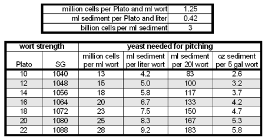
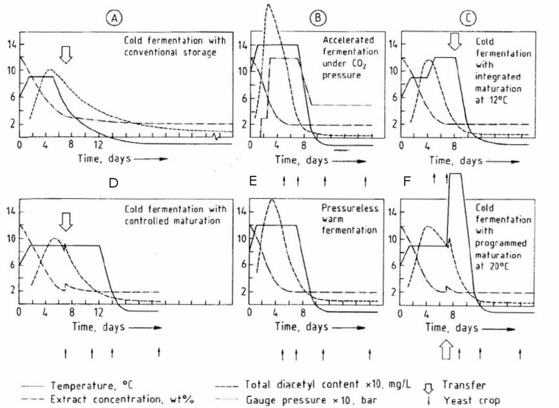
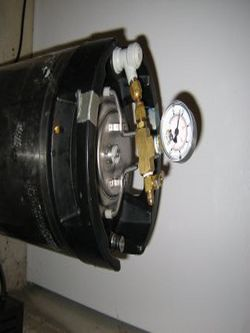

# Fermenting Lagers

*From Braukaiser — German brewing and more*

Lagers are fermented with a bottom-fermenting lager yeast (*Saccharomyces pastorianus*). These yeasts ferment at lower temperatures than top-fermenting ale yeasts (*Saccharomyces cerevisiae*). The result is a beer with a cleaner flavor profile (fewer esters, fewer fusel alcohols) than top-fermented counterparts. The extended cold storage (lagering) also makes these beers more shelf stable, which explains why most of the world's beers are of the lager variety.

Because lagers ferment at lower temperatures and yeast metabolism is slower at those temperatures, they take longer to ferment and require more attention than ale fermentations. This article is aimed at both novice and advanced lager brewers — the first section is a how-to for your first lager, and the following sections go deeper into various fermentation techniques and commercial-brewing background.

---

## Contents

1. [Your First Lager Fermentation](#your-first-lager-fermentation)
2. [The 3 Phases of a Lager Fermentation](#the-3-phases-of-a-lager-fermentation)
3. [The Conventional Fermentation in a German Lager Brewery](#the-conventional-fermentation-in-a-german-lager-brewery)
4. [Brewing Lagers in a Home Brew Setting](#brewing-lagers-in-a-home-brew-setting)
5. [Home Brewing a Lager (the Advanced Process)](#home-brewing-a-lager-the-advanced-process)
6. [Sources](#sources)

---

## Your First Lager Fermentation

Though experienced brewers may note that this is not the absolutely optimal approach, it is considered the most foolproof — which is what you want for your first lager.

**One day before brew day:** Pitch a 2 qt (2 L) well-aerated starter with an Activator Pack (Wyeast) or vial (White Labs) of your chosen lager yeast. A versatile starting choice is German Lager (WLP830 / Wyeast 2124 — the W-34/70 strain, the most widely used lager strain in German beers). Keep the starter at room temperature 68–70 °F (20–21 °C) and let it ferment. Sulfur notes (rotten egg smell) are common for lager yeasts.

**Brew an average-gravity lager:** OG 1.044–1.056 (11–12 °P). Chill the wort to below 60 °F (15 °C) — the mid-50s work best. Use [Whirlpooling](whirlpooling.md) or straining to leave hot break and hops in the kettle. After transfer, aerate well: 8–10 ppm O2, best achieved with 1–1.5 minutes of pure O2 or 20–30 minutes of sterile air through a 2-micron stone.

**Pitch the whole starter.** Wait until you see fermentation activity (low kraeusen or airlock bubbles), then move the fermenter to a constant 48–52 °F (9–11 °C) space. Let primary fermentation run 3–4 weeks until airlock activity stops.

**After primary fermentation:** Rack to a lagering vessel (carboy or soda keg with shortened dip tube). Move to 32–38 °F (0–3 °C) for at least 4 more weeks.

**Packaging:** Force carbonate in a serving keg, or bottle condition. If bottle conditioning, add a quarter to half a pack of fresh dry yeast with the priming sugar — the 6–7 week old yeast may not perform reliably on its own. Carbonate at room temperature; higher temperatures carbonate faster.

---

## The 3 Phases of a Lager Fermentation

1. **Primary fermentation** — Main fermentation of the fermentable extract. The bulk of CO2 and alcohol are produced here.
2. **Maturation** — The yeast cleans up fermentation byproducts: **diacetyl** (butterscotch flavor) and **acetaldehyde** (green apple flavor).
3. **Cold stabilization (lagering)** — Low temperatures cause haze-forming proteins and polyphenols to drop out of suspension. Flavors mellow and some esters form slowly (significant only after 12+ weeks [Narziss 2005]).

Depending on the fermentation schedule used, these phases may have distinct boundaries or flow into each other.

---

## The Conventional Fermentation in a German Lager Brewery

*The majority of information in this section is taken from "Abriss der Bierbrauerei" by Ludwig Narziss.*

After the whirlpool the wort is cooled to near 32 °F (0 °C) to maximize cold break, then warmed to pitching temperature (41–46 °F / 5–8 °C). About 60% of the cold break is removed through sedimentation tanks, flotation tanks, centrifuges, or filtration. The wort is then aerated to 8–10 ppm O2.

Yeast is pitched at approximately 500 ml thick yeast slurry per 100 L of 12 °P wort (~100 ml / 3 oz per 5 gal), yielding roughly 15 x 10^6 cells/ml. Two temperature regimes exist:

| Regime | Pitching temp | Max fermentation temp |
|---|---|---|
| Cold fermentation | 41 °F (5 °C) | 48 °F (9 °C) |
| Warm fermentation | 46 °F (8 °C) | 50–54 °F (10–12 °C) |

Low kraeusen develops after ~24 hours. High kraeusen starts on day 3, peaks at max temperature, and lasts until day 5. The beer is then slowly cooled at 0.5–0.7 °C/day. Primary fermentation is considered done at this point, but attenuation is only 40–60%.

When racked to lagering tanks at 39–41 °F (3.5–5 °C), the remaining fermentable extract is 1.2–1.4% by weight (~5–6 gravity points). The tanks are closed and a **Spundungsapparat** (pressure-sensitive bleeder valve) controls pressure to ensure proper natural carbonation during lagering. The German Purity Law prohibits use of external CO2 for carbonation.

Lagering takes 4 weeks to 6 months. Finished beers typically attenuate 2–4% below the limit of attenuation for light beers, up to 6% for dark beers, and as close as 0.5% below the limit for Export styles.

---

## Brewing Lagers in a Home Brew Setting

The commercial process described above is very difficult for home brewers because the yeast must remain active throughout the entire lagering phase. If yeast goes dormant from premature chilling, the result is an underattenuated, sweet beer with elevated diacetyl.

All home brewing instructions therefore use **accelerated fermentation and maturation**: the beer is nearly completely fermented *before* being placed into cold storage. This is also used by many commercial breweries due to time and tank space constraints.

---

## Home Brewing a Lager (the Advanced Process)

### Pitching Rate and Yeast Propagation

Proper pitching rate is especially important for cold pitching. The target is approximately 100 ml yeast sediment per 20 L (5 gal) of 12 °P (1.048 SG) wort.

*Lager yeast pitching amount based on the recommendation of 100 ml thick yeast sediment per 100 L of 12 °P wort [Narziss 2005]*

Commercial liquid yeast products (White Labs vials, Wyeast Activator packs) are not sufficient for cold-pitched lagers without a starter. Grow yeast in a starter a few days in advance:

- **With a stir plate:** ~2 qts of 10 °P (1.040 SG) starter wort
- **Without a stir plate:** 3–4 qts, shaken regularly

**Propagation temperature:** Propagate at or slightly above primary fermentation temperature. Growing yeast well above fermentation temperatures can reduce flocculation and shock the yeast when pitched. Hefebank Weihenstephan's propagation guidelines also suggest the final propagation stages be done close to fermentation temperatures.

**Reusing yeast cake:** Pitch according to the required pitching rate rather than racking directly onto the full cake. Yeast quickly loses vitality after primary fermentation — store cold (near 32 °F) and pitch within a week.

### Cold vs. Warm Pitching

**Warm pitching** (chill to 65–68 °F / 15–18 °C, pitch, wait for fermentation activity, then move to lagering temperature) allows pitching with a smaller pitch and a shorter lag time. It is associated with increased ester, diacetyl, and fusel alcohol production from the initial higher temperatures.

**Cold pitching** (chill to 43–48 °F / 6–9 °C, pitch cold, ferment at 46–50 °F / 8–10 °C) is the preferred industrial method and is also recommended for home brewing when a proper pitch of healthy yeast is available. Expected lag time: 16–36 hours.

> If concerned that yeast isn't active after cold pitching, measure the pH of the beer. If it dropped from the low-to-mid 5's at pitching time into the upper 4's 12 hours later, the yeast is working.

### Fast Ferment Test

When brewing lagers, a [Fast Ferment Test](fast-ferment-test.md) is strongly recommended. It allows you to determine the final gravity of your lager before the batch finishes — especially valuable for all-grain brewers where final gravity is greatly influenced by mashing.

### Primary Fermentation

Lager primary fermentations take 1–3 weeks versus 3–6 days for ales. The final gravity may not be reached when primary fermentation is complete.

The beer should not exceed 46–54 °F (8–12 °C) maximum during fermentation. Lower temperatures yield better-tasting lagers by further suppressing fusel alcohol formation, at the cost of longer fermentation times. Primary fermentation temperature should ideally stay below 54 °F (12 °C); closer to 48 °F (9 °C) is better.

Once fermentation activity slows significantly, take a gravity reading and taste the beer. Record this attenuation to compare yeast strains and fermentation conditions over time.

### Maturation of the Beer

After primary fermentation is considered complete, the final gravity has not yet been reached and fermentation byproducts (diacetyl, acetaldehyde) still need to be reduced by the yeast. This is **maturation**.

To understand the various maturation options, consider these 6 fermentation schedules from a TU Vienna brewing presentation, showing temperature, extract (gravity), and diacetyl profiles:

*Different lager fermentation schedules showing temperature (solid), extract/gravity (dash-dot), and diacetyl (dashed) profiles [TU Vienna]*

- **(A) Conventional** — Max temperature held 4 days, then slowly cooled over 7–8 days. Diacetyl is still high at racking and is reduced during lagering.
- **(B) High-temperature + pressure** — Higher temps and controlled pressure accelerate maturation to 8 days total. For home brewers: academic interest only — requires pressure-rated fermenters.
- **(C) Cold pitch, temperature rise for diacetyl rest** — Pitch cold at 44 °F (6 °C), rise to 48 °F (9 °C) until 40–50% attenuation, then raise temperature briefly for a diacetyl rest, rack, and quickly chill. Suitable when you have a dedicated constant-temperature lagering space.
- **(D) Cold pitch, rack to secondary early, optional Kräusen** — Pitch cold, ferment at 48 °F (9 °C). When beer is within ~2 °P (8 gravity points) of target FG, rack to secondary. Adding Kräusen provides fresh yeast. Natural carbonation can build during secondary. **A very practical option**, requiring only two constant-temperature spaces.
- **(E) Similar to D but warmer** — Higher pitching and primary temperatures yield faster fermentation.
- **(F) Explicit diacetyl rest** (Noonan/Palmer approach) — Pitch cold, ferment at ~50 °F (10 °C), raise temperature to 65–68 °F (17–19 °C) once gravity is near final, then crash to lagering temperatures. Helpful when yeast shows sluggish performance.

### When to Rack the Beer

Rack the beer when it is at least within 1 °P (4 gravity points) of the expected final extract/gravity. Racking shortly after primary fermentation also lets you harvest fresher, more viable yeast for the next batch.

### Adding Kräusen

**Kräusen beer** is fermenting wort still in its high kraeusen stage. Added after primary fermentation, it provides fresh healthy yeast for better attenuation and maturation. A less flocculant yeast strain can be used with the Kräusen addition to improve attenuation while the main flavor profile was set by the primary yeast.

For home brewers: make a 1–2 L starter from fresh wort or saved brew-day wort, pitched with yeast from the primary. Allow to start fermentation at primary fermentation temperature, then add to the secondary when racking, leaving the yeast sediment behind.

### Maturation/Cold Conditioning Vessel

**Soda kegs** are the best lagering vessel for home brewers:
- Narrower shape lets more fit in a freezer chest
- Beer can be naturally or force carbonated during lagering
- Shortened dip tube lets you rack to a serving keg without disturbing sediment
- Don't break

**Carboys** work but must be CO2-purged before transfer when fermentation is complete. Buckets should not be used for lager-term storage due to oxygen permeability.

### Natural Carbonation

Natural carbonation provides several benefits:
- Active yeast takes up oxygen picked up during racking before it can damage the beer
- No external CO2 connection needed to keep the keg sealed
- Beer is already carbonated when lagering is complete

**Achieving sufficient fermentable sugar for natural carbonation:**
- Rack when 1–1.5% fermentable extract (4–6 gravity points) remains (**Grünschlauchen** — green racking)
- Add Speise (unfermented wort), malt extract, or sugar
- Add Kräusen (preferred when beer has fermented far and less yeast is in suspension)

**Spundung:** Controlled pressure release from a fermenter. Connect a pressure gauge to the gas-in port of the keg. Use a carbonation table to determine CO2 content from headspace pressure and temperature. Vent excess pressure with the bleeder valve, or use an adjustable pressure-sensitive blow-off valve set to the target carbonation pressure.

### Lagering/Cold Conditioning

When accelerated maturation is used, the beer has been nearly completely fermented before cold storage begins, so no special care is needed to avoid shocking the yeast.

During cold conditioning:
- **Protein and polyphenol precipitation** — Haze-forming compounds agglomerate and drop out of solution [Nguyen 2007]
- **Hop polyphenol precipitation** — Leads to milder hop bitterness
- **Yeast sedimentation** — Removes yeasty smell and taste
- **Slow ester formation** — New flavor compounds (significant only after 12+ weeks [Narziss 2005])
- **Minor extract reduction** — Typically 0.1–0.2 °P additional drop

Cold condition for 4 weeks to 6 months depending on gravity and style. Fining agents (gelatin, isinglass) can speed clarification but are generally not necessary.

### Racking to a Serving Keg

*Soda keg equipped with pressure gauge and bleeder valve for Spundung*

If a soda keg was used for cold conditioning, transfer can be done in a **closed system** to minimize oxygen exposure. The shortened dip tube leaves sediment behind. Move the conditioning keg as little as possible before transfer to avoid disturbing sediment.

**Closed-system transfer using CO2 pressure:** Push beer from the source keg into the serving keg using CO2 pressure. Mount a pressure gauge and valve on the destination keg's gas-in port to maintain back-pressure and prevent foaming.

**Siphon transfer between kegs:**
1. Place source keg above destination keg
2. Connect both gas-in ports to the same CO2 regulator (equalized pressure)
3. Connect a jumper hose bev-out to bev-out (connect source keg last)
4. Briefly pull the pressure relief valve on the destination keg — this starts the siphon
5. Reconnect CO2 to the destination keg; CO2 flows from destination keg to source keg as beer flows the other way

Beer can also be filled directly into cold bottles at this stage — the cold temperature retains carbonation well enough that a counter-pressure bottle filler is not required.

### Lagers and Bottle Conditioning

**Option 1 — Bottle before cold conditioning:**
- Prime with corn sugar or DME; yeast is still active
- Carbonate at room temperature for one week, verify carbonation, then move to cold storage (32–42 °F / 0–5 °C)
- All sediment from cold conditioning remains in the bottle

**Option 2 — Bottle after cold conditioning** (per Noonan's *New Brewing Lager Beer*):
- Lager first in a carboy (4 weeks to several months)
- Add fresh yeast at bottling time: 1/4 pack dry yeast, yeast from a primary cake, or Kräusen
- Any clean, well-flocculating ale or lager yeast will do — flavor was already set during fermentation
- Transfer carefully from the lagering vessel to the bottling bucket to leave sediment behind

---

## Sources

- [Narziss, 2005] Ludwig Narziss & Werner Back, *Abriss der Bierbrauerei*, WILEY-VCH, Weinheim, 2005
- [Palmer, 2006] John J. Palmer, *How to Brew*, Brewers Publications, Boulder CO, 2006
- [TU Vienna] www.vt.tuwien.ac.at — *Brauerei lecture slides*
- [Noonan, 1996] Gregory J. Noonan, *New Brewing Lager Beer*, Brewers Publications, Boulder CO, 1996
- [Kuehbeck 2007] F. Kuehbeck, Dissertation — *Analytische Erfassung … der Läutertrübung und des Heißtrubgehalts*, Technische Universität München
- [Hermann 2005] M. Hermann, Dissertation — *Entstehung und Beeinflussung qualitätsbestimmender Aromastoffe bei der Herstellung von Weißbier*, Technical University Munich
- [Nguyen 2007] Minh-Tam Nguyen, *Boost savings by removing cold stabilization*, Brauwelt International, 2007/V

---

*Source: [Braukaiser.com — Fermenting Lagers](http://braukaiser.com/wiki/index.php?title=Fermenting_Lagers) · Last modified 19 June 2009 · Licensed under Attribution-NonCommercial 3.0 Unported*
