# Growing Yeast from a Plate

*From German brewing and more — Braukaiser.com*

Growing yeast from a plate (petri dish) allows the brewer to select only a few single-cell growth colonies. By doing so, a pure culture can be obtained even if the starting culture was questionable. Because the number of yeast cells is very small during the first few steps, a sterile environment is necessary.

The same procedure can also be used to propagate yeast stored on a slant. Instead of picking a colony from a plate, simply scoop up some yeast from the slant and use that to inoculate the 1st stage starter volume.

---

## Contents

1. [What is needed?](#what-is-needed)
2. [Before you start](#before-you-start)
3. [Picking Colonies](#picking-colonies)
4. [1st Stage Propagation](#1st-stage-propagation)
5. [2nd Stage Propagation](#2nd-stage-propagation)
6. [3rd Stage Propagation](#3rd-stage-propagation)
7. [4th Stage](#4th-stage)
8. [Examples](#examples)

---

## What is needed?

- Petri dish with yeast colonies (see [Inoculating Plates and Slants](inoculating-plates-and-slants)), or yeast on an agar slant
- Inoculation loop
- Flame source (Bunsen burner, alcohol lamp, blowtorch, or gas stove)
- Vial with sterile starter wort (see [Making Plates and Slants](making-plates-and-slants))

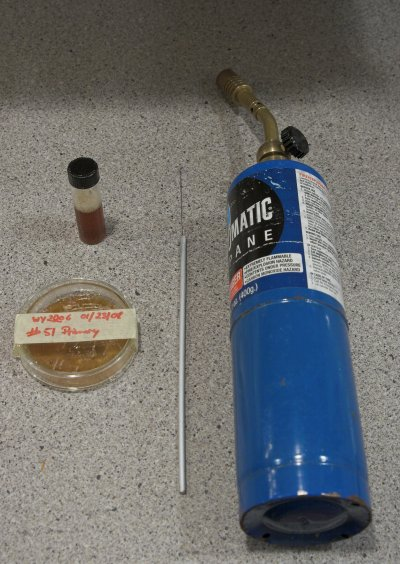

*Figure 1 — Equipment needed: petri dish with colonies, inoculation loop, flame, and sterile starter wort vial*

---

## Before you start

Make sure there is no draft or other air movement in your working area, which could blow contaminants into your cultures.

Loosen the cap of the vial containing the 1st stage starter wort slightly — this pulls in some air. Tighten the cap again and shake the vial to dissolve some oxygen. Since sterility is most important at this stage, do not oxygenate the wort by other means that could spoil it. The yeast will grow even without high O₂.

Remove the tape that keeps the petri dish closed, but keep the lid on.

Using the flame source, sterilize the inoculation loop by pulling it slowly through the flame, starting from its end. All parts of the loop that may contact the vial, wort, or culture should have glowed red. Then open the vial and dip the loop into the wort to cool it — otherwise the heat will damage the colonies you are about to pick.

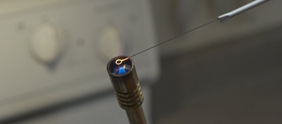

*Figure 2 — Glowing out the inoculation loop before use; it must cool in the starter wort before touching colonies*

---

## Picking Colonies

Only consider **single, round colonies** that have clearly grown from a single yeast cell. Yeast colonies are off-white with a dull surface. Some streaks on the plate should have produced such colonies.

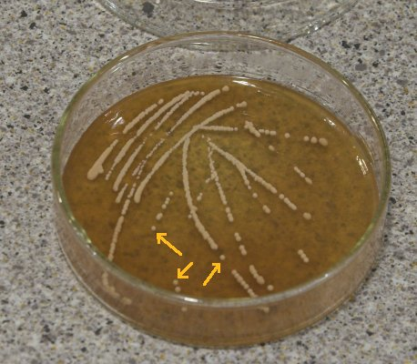

*Figure 3 — Round, off-white yeast colonies on the plate — only pick isolated, distinct ones*

Using the sterile inoculation loop, pick one colony at a time and place it into the wort in the vial. Repeat until you have picked a few colonies. You could also pick only one — this would give you a pitch of yeast grown from a single cell. Mixing a few colonies provides slightly more genetic diversity in the starting population.

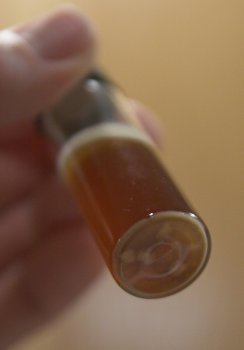

*Figure 4 — Touching the loop to a single colony to transfer it to the starter wort*

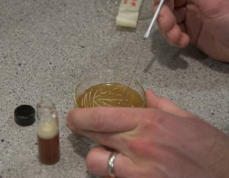

*Figure 5 — Placing the picked colony into the vial of sterile starter wort*

Close the plate and the vial. Looking at the bottom of the vial, you can see the colonies.

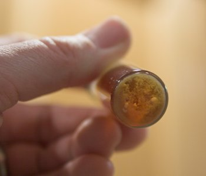

*Figure 6 — Bottom of the vial showing the picked colonies; they are visible as small dots*

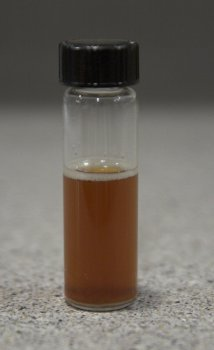

*Figure 7 — Vial after transfer with cap loosely applied to allow CO₂ to escape during growth*

> **From a slant:** If propagating from a slant rather than a plate, there are no distinct colonies — simply pick up some of the yeast "lawn" with an inoculation loop and transfer it into the 1st step medium. This skips the plating step when the culture's purity and viability can be trusted.

---

## 1st Stage Propagation

Place the vial in a warm location (18–25 °C / 70–80 °F) for 2 days. Keep the cap **loosely** applied to let CO₂ escape. A tightly closed cap risks a sudden foam-up when opened and retards yeast growth — CO₂ is toxic to yeast in high concentrations, and the yeast prefers to work in a low-CO₂ environment.

After 2 days, you should see a small kräusen and yeast sediment forming. When you shake the vial (close it first, then re-open slowly), it will be more milky than before — a sign of active growth. If nothing is happening, ensure the temperature is warm enough and give it a few more days. If nothing develops after extended waiting, the yeast was dead.

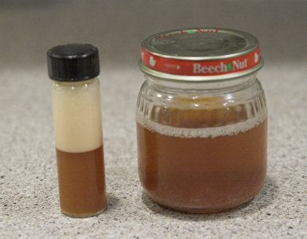

*Figure 8 — 1st stage vial showing yeast sediment and milkiness after 2 days at warm temperature*

---

## 2nd Stage Propagation

Once yeast sediment is visible and the sample looks cloudy when shaken, step it up to a larger volume of **sterile wort** — for example, 80 ml in a baby food jar.

Crack the seal on the jar to let some air in, close it again, and shake to dissolve some oxygen. Also shake up the vial, open it, flame its opening, and dump the contents into the 2nd stage wort. Let this ferment for another 2 days at a warm location.

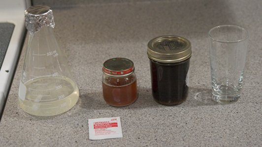

*Figure 9 — 2nd stage wort in a baby food jar; the vial contents are pitched in after flaming the vial's rim*

---

## 3rd Stage Propagation

Once the 2nd stage shows a kräusen and increased sediment, move to approximately 400 ml (12 oz) of starter wort in a 500 ml Erlenmeyer flask.

To prepare: add water, a stir bar, and a pinch of yeast nutrient to the flask. Cap with aluminum foil and boil for 10 minutes. Let it cool, then add canned wort to achieve a final gravity of 8–10 °P (1.032–1.040 SG). At this gravity, the yeast will have sufficient fermentables without being stressed.

Since the yeast population is now large enough to fend off small contaminations, it is safe to **oxygenate the wort** with an oxygen system at this stage.

Before pitching, pour a small amount of the 2nd stage into a glass and taste it. If it does not taste nasty or overly sour, the culture is still pure. Rouse the sediment in the 2nd stage vessel and pour the rest into the Erlenmeyer flask.

Place the flask on a stir plate. This and subsequent stages can be done at room temperature or slightly above fermentation temperature. Using fermentation temperature allows the yeast to acclimate gradually before pitching. Let it go until the starter becomes cloudy and develops a kräusen.

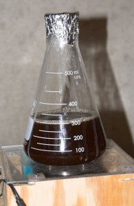

*Figure 10 — 400 ml starter in an Erlenmeyer flask on a stir plate during the 3rd stage*

---

## 4th Stage

Once the 400 ml starter is sufficiently cloudy, pitch it into 1,600 ml of fresh starter wort to make a 2 L total. Aerate well, return to the stir plate, and aerate occasionally — at this volume the stir plate alone does not provide sufficient aeration.

After a few days (faster at room temperature) fermentation will be complete. Let the yeast settle and **decant the spent starter beer**. If more yeast is desired, add fresh wort, aerate, and continue stirring.

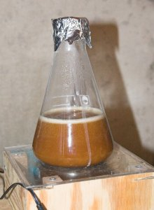

*Figure 11 — 4th stage starter settling before decanting; yeast sediment accumulates at the bottom*

---

## Examples

| Yeast | 1st stage | 2nd stage | 3rd stage | 4th stage | Yield |
|-------|-----------|-----------|-----------|-----------|-------|
| Wyeast Bavarian Lager | 10 ml / 22 °C / 2 days | 80 ml / 22 °C / 2 days | 300 ml / 10 °C / 3 days | 2000 ml / 10 °C / 4 days | 70 ml sediment |

---

*Previous: [Inoculating Plates and Slants](inoculating-plates-and-slants)*
*Next: [Yeast Propagator](yeast-propagator)*

*Source: [braukaiser.com](http://braukaiser.com/wiki/index.php?title=Growing_Yeast_from_a_Plate) — Content available under Attribution-NonCommercial 3.0 Unported.*
