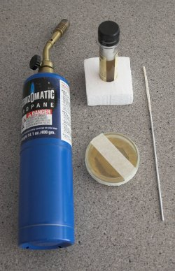
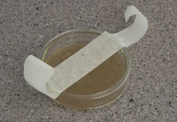
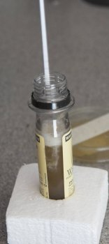
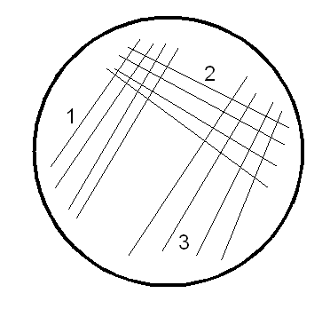
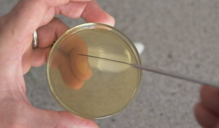
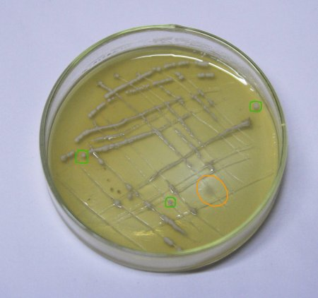

# Inoculating Plates and Slants

*From German brewing and more — Braukaiser.com*

These instructions show how to inoculate a plate of malt agar with a yeast sample to grow single-cell colonies. This technique allows you to "clean" a suspect yeast sample by selecting only one or a few yeast cells for further propagation.

---

## Contents

1. [What's needed](#whats-needed)
2. [Preparation](#preparation)
3. [Take a sample](#take-a-sample)
4. [Streak onto plate](#streak-onto-plate)
5. [Let it grow](#let-it-grow)

---

## What's needed

To streak yeast onto a plate you'll need:

- **A flame source** for sterilizing the inoculation needle — a propane torch, gas stove, alcohol lamp, or lighter all work
- **An inoculation needle** — a piece of wire works too, but dedicated inoculation needles are inexpensive
- **A yeast sample** — an empty Wyeast smack pack, White Labs vial, dregs from a bottle-conditioned beer, active fermentation, yeast sediment, etc. If using an old vial, add sterile wort to get the yeast fermenting again before taking a sample
- **A petri dish with malt agar** prepared in advance (see [Making Plates and Slants](making-plates-and-slants))

*Figure 1 — Equipment needed for streaking: flame source, inoculation needle, yeast sample, and prepared agar plate*

---

## Preparation

In a draft-free room, remove the tape from the petri dish and place it on the table. Open the yeast sample if necessary. Then use the flame to heat the **full length of the needle** until it glows — this sterilizes it completely.

*Figure 2 — Glowing out the inoculation needle to sterilize it before use*

---

## Take a sample

Dip the hot needle into the yeast sample. This cools it and picks up a small amount of yeast. You should **not** see visible blobs or drops of yeast on the needle — if so, you picked up too much and won't be able to spread it enough for distinct single-cell growth. Don't worry if you can't see anything; there will still be yeast on the needle.

*Figure 3 — Dipping the cooled needle into the yeast sample to pick up a small amount*

---

## Streak onto plate

Pick up the petri dish and streak the needle across the agar surface using the pattern shown below. Streak area 1 first, then 2, then 3. Do **not** pick up more yeast between streaks. If only a small amount of yeast was picked up, the cells streaked in area 1 will be spaced far enough for distinct single-cell colonies. If more yeast was picked up, it may take until area 3 for sufficient spacing.

*Figure 4 — Standard three-zone streak pattern; start at zone 1 and work outward*

> **Technique tip:** Stop breathing during this step and work quickly to minimize the time the plate is exposed to open air, which is when contamination is most likely.

---

## Let it grow

Close the plate and seal it with tape around the edges — this keeps the agar from drying out and reduces the risk of airborne contamination. Keep it in a warm place (20–25 °C / 70–80 °F).

After a few days, yeast colonies should appear. **Yeast colonies** grow along the streak marks and have an off-white, dull appearance — they form perfectly round dots in areas of lowest cell density. Mold infections appear as fuzzy, spider-web-like growths, typically with a different colour (white, green, black).

*Figure 5 — Yeast colonies (circled green) showing single-cell growth; orange circle indicates a white mold infection*

*Figure 6 — Close-up of the streak zones; distinct round colonies are visible in the lower-density areas*

Pick one or a few colonies to propagate for a pitch of yeast, or streak them onto a slant for longer-term storage.

*Figure 7 — Plate sealed with tape after colony growth is confirmed*

---

*Previous: [Making Plates and Slants](making-plates-and-slants)*
*Next: [Growing Yeast from a Plate](growing-yeast-from-a-plate)*

*Source: [braukaiser.com](http://braukaiser.com/wiki/index.php?title=Inoculating_Plates_and_Slants) — Content available under Attribution-NonCommercial 3.0 Unported.*
