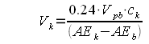
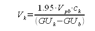
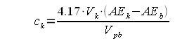
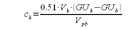
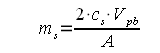
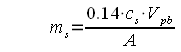

# Kräusening

*From German brewing and more*

Besides sugar and dried malt extract (DME), beer can also be carbonated with unfermented wort (a.k.a. **Speise**) or actively fermenting beer (**Kräusen** or Kräusen beer, pronounced "croysen"). This procedure is generally used by breweries that bottle-condition their beers — freshly fermenting beer is readily available in a brewery.

**Advantages over priming with corn sugar or DME:**

- The flavor of the beer will not be changed — a part of the original wort (same IBUs, same malt profile) is added.
- The apparent OE (original extract) or starting gravity will not be changed. Using a highly concentrated sugar solution effectively raises the OG by 0.5–0.75 Plato (2–3 gravity points).
- In the case of Kräusening, fresh and healthy yeast is added which does a better job scrubbing oxygen and off-flavors. Bottles can also serve as a yeast bank since it is the more flocculent yeast at the bottom.
- Carbonation time is more predictable because fresh yeast is added. Since carbonation takes only a few days to a week (versus many weeks), the beer can be aged longer in bulk for the same total time from kettle to glass.
- You will have more beer to bottle — you can get 5 gal out of a 5 gal carboy.

The main disadvantage is added complexity.

---

## Contents

- [Preparation](#preparation)
- [Calculating the Volume](#calculating-the-volume)
- [Bottling Day](#bottling-day)
- [Conditioning](#conditioning)
- [Kegging](#kegging)
- [Final Comments](#final-comments)

---

## Preparation

If you want to prime with Speise or Kräusen, keep some of the original wort from that batch. Some brewers store it in a sanitized jar in the fridge, but storing in the **freezer** is safer — no contamination risk over the following weeks. Collect it by filtering the hot-break/hop sludge left in the kettle through a paper towel.

When needed, take the wort from the freezer, defrost it, and **boil for 10 minutes** in a 2000 ml Erlenmeyer flask to sanitize. If more bitterness is desired, add hops to this boil. Chill overnight or in an ice bath.

**To prepare Kräusen**, inoculate the wort with yeast:
- Add dry or liquid yeast, or
- Use a sanitized racking cane to pull yeast from the fermenter: close one end with your thumb, push to the bottom, open to suck up yeast sediment, transfer to the starter vessel. Repeat until enough yeast is collected.

You may also use a **different yeast** than the one used for primary fermentation. For example:
- Lager yeast during cold months to condition an ale at basement temperatures.
- Better-flocculating yeast to bottle a beer fermented with a poorly flocculating strain (in which case, drop out the initial yeast with a fining agent like gelatin first).

Wait until the Kräusen starts fermenting before use.

---

## Calculating the Volume

The challenge with calculating Kräusen volume is that its sugar content keeps changing as it ferments. You will need to make an initial guess and refine on bottling day.

**Units of carbonation:**
- **g/l CO₂** — weight of dissolved CO₂ per liter of beer.
- **Volumes of CO₂** — the volume CO₂ would occupy as a gas at atmospheric pressure relative to the beer volume. For example, 1 pint of beer with 2 volumes of CO₂ means the CO₂ would occupy 2 pints if released. Conversion: **1 volume CO₂ = 2 g/l CO₂**.

The **missing carbonation** (to be supplied by the Kräusen sugar) is the difference between current CO₂ content and desired CO₂ content. Current CO₂ content of still beer at a given temperature can be found in carbonation tables at 0 pressure.

With the assumption that 1 g of sugar ferments into equal parts CO₂ and ethanol (close enough for this calculation), use the following formulas:

**Metric units — Kräusen volume:**

Where:
- **V_K** — Kräusen volume in liters
- **V_pb** — volume of the primed beer in liters (includes the Kräusen volume)
- **c_k** — carbonation to be provided by Kräusen in g/l CO₂
- **AE_k** — current apparent extract of the Kräusen in Plato (hydrometer reading)
- **AE_b** — current apparent extract of the beer in Plato (final extract, hydrometer reading)

**US units — Kräusen volume:**

Where:
- **V_K** — Kräusen volume in quarts
- **V_pb** — volume of the primed beer in quarts (includes Kräusen volume)
- **c_k** — carbonation to be provided by Kräusen in volumes CO₂
- **GU_k** — current gravity units (points) of the Kräusen (hydrometer reading)
- **GU_b** — current gravity units of the beer (final gravity, hydrometer reading)

> **V_pb includes the Kräusen volume** — make an initial guess at the Kräusen volume (5% of beer volume works well). If the calculated result differs significantly from the guess, repeat with the better estimate. Two iterations is typically accurate enough.

To calculate the volume of **Speise** instead, use the original extract or starting gravity as AE_k or GU_k.

---

### When You Have Less Kräusen Than Needed

If the calculated volume exceeds what is available (some must be left behind to avoid adding sediment), calculate the carbonation achievable from the available volume:

**Carbonation from available Kräusen — metric:**

**Carbonation from available Kräusen — US:**

Then calculate the **remaining carbonation** needed from additional sugar:

And the **weight of sugar** to supply it:

**Metric:**

Where:
- **m_s** — sugar weight in g
- **c_s** — carbonation from sugar in g/l CO₂
- **A** — fermentability factor: 1.0 for table sugar, 0.92 for corn sugar [Palmer], 0.65 for DME

**US:**

Where:
- **m_s** — sugar weight in oz
- **c_s** — carbonation from sugar in volumes CO₂
- **A** — fermentability factor: 1.0 for table sugar, 0.92 for corn sugar [Palmer], 0.65 for DME

A spreadsheet is available to simplify these calculations and support Kräusen from a different wort than the primed beer:
- [Carbonation calculator (US units)](http://braukaiser.com/documents/Kaiser_carbonation_calculator_US.xls)
- [Carbonation calculator (metric units)](http://braukaiser.com/documents/Kaiser_carbonation_calculator_metric.xls)

---

## Bottling Day

1. Take a gravity reading of the beer to be bottled.
2. With a sanitized spoon, skim the brown Kräusen head off the Kräusen beer — you don't want that in your finished beer.
3. Take a gravity reading of the Kräusen beer.
4. Fill out the spreadsheet and determine the amount of Kräusen needed. Note that you cannot use all of it — leave the sediment behind. If you need more than available, calculate the required sugar addition.
5. Boil sugar if needed.
6. **With one pour (no tilting back)**, pour the Kräusen beer into a sanitized measuring cup until the desired volume is reached. Minimize sediment — yeast in suspension is sufficient for carbonation.
7. Pour or gently place the Kräusen into the bottling bucket.
8. Rack the beer on top. Ensure good mixing.
9. Once enough beer is in the bottling bucket, add the sugar solution if needed. Adding it too early could scald the yeast.
10. Mix gently if necessary (use a sanitized racking cane or turkey baster).
11. Bottle as usual.

---

## Conditioning

Bottles should carbonate within about **one week** at the appropriate fermentation temperature:
- Lager: 10–14 °C / 50–58 °F
- Ale: 18–21 °C / 64–70 °F

This quick conditioning time is one of the key benefits of Kräusening. The beer may still benefit from additional aging afterward.

---

## Kegging

The same method can be used to carbonate lagers in a corny keg before lagering. Add enough Kräusen to exceed the desired CO₂ level, then monitor pressure build-up and blow off any excess CO₂. This has the added benefit of adding fresh and healthy yeast that may attenuate the beer further before cold conditioning. After cold conditioning, rack the beer off the sediment into a serving keg.

---

## Final Comments

Is all this extra work worth the effort? Every brewer has to decide for themselves. Though it seems more complicated, the additional steps don't add much overhead to bottling since most of the time is spent filling bottles anyway. The beer will be ready within about a week after bottling. Using the spreadsheet and measuring the actual attenuation of the Kräusen on bottling day removes the worry of waiting for just the right attenuation.

---

*Source: [braukaiser.com/wiki/index.php?title=Kraeusening](http://braukaiser.com/wiki/index.php?title=Kraeusening) — last modified 2 January 2010. Content available under Attribution-NonCommercial 3.0 Unported.*
