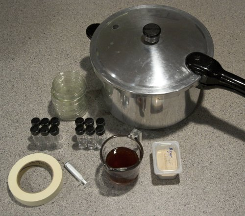
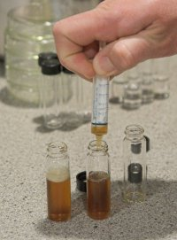
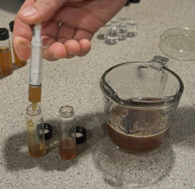
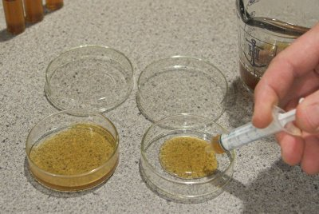
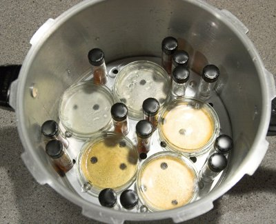
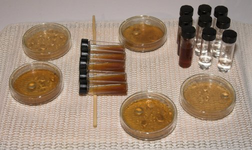
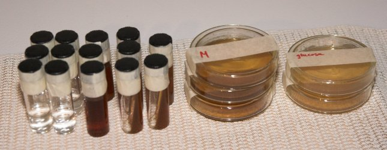

# Making Plates and Slants

*From German brewing and more — Braukaiser.com*

Before you can culture yeast, you need to create sterile media (slants, plates, starter volumes, glycerin solutions…) that can then be used to store or propagate yeast.

---

## Contents

1. [What is needed](#what-is-needed)
   - Hardware: pressure canner, vials, petri dishes, baby food jars, syringe, tape
   - Software: wort, agar
2. [Making Small Starter Volumes](#making-small-starter-volumes)
3. [Making Slants](#making-slants)
4. [Making Plates](#making-plates)
5. [Sterilizing](#sterilizing)
6. [Cooling](#cooling)
7. [Store](#store)

---

## What is needed

Yeast culturing at home does not actually require a lot of specialized equipment. Here is a list of what is needed:

### Hardware

#### Pressure canner

When working with very small amounts of yeast, sanitation alone is no longer sufficient. **Sterilization** — complete elimination of all living organisms, including their spores — is required. This cannot be achieved by chemical means or boiling at atmospheric pressure. Microbiology labs use autoclaves to sterilize vessels, tools, and media. An autoclave uses pressurized steam to reach temperatures high enough for sterilization. Though most home brewers do not have access to autoclaves, the same function can be achieved with a **pressure canner**. Not only is a pressure canner much cheaper than an autoclave, it also has uses in the kitchen and can be used to can starter wort.

When buying a pressure canner, look for a model that operates at at least 15 psi. This will produce a temperature high enough for sterilization.

*Figure 1 — Pressure canner with vials and petri dishes ready for sterilization*

#### Vials

Vials are needed for making slant cultures. Look for autoclavable ones. Various shapes are available. Slant tubes with rounded bottoms (e.g. from Morebeer) have the advantage that they can stand on their own.

#### Petri dishes

If you want to work with single cell cultures or purify a yeast culture, you will need **Petri dishes**. Get the glass ones, which can be cleaned and reused. The 75 mm size is large enough to streak out yeast cultures and still fairly affordable.

#### Baby food jars

Glass baby food jars can hold agar cultures or small amounts of starter wort. They are particularly useful for keeping sterile wort for the 2nd stage of propagation.

#### Syringe

A small oral syringe (5 ml) works great for measuring the amount of media added to vials and plates. Ask at the pharmacy if you do not have one on hand.

#### Tape

Painters tape is used to hold Petri dishes closed after sterilization and cooling. It also gives vials an additional seal and can be used to attach notes.

### Software

#### Wort

You'll need about 100–150 ml of 8–10 Plato wort (1.032–1.040 SG). Left-over wort from a batch of beer works well. You can also make wort with malt extract. Having it hopped makes it more selective for yeast, since many bacteria do not grow in the presence of alpha acids.

#### Agar

**Agar** is used to solidify the wort. Gelatin may work as well. Since agar is a common vegetarian substitute for gelatin, it should be available at health food stores. It can also be ordered from a well-stocked home-brew store.

---

## Making Small Starter Volumes

When stepping up from a slant or plate, using only boiled wort for the initial steps may not be sanitary enough, and spoiled yeast cultures can result. To avoid this, fill a few vials with 10 ml of wort and sterilize them in the pressure cooker along with the slants and plates. This starter is then either dumped onto a slant or inoculated with yeast from a plate or slant.

*Figure 2 — Vial filled with 10 ml of starter wort for sterilization*

---

## Making Slants

For slants and plates, agar media is needed. Use approximately 3–4% agar by weight:

- 100 ml wort
- 3–4 g agar

Mix in a heat-proof vessel and heat (stove or microwave) to dissolve the agar — it will thicken as it heats. There is no danger in boiling it, but boiling is not necessary at this point. Use the syringe to measure **5 ml** of agar into each vial.

*Figure 3 — Using a syringe to dispense 5 ml of agar media into each vial*

---

## Making Plates

Squirt **10 ml** of agar media into each petri dish.

If you want to grow microbes other than yeast, or use plates for sanitation tests, you can make a glucose agar media that is less selective than the low-pH, hopped wort agar:

**Glucose-based media:**

- 100 ml water
- 5 g glucose (corn sugar)
- Pinch of yeast nutrient and/or Diammonium Phosphate (DAP)
- 3 g agar

---

## Sterilizing

Before loading the pressure canner, add some water. There needs to be enough water to last through the 15–20 min sterilization process, but not so much that it comes up the sides of the Petri dishes. This may require elevating the supporting false bottom — inserting it upside-down raises it further from the bottom.

Place the plates and vials on the false bottom. Round-bottomed vials can stand on their own and will not tip over during sterilization. Once all items are loaded, place the canner on the stove and add the lid — but do **not** close the pressure relief valve yet.

Turn on the heat and wait for steam to develop and blow out. Letting some steam blow out first replaces the air inside with steam, which is far more effective for sterilization. Then close the pressure relief valve and wait for pressure to build up. Follow the same procedure as for pressure canning food.

The target pressure has been reached when steam is blown off by the pressure relief valve. Wait **15–20 minutes**, then turn off the heat.

> **Important:** Let the canner cool down on its own. Do not vent steam or place it in a cool water bath — rapid cooling can cause media inside vials to release steam too quickly, causing the vials to spill or burst.

*Figure 4 — Pressure canner loaded and ready for the sterilization run*

*Figure 5 — Vials standing on the false bottom inside the canner*

---

## Cooling

Once the canner has cooled enough for pressure to be gone, open it. Tighten the caps on all vials and let them cool on the counter. Do not worry about condensation inside the petri dishes — simply seal them with masking tape once cooled, **without opening them first**. Opening them to shake off moisture risks contamination; the moisture will be absorbed by the slant media during storage.

To make slants, lay each vial on a chopstick so that the media stops just short of the top of the vial. This creates a larger surface area for later use. Once cooled, seal the top of the vials with painters tape as an additional barrier against contaminants.

*Figure 6 — Vials cooling after sterilization, laid at an angle on a chopstick to form slants*

---

## Store

Slants and plates can be stored anywhere. Since they have been sterilized, they should not spoil. To prevent the slants from drying out, keep them in a large zip-top bag.

*Figure 7 — Finished slants stored in a sealed zip-top bag to prevent drying*

---

*Next: [Inoculating Plates and Slants](inoculating-plates-and-slants)*

*Source: [braukaiser.com](http://braukaiser.com/wiki/index.php?title=Making_Plates_and_Slants) — Content available under Attribution-NonCommercial 3.0 Unported.*
