# Microscope Use in Brewing

*From German brewing and more — Braukaiser.com*

For many home brewers the ultimate brewing gadget is a microscope. This article gives interested home brewers guidance on buying a microscope and necessary accessories, and shows how to make effective use of one in the brewery.

---

## Contents

1. [What to expect from using a microscope](#what-to-expect)
2. [Purchasing a Microscope](#purchasing-a-microscope)
3. [Additional equipment](#additional-equipment)
4. [Using the microscope](#using-the-microscope)
   - Preparing the sample
   - Un-flocculating yeast
   - Preparing the hemocytometer
   - Counting
   - Methylene blue staining
   - Cell counts using ImageJ
5. [Other uses](#other-uses)
   - Assessing yeast health
   - Ale vs. lager yeast
   - Determining the source of beer haze
6. [Appendix](#appendix)
   - Gallery of various microscopy images
   - Improved Neubauer counting grid
   - Further reading
7. [References](#references)

---

## What to expect from using a microscope

The primary use of a microscope in the brewery is counting yeast cells with a **hemocytometer**. Cell counts are useful for:
- Determining pitching rate
- Measuring remaining cell density when bottling
- Determining yeast densities in slurry — establishing a correlation between slurry weight and cell count allows more precise pitching without lengthy counts

Yeast counting takes time — easily 20–30 minutes per session. This is why pitching by weight is more practical when yeast density can be predicted accurately.

With a simple staining technique (methylene blue), you can assess the health of a yeast culture.

A microscope also allows better classification of haze sources — distinguishing between yeast cells and much smaller protein globules.

> **What a microscope cannot do:** Reliably detect infection before it is noticeable in the beer. Bacteria concentrations at the point of flavor impact are very low; only by chance would you see a bacterium in a yeast or beer sample. Selective agar growth media is better suited for this task.

---

## Purchasing a Microscope

For brewing use, look for a **compound (multiple lens) light microscope** with the following features:

- **400× magnification** — needed for cell counting; 100× is also useful for viewing a larger area of the hemocytometer grid. Magnification = objective power × eyepiece power (e.g. 40× objective × 10× eyepiece = 400×). Many microscopes also offer 1000× (100× objective + oil immersion), but this is not needed for brewing.
- **Coarse and fine focusing** — at 400×, fine focus control is essential for working with a hemocytometer cover slip without breaking it.
- **Sturdy, level stage** — some cheaper microscopes have slanted stages; a level stage is needed to hold the hemocytometer properly.
- **Mechanical stage** — the hemocytometer must be moved with micron-level precision in X and Y. Simple clamps requiring hand movement of the slide are not adequate.
- **Abbe condenser with iris diaphragm** — the diaphragm should be nearly closed to enhance contrast, which is essential for seeing yeast clearly.
- **Monocular vs. binocular** — binocular is more comfortable for extended use (~$100 premium). Trinocular versions (binocular + camera port) are also available. If you plan to use a camera and view on a screen, monocular may suffice.

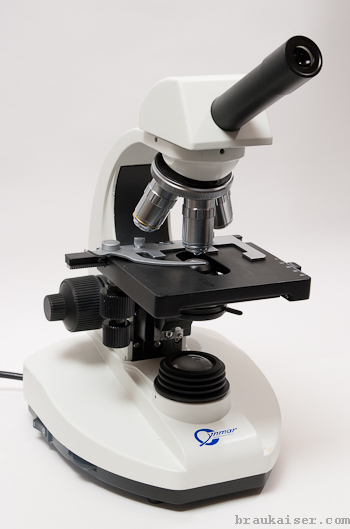

*Figure 1 — A simple student-grade compound microscope suitable for brewing use*

---

## Additional Equipment

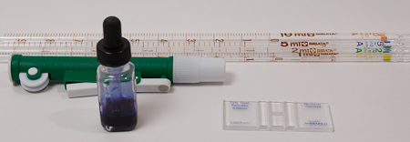

*Figure 2 — Useful supplies and accessories: glass pipettes, pipette pump, methylene blue, and hemocytometer*

- **Hemocytometer** — initially designed for blood cell counting, this is the primary tool for yeast cell counts. A precision glass instrument with a counting grid of known dimensions etched in. Available with **dark lines** (etched into plain glass) or **bright lines** (transparent metal coating with etched bright lines). Both work equally well for yeast counting. The counting area is covered with a thin cover slip supported at a known height above the grid; the liquid sample is drawn in by capillary action. Cost: $20–$50. The **Improved Neubauer** pattern is the most common grid style.
- **Graduated glass pipettes** — essential for precise dilution of samples in starters and slurries. Serological pipettes are recommended (their graduation shows the volume dispensed when completely emptied). Useful sizes: 1, 2, 5, and 10 ml. Cost: ~$2–3 each.
- **Pipette pump** — needed to fill pipettes precisely. Hand-operated mechanical versions cost ~$10; a 10 ml pump also works for 1, 2, and 5 ml pipettes.
- **Methylene blue stain** — allows yeast viability assessment. Available as powder or 1% aqueous solution, either works. Also available from aquarium supply stores.
- **Small dropper bottle** — for the 1% methylene blue stock solution.
- **Tally counter** — makes counting cells much easier. Mechanical or smartphone app.

Lab supplies are available from cynmar.com and many other online vendors.

---

## Using the Microscope

### Preparing the sample

Since cells are counted from a very small sample, the **whole volume must be thoroughly mixed** before sampling, and yeast must not be allowed to flocculate. This is critical.

There are two approaches to measuring pitching cell density:
1. **Count after pitching** — no dilution required, but cannot remove excess yeast
2. **Count in the propagation vessel** — requires dilution; if adding about 5% of wort volume to yeast (1 qt per 5 gal, or 1 L per 20 L), a 1:20 dilution is recommended

For a 1:20 dilution: add 19 ml of water to a small vessel, then add 1 ml of the stirred yeast culture. Mix well — do not shake vigorously. Repeatedly draw the sample into the pipette and push it back to flush, especially with ale strains that tend to aggregate in foam.

---

### Un-flocculating yeast

Poor flocculators (dusty lager yeast, German ale yeast) are easy to work with. Most other strains need help staying dispersed. Practical options [1]:

**Fresh wort** — Maltose inhibits flocculation. Adding fresh wort and a few minutes on a stir plate works even for heavy flocculators like English ale yeast (WLP002). This is the most practical approach when the sample will be pitched, since yeast health is not affected and even distribution during pitching is improved.

**Sulfuric acid (H₂SO₄)** — Effective and does not affect viability (important if methylene blue staining will follow). However, it is highly corrosive and must be handled carefully. Only use when the sample will not be pitched.

**Disodium EDTA** — Safer than sulfuric acid. EDTA is a chelating agent that captures the calcium ions needed for flocculation. Does not affect yeast health; methylene blue staining can still be used.

**PBW (Powdered Brewery Wash)** — Contains chelating agents and is safe to handle, readily available to many brewers. However, it does affect yeast health and methylene blue staining cannot be used afterward.

---

### Preparing the hemocytometer

Place the cover slip over the counting grid as directed by the manufacturer (typically resting on two support ridges).

Draw a sample with the pipette and create a small drop at the pipette tip. Place the drop right at the edge of the cover slip — it will be drawn into the counting chamber by capillary action. Repeat for the second counting grid if present. The liquid should cover the counting grid **without overflowing into the moat** — overflow can push the cover slip upward and change the volume above the grid.

Place the hemocytometer on the microscope stage and start at the lowest magnification. Move the stage toward the objective, then slowly away while looking through the eyepiece until the counting grid comes into view. Focus and step up to the next magnification, re-focusing each time. Check that cells are evenly distributed — clumping suggests the sample needs to be re-mixed or the yeast needs more time to un-flocculate.

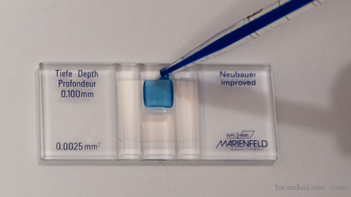

*Figure 3 — Darklined hemocytometer with 2 counting grids being filled; the sample has been stained with methylene blue (stronger than usual) to illustrate how it is drawn into the counting chamber by capillary action*

---

### Counting

Switch to **400×** for counting. By convention, count cells in the **4 corner 4×4 grids and the center 4×4 grid** of the Improved Neubauer hemocytometer (5 grids total — see Figure 13 in the Appendix). If yeast density is very low, additional grids may be needed.

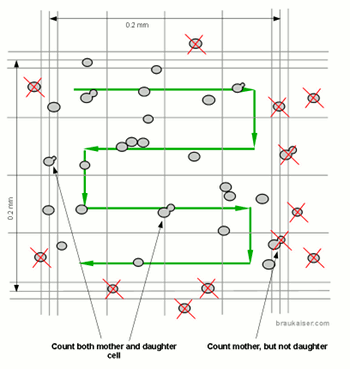

*Figure 4 — When counting: include cells touching the middle of the triple lines on the top and left of the 4×4 grid; exclude cells touching the right and bottom middle lines. Count budding cells as two (they will soon be two cells).*

For a hemocytometer with 0.1 mm depth (most common), cell density in million cells per ml is:

**Cell density (M/ml) = (total cells counted / number of grids counted / 0.0001 mm³) × dilution factor**

- Dilution factor = (sample volumes of water added) + 1
  - No dilution → factor = 1
  - 1 ml sample + 1 ml water → factor = 2
  - 2 ml sample + 10 ml water → factor = 6

Total cells in the culture (billions) = cell density (M/ml) × culture volume (L).

Accuracy is improved by:
- Thorough mixing before sampling
- Thorough mixing of the diluted sample and rinsing the pipette with it
- Counting at least 100 cells (statistical error is proportional to 1/√n)
- Filling both counting chambers with separate pipette loads

---

### Methylene blue staining

**Methylene blue** allows simple assessment of yeast culture health. In theory, dead cells stain blue while living cells remain colourless. In practice it tends to overestimate viability, but it is a quasi-standard in the brewing industry for viability testing due to its simplicity and quick results.

In its **oxidized form** methylene blue is blue; in its **reduced form** (leucomethylene blue) it is colourless. In living cells, cellular respiration quickly reduces the dye to its colourless form — which is why living cells do not stain. In dead cells, methylene blue accumulates in its oxidized (blue) form.

> **Caveat:** Aged cells deposit lipids and sugars into their cell walls as environmental protection. This prevents methylene blue from entering, so old dead cells may **not** stain blue — which is why methylene blue overestimates viability compared to plate counts. Results below 85–90% viability should be considered inaccurate when using this stain [6]. For practical brewing purposes, a culture showing less than 90% viability by methylene blue should not be used.

**Blue Bottle Experiment** (demonstrates oxidized/reduced equilibrium):

Mix 250 g water, 4 g sodium hydroxide, and 5 g glucose in a flask. Add 3–5 drops of 1% methylene blue — the solution turns dark blue (oxidized form).

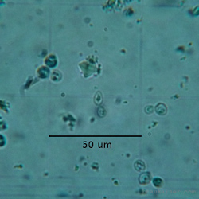

*In a high-pH environment, glucose oxidizes to gluconic acid, consuming oxygen and reducing methylene blue to its colourless leuco form. The reaction takes a few minutes; a blue layer may remain at the surface where air contact persists.*

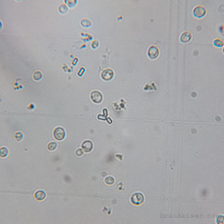

*When oxygen is added (e.g. via an oxygen wand), leucomethylene blue oxidizes back to methylene blue — visible as blue streaks in the solution.*

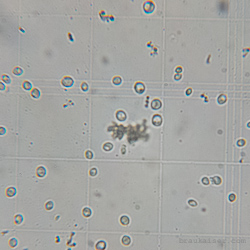

*After vigorous shaking, more oxygen dissolves and the solution turns dark blue again. Upon standing it will once again lose its colour.*

**Protocol for viability testing:**
1. Prepare a 1% w/w methylene blue stock solution in a dropper bottle
2. Dilute the yeast sample as necessary
3. Add 1 drop per 5 ml of diluted sample (the drop volume of ~0.05–0.07 ml decreases cell count by ~1%, within normal noise)
4. Let stand 1 minute
5. Remix and pipette into the hemocytometer; view at 400×

Count **colourless and light blue/greenish cells** as viable; count **dark blue cells** as dead. Do not count blue-stained buds if the mother cell is unstained — buds are metabolically active and may not reduce the dye.

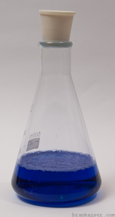

*Figure 5 — A culture heat-pasteurized to kill all yeast cells. All cells stained blue.*

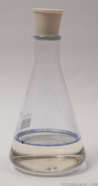

*Figure 6 — An old cell culture confirmed dead by plate streaking. Not all cells stained blue. Note the elongated shape of starved cells.*

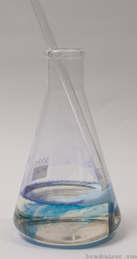

*Figure 7 — A healthy culture with less than 5% methylene blue staining and round, plump cells. This also illustrates a sample that is too dense and should be diluted further.*

---

### Cell counts using ImageJ

Cell counts at the microscope take time and are tiring. An alternative is to photograph the counting grid and count cells using desktop software like [ImageJ](http://rsb.info.nih.gov/ij/). Photos can be taken with a dedicated microscope camera or even a smartphone held to the eyepiece. When photographing for counting, it is also possible to work at 100× (wider field of view), in which case only one image per side of the hemocytometer is needed.

ImageJ offers both automated (particle recognition) and manual (click-to-mark) counting modes. The manual **Cell Counter** plugin (Plugins → Analyze → Cell Counter) is practical for phone-quality images. After initialising the image, click each cell to place a marker and increment the counter. Multiple cell types can be used to separate grids or to count stained vs. unstained cells.

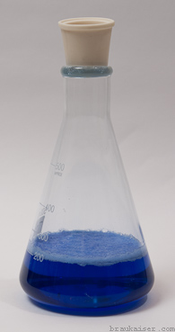

*Figure 8 — Screenshot of ImageJ with the cell counter plugin. The image is a cell phone photo at 100× magnification, zoomed in to show one 4×4 counting grid.*

---

## Other Uses

### Assessing yeast health

Healthy yeast cells are **plump and round**. Starved or old yeast cells have a more elongated, football-like shape (see Figure 6).

### Ale vs. lager yeast

You will generally not be able to differentiate between yeast strains — though some strains have larger cells than others. One observable difference:

- **Ale yeast** tends to stick together after budding, forming small stringed colonies of 5–10 cells. These colonies attach readily to CO₂ bubbles and rise into the kräusen.
- **Lager yeast** separates after budding and only forms clumps (not chains) when flocculating.

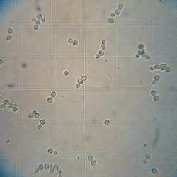

*Figure 9 — Ale yeast showing its typical tendency to form stringed colonies of 5–10 cells*

### Determining the source of beer haze

Take a sample of the hazy beer and view it under the microscope using the standard cell count procedure. Clean the hemocytometer thoroughly and fill one side with water for comparison.

Particles will be sparse unless the haze is strong. You can determine whether the haze is from **yeast** or **protein complexes** — protein complexes are ~0.5 µm in size, roughly 10× smaller than yeast cells (~5–10 µm). If the haze results from microbial infection, it should also be apparent in the taste. Bacteria are much smaller than yeast and typically rod-shaped.

> **Note:** Do not confuse **rod-shaped crystals** (possibly calcium oxalate monohydrate) with bacteria — these rods can appear in sediment and are approximately as large as yeast cells. Bacteria are much smaller.

Yeast hazes will eventually settle. Protein-based hazes are more stubborn and may take many months to settle, or may require treatment with a fining agent like gelatin.

---

## Appendix

### Gallery of Various Microscopy Images

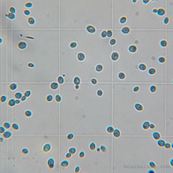

*Figure 10 — Calcium oxalate crystal (square object, middle top) as found in the sediment of a Schneider Weisse bottle*

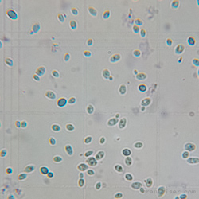

*Figure 11 — Rod-shaped crystals, possibly calcium oxalate monohydrate, easily mistaken for bacteria. Note they are approximately as large as yeast cells; bacteria are much smaller.*

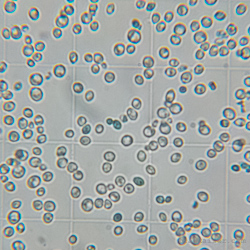

*Figure 12 — The center of this image shows a cold break particle*

---

### Improved Neubauer Counting Grid

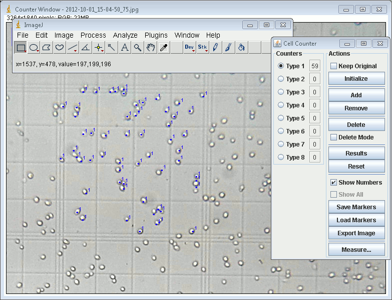

*Figure 13 — The Improved Neubauer counting grid. The 5 highlighted squares are the 4×4 grids commonly used for yeast cell counts. [Download PDF of this grid](http://braukaiser.com/download/Neubauer_hemocytometer.pdf)*

---

### Further Reading

- [Celeromics — Cell Counting with Neubauer Chamber](http://www.celeromics.com/en/resources/Technical%20Notes/cell-article-chamber.php)
- [White Labs — Cell Counting/Viability Testing](http://www.whitelabs.com/beer/cell_count.html)
- [White Labs — Cell Counting and Viability presentation (PDF)](http://www.whitelabs.com/beer/CellCounting&Viability.pdf)
- [American Brewers Guild — Using a Haemocytometer (PDF)](http://www.abgbrew.com/pdf/haemocytometer.pdf)

---

## References

1. [Yeast un-flocculation for cell counting — Braukaiser blog](http://braukaiser.com/blog/blog/2012/10/03/yeast-un-flocculation-for-cell-counting/)
2. [Celeromics — cell counting error](http://www.celeromics.com/en/resources/Technical%20Notes/cell-counting-error/cell-counting-error.php)
3. [Wikipedia — Methylene blue](http://en.wikipedia.org/wiki/Methylene_blue)
4. [Caltech — Blue Bottle experiment (PDF)](http://www.its.caltech.edu/~ccc/participants/volunteers/Blue-Bottle.pdf)
5. Yahoo! Voices — The Methylene Blue Staining Procedure and Yeast Viability
6. C. Boulton, D. Quain, *Brewing Yeast and Fermentation*, Blackwell Science Ltd, 2001
7. [White Labs — Cell Counting and Viability (PDF)](http://www.whitelabs.com/beer/CellCounting&Viability.pdf)

---

*Source: [braukaiser.com](http://braukaiser.com/wiki/index.php?title=Microscope_use_in_brewing) — Content available under Attribution-NonCommercial 3.0 Unported.*
