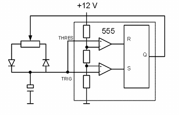
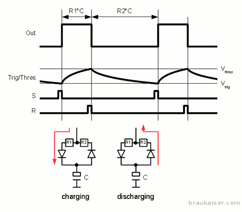
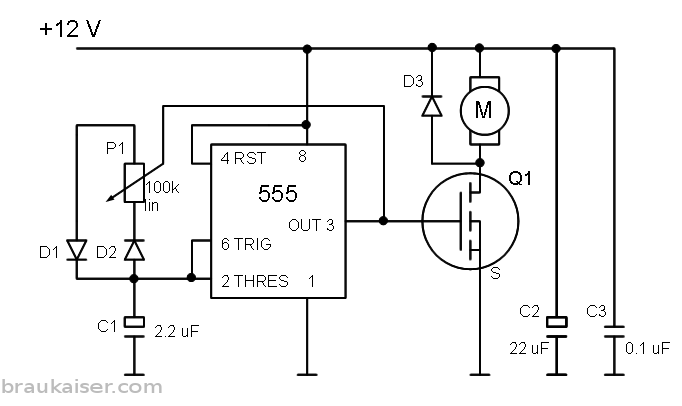
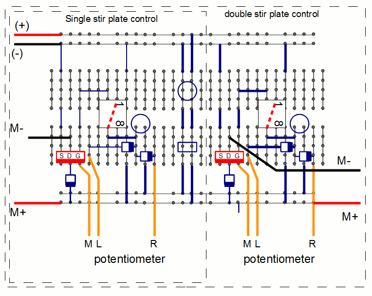
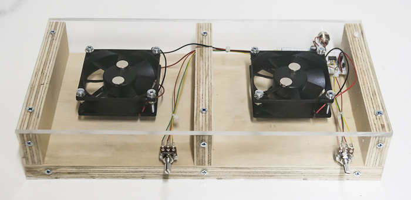
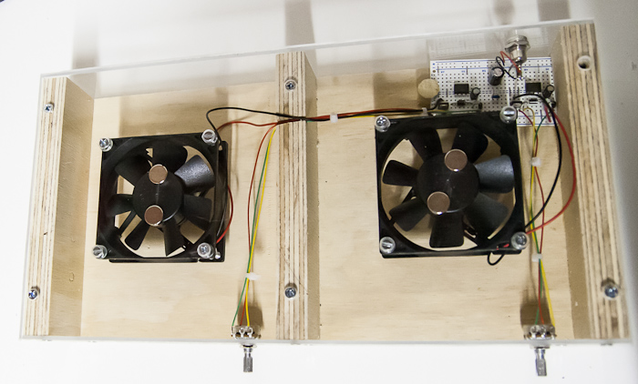

# PWM Controlled Stir Plate Design

*From German brewing and more — Braukaiser.com*

A DIY stir plate design using pulse width modulation (PWM) for precise, stable fan speed control — suitable for yeast starter propagation.

---

## Contents

1. [Introduction](#introduction)
2. [Design options](#design-options)
3. [PWM design](#pwm-design)
   - Wiring diagram and parts list
   - Housing
   - Testing & troubleshooting

---

## Introduction

A stir plate uses a pair of spinning magnets to move a **magnetic stir bar** contained inside a flask or other vessel. The spinning stir bar keeps the liquid — in this case a yeast starter — agitated, which promotes gas exchange and keeps yeast in suspension. The main advantage of this set-up is ease of sanitization: all surfaces in contact with the starter (flask and stir bar) can be sanitized through boiling.

Experiments and observations by home brewers have shown that **constantly agitated starters increase yeast growth by 2 to 4 times** over non-agitated starters. This is the primary reason home brewers are interested in building or acquiring stir plates. Given the relatively high price of commercial units ($50 for a simple design, $100+ for most models), many home brewers opt to build their own.

Commercial labs often favour orbital shaker tables (more capacity, higher cost and complexity). Stir plates are simpler to build and more practical for home use.

---

## Design Options

Most home-built stir plates use a **DC fan** with strong magnets attached. The main design difference lies in speed control:

- **Variable resistor** — simple but limited; most fans have a narrow voltage band between no rotation and full speed, making smooth control difficult without load resistance from the stirred liquid.
- **Linear voltage controller** — slightly more complex but still suffers from the same narrow voltage-to-speed relationship.
- **Pulse width modulation (PWM)** — does not change the voltage applied to the fan but the fraction of time it is powered on and off (typically 10–100 Hz). The fan's inertia smooths out the pulses into even rotation speed. This is what this article describes.
- **Microcontroller with speed feedback loop** — the most sophisticated approach, using an RPM sensor and closed-loop control (e.g. the Digital Stirplate by Digital Homebrew).

---

## PWM Design

The fan speed control logic described here is based on a [Home Brew Talk post by rocketman768](http://www.homebrewtalk.com/f51/simple-pwm-stirplate-controller-219121/) with a few modifications. It employs a **NE555N** timer chip.

The NE555N is essentially an RS flip-flop with differential comparators at its R (reset) and S (set) inputs. When the voltage at the THRES input exceeds the internally generated V_thres, the R input asserts high and the output resets to 0. Conversely, when the voltage at the TRIG input falls below V_trig, the S input asserts high and output Q goes high. In this design TRIG and THRES are connected to the same terminal of a capacitor, so R and S can never be asserted simultaneously.

Pulses of varying width are generated by triggering R and S at changing time intervals through **charging and discharging of a capacitor**. The rate at which a capacitor charges depends on the product of its capacitance and the resistance through which it is charged (the RC constant). Capacitance is held constant; resistance is varied using a potentiometer.

*Figure 1 — The internals of the NE555N timer chip connected to a capacitor that can be charged and discharged through a variable resistor*

The capacitor connects to output Q through variable paths of a potentiometer and diodes:

- When Q is high, the capacitor charges through the R1 portion of the potentiometer until it reaches V_thres → Q goes low
- The capacitor then discharges through the R2 portion until it falls below V_trig → Q goes high again

Since R1 and R2 are the two halves of a potentiometer, their sum remains constant. Changing R1 changes the **duty cycle** (percentage of time Q is high) without changing the **frequency** of pulses.

*Figure 2 — Charging and discharging the capacitor produces pulses on the Q output; pulse width depends on R1 and R2, which are set by the potentiometer position*

Q drives a **MOSFET** that switches the fan on and off. The longer Q is high, the longer the fan is powered, and the faster it spins. The fan's inertia, combined with a sufficiently high pulse frequency, produces smooth rotation despite the pulsed supply.

---

### Wiring Diagram and Parts List

*Figure 3 — Wiring diagram of the PWM control logic and the DC fan*

**Key components:**
- **555** — NE555N timer chip
- **D1, D2** — control which section of potentiometer P1 governs charging/discharging of C1
- **D3** — flyback diode protecting the MOSFET from voltage spikes when the inductive fan load is interrupted
- **C2, C3** — stabilise the input power supply

*Figure 4 — Suggested breadboard layout; a standard breadboard is large enough for 2 control circuits. Pins 2 and 6 of the 555 are connected by a wire under the board (red dashed line); all other connections are wire jumpers on top (blue lines). (+) and (−) are 12 V supply, M+ and M− are fan terminals, M/L/R are the potentiometer terminals.*

> **Tip:** If the fan speeds up when the potentiometer is turned to the right but you want the opposite direction, simply swap the L and R connections.

#### Part List

All parts available from [mouser.com](http://mouser.com):

| ID | Description | Mouser item number |
|----|-------------|-------------------|
| 555 | NE555N timer chip | 511-NE555N |
| D1, D2, D3 | General purpose diode | 625-1N4933-E3 |
| C1 | Aluminum electrolytic capacitor, 2.2 µF | 647-UVY2A2R2MDD |
| P1 | 100k linear potentiometer | 858-P160KNP0C20B100K |
| C2 | Aluminum electrolytic capacitor, 22 µF | 140-RGA220M2ABK0811G |
| C3 | Multilayer ceramic capacitor, 0.1 µF | 810-FK18X7R1E104K |
| Q1 | MOSFET NFET DPAK 30 V 54 A 5.5 mΩ | 863-NTD4906N-35G |
| M | 12 V DC fan | 670-OD8025-12HSS |

You will also need a **12 V DC power supply** and a matching jack.

---

### Housing

Home brewers have been creative with enclosures. Any box with a reasonably rigid top cover (between the fan and the flask) will work. While Tupperware containers have been used, they may not provide enough rigidity to support a 2 L or larger Erlenmeyer flask.

A sturdy plastic project box or custom-built enclosure is recommended. The double stir plate shown here uses thick plywood and acrylic glass — being able to see the spinning fan can be an advantage.

*Completed double stir plate. 14 inches wide × 7 inches deep × 2.5 inches high*

*Detail view of the stir plate construction showing fan mounting and magnet placement*

---

### Testing & Troubleshooting

Apply 12 V. If nothing smokes, turn the potentiometer and check for fan speed change. If nothing happens:

1. Check **pin 8** (VCC) of the 555 — should be at 12 V
2. Check **pin 4** (RESET) — should be at 12 V
3. Check **pin 1** (GND) — should be at 0 V
4. Check **pin 3** (OUTPUT) — if 0 V, fan should be off; if 12 V, fan should run at full speed
5. Check **pins 2 and 6** — should have the same voltage as pin 3; if not, check their connections through the potentiometer

A simple voltmeter is sufficient for debugging, though an oscilloscope would be more useful.

---

*Source: [braukaiser.com](http://braukaiser.com/wiki/index.php?title=PWM_Coltrolled_Stir_Plate_Design) — Content available under Attribution-NonCommercial 3.0 Unported.*
