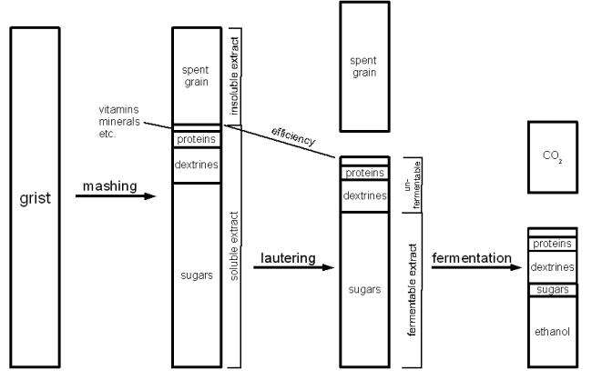

# Understanding Attenuation

*From Braukaiser — German brewing and more*

This article is intended to give the advanced home brewer a better understanding of attenuation, how it is affected by the brewing process, and how controlling it can be used to improve the brewing process.

---

## Contents

1. [Calculating Attenuation](#calculating-attenuation)
2. [Brewing Process and Wort Composition](#brewing-process-and-wort-composition)
3. [Apparent vs. Real Extract](#apparent-vs-real-extract)
4. [Apparent vs. Real Attenuation](#apparent-vs-real-attenuation)
5. [Limit of Attenuation](#limit-of-attenuation)
6. [Yeast Strain Differences in Attenuation](#yeast-strain-differences-in-attenuation)
7. [Attenuation Numbers Listed for Yeast Strains](#attenuation-numbers-listed-for-yeast-strains)
8. [Affecting Attenuation](#affecting-attenuation)
9. [Appendix](#appendix)

---

## Calculating Attenuation

**Attenuation** refers to the percentage of original extract that has been fermented:

```
Attenuation = 100% x (starting extract - current extract) / (starting extract)
```

This formula works with extract given in weight percentages or degree Plato. Extract refers to all non-water substances (sugars, dextrins, proteins, vitamins, minerals, etc.) present in the wort. Since an almost linear relationship exists between (specific gravity - 1) and extract percentages, the formula can also be expressed as:

```
Attenuation = 100% x (starting gravity - current gravity) / (starting gravity - 1)
```

---

## Brewing Process and Wort Composition

To understand the different forms of attenuation we need to look at the extract composition first.



*Figure 1 — From grist to beer: extract composition at each stage of the brewing process*

During mashing, the majority of the grist is converted into water-soluble compounds. The conditions during mashing as well as the malts and adjuncts used determine the exact ratio between the various compounds (sugars, dextrins, proteins, and others). Once conversion is complete, the sweet wort is separated from the spent grain in the lauter. Due to inefficiencies, not all dissolved extract ends up in the boil kettle — the percentage that does is called **lauter efficiency**.

During the boil, only minor changes happen to wort composition. Enzyme denaturization finally fixes the ratio between fermentable and unfermentable extract. Protein coagulation changes protein composition. Hops add additional compounds, but these are of little interest for attenuation.

During fermentation the fermentable sugars are converted into almost equal parts of CO2 and ethanol, plus much smaller amounts of other compounds (esters, higher alcohols). The yeast absorbs most simple proteins and nutrients. The amount of fermentable sugars left in the finished beer affects its character, and different beer styles have different amounts.

---

## Apparent vs. Real Extract

Hydrometers are calibrated for measuring the extract content of a water solution. When used to measure beer — which contains ethanol — the reading is skewed by the lower specific gravity of ethanol. The result is a lower density reading than would be true if the alcohol were replaced with water. This measured value is called **apparent extract** (AE). The **real extract** (RE) is what would be measured if no alcohol were present.

To determine the real extract from the apparent extract when the original extract is known [Realbeer]:

```
RE = 0.1808 x OE + 0.8192 x AE
```

---

## Apparent vs. Real Attenuation

**Apparent attenuation** uses the apparent extract. **Real attenuation** uses the real extract. When brewers speak of attenuation, they most likely mean apparent attenuation since it is easily calculated from hydrometer readings. The relationship between the two is:

```
Real Attenuation = 0.82 x Apparent Attenuation
```

Real attenuation is only needed when there is interest in the actual percentage of extract fermented, or when calculating sugar additions for carbonation priming (see *Accurately Calculating Sugar Additions for Carbonation*).

---

## Limit of Attenuation

The **limit of attenuation** is the sum of all the sugars the yeast is able to ferment, expressed as a percentage of the total extract content — the attenuation of the beer if no fermentable sugars were left.

There are slight differences in what ale yeast (*S. cerevisiae*) and lager yeast (*S. pastorianus*) can ferment. Lager yeast also fully ferments raffinose and melibiose, which ale yeast cannot or only partially ferments. However, raffinose is absent from brewing wort and melibiose is only present in very small amounts, so the limit of attenuation has little practical dependency on yeast type.

This fact is exploited in a **[Fast Ferment Test](fast-ferment-test.md)**. A sample of wort is pitched with a large amount of yeast and kept warm with regular rousing to ensure complete fermentation. The resulting apparent extract gives the limit of attenuation for that wort — an upper limit to the attenuation achievable with brewers yeast.

---

## Yeast Strain Differences in Attenuation

If yeast strains all have essentially the same limit of attenuation, why are some strains more attenuative than others?

In contrast to a fast ferment test, beer is fermented at lower temperatures, with smaller pitching rates, and without constant rousing. **Flocculation** causes yeast to drop out of suspension before it can ferment all available sugars. Nutrient depletion and high alcohol levels may also cause cells to die early. The result is leftover fermentable sugars that shape the flavor of the finished beer. The closer a beer's attenuation is to its limit, the drier and less sweet it will taste.

Less flocculating yeasts remain in contact with wort for longer and thus attenuate further. The beechwood aging used by Anheuser-Busch for Budweiser achieves the same result by maximizing the contact area between beer and yeast.

[Narziss, 2005] lists typical differences between finished beer attenuation and limit of attenuation for some German styles:

| Style | Attenuation gap below limit |
|---|---|
| Helles | 2–4% |
| Export | 0.5–2% |
| Pilsner | 0.5–4% |
| Bock, Dunkel | up to 6% |

**Example:** A Helles with a target attenuation 3% below the limit. The wort has an OE of 12.0 °P and a fast ferment test final extract of 2.0 °P. Limit of attenuation = 100% x (12 - 2.0) / 12 = **83%**. Target attenuation = 83% - 3% = **80%**. This is reached when the beer has an AE of 12 - 12 x 80% / 100% = **2.4 °P**.

Even without that level of control, comparing the limit of attenuation to the actual attenuation explains unexpected finishing gravities: a high FG with a high limit of attenuation points to a fermentation problem; a high FG with a low limit of attenuation points to a mashing problem.

---

## Attenuation Numbers Listed for Yeast Strains

Yeast vendors like Wyeast and White Labs list attenuation ranges for their strains. However, since the yeast strain is only one factor in attenuation (mashing and yeast health also matter significantly), these values are only useful to **compare yeasts with each other** — they cannot be used to predict the final gravity of a specific beer. That can only be done with a fast ferment test.

> Wyeast has stated that there is no standard wort for measuring attenuation and that their listed values are more based on previous performance of the yeast.

Hefebank Weihenstephan, a commercial yeast bank in Germany, does not even list attenuation estimates — only the expected difference between limit of attenuation and actual attenuation when fermentation is done properly.

---

## Affecting Attenuation

There are 2 parameters the brewer can affect: (1) the **limit of attenuation**, set by wort production, and (2) the **difference between final attenuation and the limit**, set by fermentation. Mash composition also has a small impact on the fermentation side since the ratio between glucose, maltose, and maltotriose affects fermentation performance.

### Wort production

**All-grain brewers:**

- **Saccharification rest temperature** — The primary lever. Lower temperatures (within range) allow beta-amylase and limit dextrinase to work longer, producing more fermentable sugars. At temperatures above optimum, a 1 °C increase causes a ~4% drop in limit of attenuation.
- **Mash schedule** — In German brewing a two-stage conversion rest (63 °C / 145 °F maltose rest, then 70 °C / 160 °F saccharification) is common. The length of the 63 °C rest controls fermentability. Total mash time and time spent below 80 °C (175 °F) also matter, as alpha-amylase remains active below that temperature.
- **Water-to-grist ratio** — Thin mashes denature enzymes faster but also make them work more efficiently. The two effects balance out, making mash thickness insignificant for fermentability in practice.
- **Base malt** — High diastatic power malts (Pilsner, Pale) produce more fermentable worts; lower diastatic power malts (Munich, unmalted grains) produce less.
- **Specialty malts** — Crystal and roasted malts add mostly unfermentable sugars, lowering fermentability.
- **Mash pH** — Beta-amylase optimum: pH 5.0–5.5; alpha-amylase optimum: pH 5.3–5.8. An attenuation optimum exists between pH 5.3 and 5.7 (measured at room temperature) — this should be the mash pH target.

**Extract brewers:**

- **Type of extract** — Different extracts have different levels of fermentability.
- **Specialty malts** — Crystal and roasted malts lower fermentability.
- **Blending extracts** — Highly fermentable and less fermentable extracts can be blended to dial in a target limit of attenuation.
- **Unfermentable sugars** — Maltodextrin and lactose can be added to reduce fermentability.

**Partial mash:** A mix of all-grain and extract factors; the more extract is produced by mashing, the more the all-grain factors apply.

### Fermentation

- **Lager vs. ale yeast** — Ale yeast is slower to uptake maltotriose, leaving slightly more behind.
- **Yeast strain** — Less flocculant yeasts remain in suspension longer and ferment more sugars. Rousing a flocculant yeast can improve attenuation.
- **Yeast health** — Healthy yeast withstands the increasingly toxic alcohol environment better. Especially important for high-gravity beers.
- **Pitching rate** — Rule of thumb: 0.75 million cells/ml/°P for ales; 1.5 million cells/ml/°P for lagers [Zainasheff].
- **Fermentation temperature** — Higher temperatures accelerate metabolism and generally improve attenuation, but increase off-flavor compounds. A temperature rise near the end of fermentation can boost attenuation without the esters associated with high early temperatures.
- **Agitation** — Rousing yeast improves contact with unfermented sugars. Suggested for fast ferment tests; generally avoided for flavor reasons in production.
- **Fermentation time** — Especially relevant for lagers. Taking the beer off the yeast at the desired attenuation allows targeting a specific attenuation/limit gap. Ensure diacetyl and acetaldehyde are sufficiently reduced before removing from yeast.
- **Wort composition** — Lower ratios of maltotriose and higher ratios of glucose and maltose lead to better attenuation by the yeast.

### Practical means of affecting attenuation

- Use saccharification rest length and temperature to fine-tune the limit of attenuation for a given recipe; optimize other mash parameters for conversion performance.
- Choose a yeast strain that suits the beer style; ensure adequate pitching rate and yeast health to achieve the desired attenuation gap.

---

## Appendix

### Converting apparent to real attenuation

Using the real extract formula:

```
RE = 0.1808 x OE + 0.8192 x AE
```

Real attenuation (RA) relates to apparent attenuation (AA) as:

```
RA = 1 - RE/OE
   = 1 - (0.1808 x OE + 0.8192 x AE) / OE
   = 0.8192 - 0.8192 x (AE/OE)
   = 0.8192 x (1 - AE/OE)
   = 0.8192 x AA
```

### Sources

- [Realbeer] realbeer.com — *Attenuation and related formulae*
- [Narziss, 2005] Ludwig Narziss & Werner Back, *Abriss der Bierbrauerei*, WILEY-VCH, Weinheim, 2005
- [Palmer, 2006] John J. Palmer, *How to Brew*, Brewers Publications, Boulder CO, 2006
- [Zainasheff] Jamil Zainasheff, mrmalty.com
- [BABC] Bay Area Brew Crew, *Library: Yeast and Fermentation*
- [Alexander 2007] Steve Alexander, Home Brew Digest #5133 — *dextrin redux (part 2)*

---

*Source: [Braukaiser.com — Understanding Attenuation](http://braukaiser.com/wiki/index.php?title=Understanding_Attenuation) · Last modified 19 March 2009 · Licensed under Attribution-NonCommercial 3.0 Unported*
