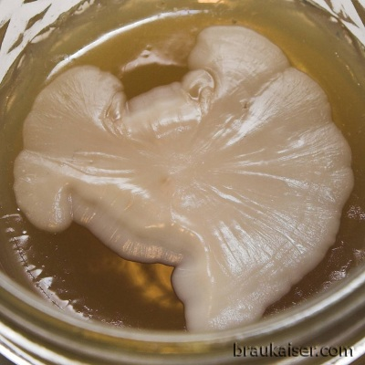
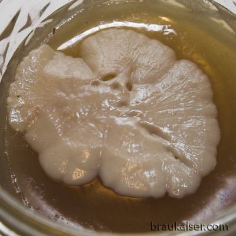
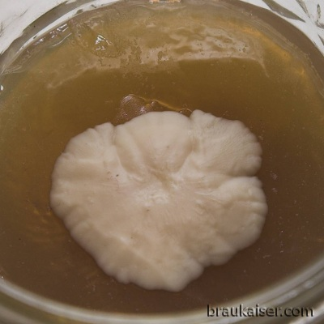
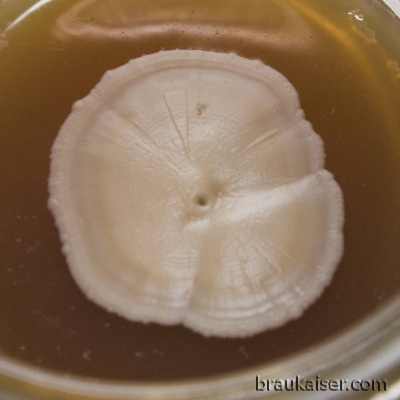
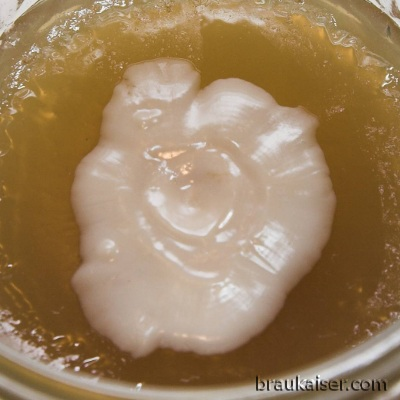
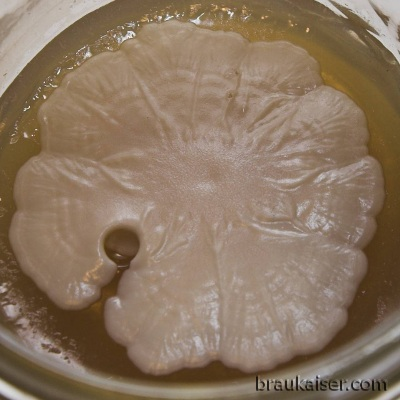

# Yeast Bank Contents

*From German brewing and more — Braukaiser.com*

A reference list of the yeast strains maintained in this home brewer's yeast bank, mostly intended for fellow club members. Strain origins are taken from Kristen England's yeast comparison chart hosted at [mrmalty.com](http://www.mrmalty.com/yeast.htm).

Some entries include pictures of **giant colonies** — yeast colonies grown on thick agar, which allows for a much larger colony than is possible on standard petri dishes.

---

## Contents

1. [Lager](#lager)
   - German: WLP830, WLP800, WY2042, WLP833, WY2206
   - American: WY2007, WY2035
2. [Ale (other than Belgian or Weissbier)](#ale)
   - German: WY1007, WY2565
   - British: WLP002, WY1084
   - American: WLP001
3. [Weissbier](#weissbier)
   - WLP300, WY3068, WLP351-1, WLP351-2, KLWB, SCHN, KUCH
4. [Belgian](#belgian)
   - Hennepin
5. [Other bugs](#other-bugs)

---

## Lager

### German

#### WLP830

- **Origin:** White Labs vial
- **First cultured:** April 2008
- **Storage:** slant and stab cultures
- **Strain origin:** Weihenstephan yeast bank W34/70 — the most commonly used yeast in German lager brewing
- **Notes:** [White Labs WLP830 strain description](http://whitelabs.com/beer/strains_wlp830.html)

#### WLP800

- **Origin:** given by a fellow home brewer
- **First cultured:** March 2008
- **Storage:** slant and stab cultures
- **Strain origin:** Pilsner Urquell
- **Notes:** [White Labs WLP800 strain description](http://whitelabs.com/beer/strains_wlp800.html)

#### WY2042

- **Origin:** yeast samples given by a fellow home brewer
- **First cultured:** April 2008
- **Storage:** slant culture
- **Strain origin:** Miller via Carlsberg
- **Notes:** [Wyeast WY2042 — Danish Lager](http://www.wyeastlab.com/hb_yeaststrain_detail.cfm?ID=28)

*Giant colony — WY2042 Danish Lager*

#### WLP833

- **Origin:** yeast samples given by a fellow home brewer
- **First cultured:** April 2008
- **Storage:** slant culture
- **Strain origin:** Brauerei Aying
- **Notes:** [White Labs WLP833 strain description](http://whitelabs.com/beer/strains_wlp833.html)

#### WY2206

- **Origin:** Activator pack
- **First cultured:** March 2007
- **Storage:** slant culture
- **Strain origin:** Weihenstephan yeast bank W206
- **Notes:** [Wyeast WY2206 strain description](http://www.wyeastlab.com/hb_yeaststrain_detail.cfm?ID=132)

*Giant colony — WY2206 Bavarian Lager*

---

### American

#### WY2007

- **Origin:** Activator pack
- **First cultured:** April 2007
- **Storage:** slant culture
- **Strain origin:** Budweiser, Anheuser-Busch — confirmed after a paper from Charlie Bamforth using this strain
- **Notes:** [Wyeast WY2007 — Pilsen Lager](http://www.wyeastlab.com/hb_yeaststrain_detail.cfm?ID=26)

#### WY2035

- **Origin:** Propagator pack
- **First cultured:** November 2010
- **Storage:** slant culture, stab culture
- **Strain origin:** August Schell
- **Notes:** [Wyeast WY2035 — American Lager](http://www.wyeastlab.com/rw_yeaststrain_detail.cfm?ID=27)

---

## Ale

*(other than Belgian or Weissbier)*

### German

#### WY1007

- **Origin:** Activator Pack
- **First cultured:** December 2006
- **Storage:** slant and stab culture
- **Strain origin:** Zum Uerige, Altbier brewery in Düsseldorf, Germany
- **Notes:** [Wyeast WY1007 — German Ale](http://www.wyeastlab.com/hb_yeaststrain_detail.cfm?ID=150)

*Giant colony — WY1007 German Ale*

#### WY2565

- **Origin:** Activator Pack
- **First cultured:** May 2007
- **Storage:** slant and stab culture
- **Strain origin:** Weihenstephan W165
- **Notes:** [Wyeast WY2565 — Kölsch](http://www.wyeastlab.com/hb_yeaststrain_detail.cfm?ID=144)

---

### British

#### WLP002

- **Origin:** White Labs vial
- **First cultured:** October 2008
- **Storage:** slant and stab culture
- **Strain origin:** Fullers
- **Notes:** [White Labs WLP002 strain description](http://whitelabs.com/beer/strains_wlp002.html)

*Giant colony — WLP002 English Ale*

#### WY1084

- **Origin:** fellow home brewer
- **First cultured:** April 2010
- **Storage:** slant and stab culture
- **Strain origin:** Guinness
- **Notes:** [Wyeast WY1084 — Irish Ale](http://www.wyeastlab.com/hb_yeaststrain_detail.cfm?ID=6)

---

### American

#### WLP001

- **Origin:** White Labs vial
- **First cultured:** unknown
- **Storage:** slant and stab culture
- **Strain origin:** Sierra Nevada
- **Notes:** [White Labs WLP001 strain description](http://whitelabs.com/beer/strains_wlp001.html)

*Giant colony — WLP001 California Ale*

---

## Weissbier

#### WLP300

- **Origin:** 6-month-old White Labs vial
- **First cultured:** February 2007
- **Storage:** slant and stab culture
- **Strain origin:** Weihenstephan yeast bank W68
- **Notes:** [White Labs WLP300 strain description](http://whitelabs.com/beer/strains_wlp300.html)

#### WY3068

- **Origin:** Activator pack
- **First cultured:** May 2008
- **Storage:** slant culture
- **Strain origin:** Weihenstephan yeast bank W68 — the most popular Weissbier yeast in Germany
- **Notes:** [Wyeast WY3068 — Weihenstephan Weizen](http://www.wyeastlab.com/hb_yeaststrain_detail.cfm?ID=135)

*Giant colony — WY3068 Weihenstephan Weizen*

#### WLP351-1

- **Origin:** old White Labs vial
- **First cultured:** September 2006
- **Storage:** slant and stab culture
- **Strain origin:** Weihenstephan yeast bank W175 — likely mutated from the original strain
- **Notes:** This strain behaves unusually — it ferments well past the attenuation limit seen by other strains and shows very poor head retention. It does, however, produce a strong clove aroma. See [Weissbier Experiment — Different yeasts](http://braukaiser.com/lifetype2/index.php?op=ViewArticle&articleId=103&blogId=1) for more.

#### WLP351-2

- **Origin:** given by a fellow home brewer
- **First cultured:** March 2008
- **Storage:** slant culture
- **Strain origin:** Weihenstephan yeast bank W175 — not yet checked for mutation
- **Notes:** [White Labs WLP351 strain description](http://whitelabs.com/beer/strains_wlp351.html)

#### KLWB

- **Origin:** cultured from the dregs of a bottle of Koenig Ludwig Weissbier
- **First cultured:** November 2009
- **Storage:** slant culture
- **Strain origin:** Koenig Ludwig Weissbier bottle
- **Notes:** Unknown whether this is the primary fermentation strain or a separate bottling yeast.

#### SCHN

- **Origin:** cultured from a bottle of Schneider Weisse Original
- **First cultured:** July 2012
- **Storage:** slant culture
- **Strain origin:** Schneider Brewery, Kelheim, Germany
- **Notes:** Based on appearance under the microscope and fermentation tests, this is a true Weissbier yeast and not a separate bottling strain.

#### KUCH

- **Origin:** cultured from a bottle of Kuchelbauer Weisse
- **First cultured:** July 2012
- **Storage:** slant culture
- **Strain origin:** Weissbierbrauerei Kuchelbacher, Abensberg, Germany
- **Notes:** Based on appearance under the microscope and fermentation tests, this is a true Weissbier yeast and not a separate bottling strain.

---

## Belgian

#### Hennepin

- **Origin:** fellow homebrewer, cultured from a bottle of Hennepin (Brewery Ommegang)
- **First cultured:** April 2010
- **Storage:** slant culture
- **Strain origin:** bottle of Hennepin (Brewery Ommegang)
- **Notes:** not yet used

---

## Other Bugs

*(no entries at time of writing)*

---

*Source: [braukaiser.com](http://braukaiser.com/wiki/index.php?title=Yeast_Bank_contents) — Content available under Attribution-NonCommercial 3.0 Unported.*
