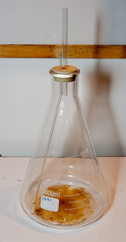
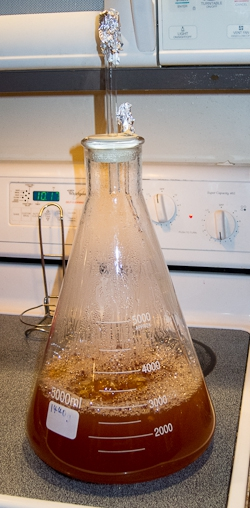
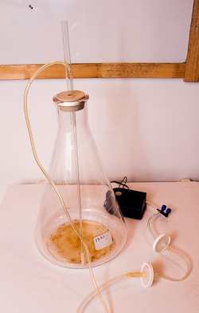
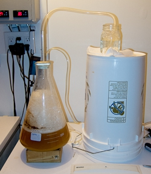
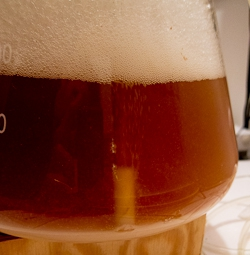

# Yeast Propagator

*From German brewing and more — Braukaiser.com*

A DIY yeast propagator inspired by the Carlsberg Flask design, providing heat sterilization, continuous stirring, and active aeration during yeast propagation.

---

## Contents

1. [Motivation](#motivation)
2. [Design and Use](#design-and-use)
3. [Performance](#performance)
4. [References](#references)

---

## Motivation

It is well established that yeast propagation is best done with plenty of oxygen. While the sugar concentration in propagation worts is high enough to inhibit fully aerobic sugar metabolism, the added oxygen is still beneficial — yeast can synthesize and store more **sterols** for healthy cell walls.

In the oxygen-depleted environment of brewing fermentation, sterol reserves are equally divided between mother and daughter cell when budding occurs. This can lead to insufficient sterol levels after the growth phase — precisely when strong cell walls are needed to withstand increasing alcohol concentrations.

During the early phase of yeast propagation on a stir plate, the starter beer is saturated with dissolved O₂ at around 8 ppm. This results from the vortex formed by stirring, which continuously mixes beer with headspace air. As yeast growth progresses and CO₂ is produced, O₂ concentration in the headspace gradually declines. Additionally, a kräusen forms which further inhibits contact between air and beer.

Inspired by the design of the **Carlsberg Flask** — a vessel that can be completely sterilized before yeast addition and which allows for aeration before and during propagation — these were the design requirements:

- Heat sterilization of the vessel and the wort
- Keeping yeast in suspension during propagation
- Continuous aeration during propagation

---

## Design and Use

The propagator uses a **5,000 ml Erlenmeyer flask** (available from homebrew suppliers). A size 12 foodgrade stopper with two drilled holes holds two glass tubes:

- A **large glass tube** connected to a blow-off hose
- A **small glass tube** bent over a flame (to keep it out of the path of the stir bar) connected to a sterile air filter and an aquarium air pump; an aquarium air stone fits over its end

A **magnetic stir bar** keeps the yeast in suspension throughout propagation.

*Figure 1 — The assembled propagator: 5 L Erlenmeyer flask with stopper, blow-off tube, and air inlet tube with air stone*

**Sanitization:** The wort and the propagator are sanitized together on the stovetop through boiling. Take care that the boil is not too vigorous, as this can blow liquid through the blow-off tube. The glass parts can alternatively be sanitized with a chemical sanitizer like StarSan, but the ability to sanitize both device and wort simultaneously is the key advantage of heat-resistant glassware.

The aquarium pump connects through sterile air filters in series to the air inlet. A small flow-control valve (available at aquarium supply stores) allows adjustment of the air flow and reduction of foaming inside the flask.

*Figure 2 — Aquarium pump connected through sterile air filters; a small valve controls air flow to minimize foaming*

> **Safety note:** When the starter is fermenting and the blow-off tube is submerged in water (or could become clogged), **never shut off the air supply** without first pinching off the air hose or using another means to prevent beer from being siphoned back through the air stone and into the air hose and filters. A check valve from an aquarium supply store is useful here.

**During propagation:** Air is pumped into the propagator at a slow rate while the stir plate keeps yeast in suspension. Excess kräusen is blown off through the blow-off tube.

> **Note:** Due to the increased kräusen formation caused by the constant aeration, this propagation method is **only suited for bottom-fermenting (lager) yeast**. Top-fermenting yeast rises into the kräusen and too much would be blown off and lost.

*Figure 3 — Propagator in action: air bubbling in, kräusen visible, stir plate keeping yeast in suspension*

*Figure 4 — Close-up of the air stone with bubbles rising through the wort; stir plate is off, showing yeast sediment*

**Harvesting:** When propagation is complete, disconnect the air hose and place the propagator in the fridge to allow the yeast to settle. When ready to pitch, decant the spent starter beer and weigh the flask with yeast cake and stir bar. With the empty weight known, the yeast cake weight can be calculated.

> Each gram of freshly propagated yeast (minimal trub content) contains approximately **4–5 billion cells**. 20 L (~5 gal) of 12 °P lager beer requires about 90–100 g of yeast sediment for pitching.

*Figure 5 — Yeast settled at the bottom of the flask after refrigeration, ready for decanting and pitching*

---

## Performance

With constant aeration and stirring, yeast yield is approximately **1.5–2.0 billion new cells per gram of extract** — slightly higher than stirring alone without constant aeration, which yields approximately **1.2–1.6 billion new cells per gram of extract**. These figures were taken from records kept across various propagation methods.

---

## References

1. CPE Systems — [Carlsberg Flask](http://www.cpesystemsinc.com/cpeproducts.asp?rcdno=539)
2. Alfa Laval — [SCANDI BREW® Carlsberg Flask](http://www.alfalaval.com/solution-finder/products/scandi-brew-carlsberg%20flask/pages/scandi-brew-carlsberg-flask.aspx)

---

*Previous: [Growing Yeast from a Plate](growing-yeast-from-a-plate)*

*Source: [braukaiser.com](http://braukaiser.com/wiki/index.php?title=Yeast_Propagator) — Content available under Attribution-NonCommercial 3.0 Unported.*
