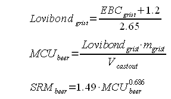
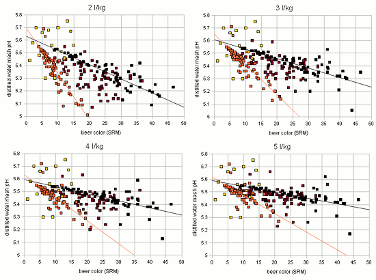
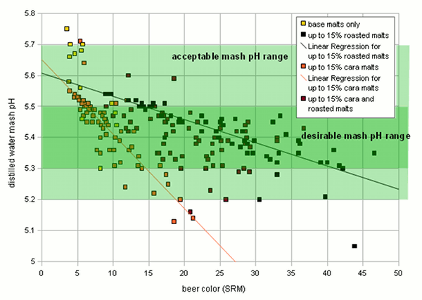
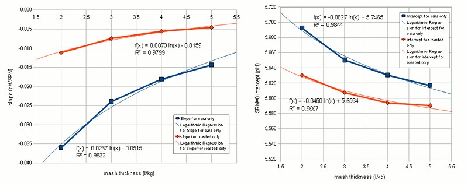
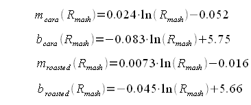
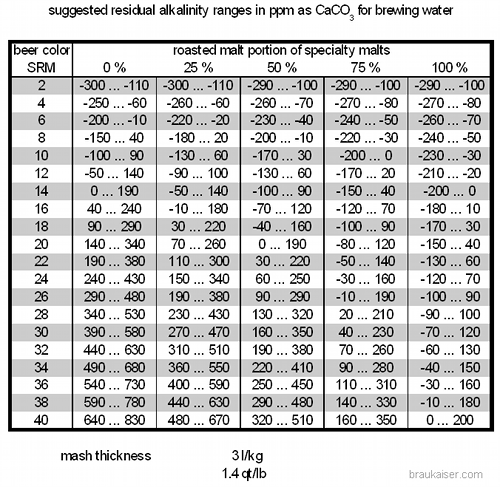
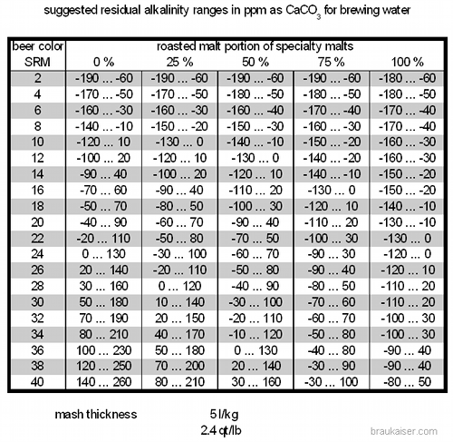

# Beer Color, Alkalinity and Mash pH

*From German brewing and more — Kai Troester, braukaiser.com*

Mash pH is the result of the balance between **grist acidity** and **water alkalinity**. The acidity of the grist is determined by the malts used — darker malts are generally more acidic than lighter ones. The color of the malts used also largely determines the beer color. Water alkalinity (more precisely, its **residual alkalinity**) is determined by its mineral composition. It therefore stands to reason that beer color and water composition — necessary for a proper mash pH — are related.

This article uses results from [mash pH experiments](brewing/effect-of-water-and-grist-on-mash-ph) to illuminate the relationship between beer color, mash pH and water composition. It develops a formula that can be used to make a crude prediction of the mash pH, or the alkalinity necessary for a given mash pH, based on the color and mash thickness of the beer.

---

## Contents

1. [Malt Color, Type and Acidity](#malt-color-type-and-acidity)
2. [Random Recipe Creation and pH/Color Calculations](#random-recipe-creation-and-phcolor-calculations)
3. [Considering Residual Alkalinity](#considering-residual-alkalinity)
4. [Simple Guidelines for Beer Color and Suitable Brewing Waters](#simple-guidelines-for-beer-color-and-suitable-brewing-waters)
5. [Final Remarks](#final-remarks)

---

## Malt Color, Type and Acidity

Brewers know that darker malts are more acidic. But what does malt acidity actually mean? The malts certainly don't taste sour.

**Malt acidity** is the malt's ability to lower mash pH. It can be measured two ways:

1. **Distilled water mash pH** — The pH of a mash made with mineral-free water. In the absence of pH-affecting water ions, the mash pH is determined only by malt acidity and mash thickness. This works well for base malts.
2. **Titration** — A sample from such a mash is treated with a strong base (e.g. sodium hydroxide) until a predetermined pH (e.g. 5.7) is reached. The amount of base added per unit of malt is a direct measure of the malt's acidity. This method works better for specialty malts, which are generally much more acidic than base malts.

From the mash pH experiments, the following formula was developed for calculating the distilled water pH of a given grist:



Where:
- **pH_DIwater_mash** = the mash pH of the grist in distilled water
- **pH_bi** = the distilled water mash pH of base malt *i*
- **g_bi** = the contribution of base malt *i* to the weight of the grist (0–1)
- **g_sj** = the contribution of specialty malt *j* to the weight of the grist (0–1)
- **a_sj** = the acidity of specialty malt *j* in mEq/kg
- **R_mash** = the mash thickness in l/kg

In plain English: the weighted average of the distilled water mash pH for all base malts and the titration endpoint for specialty malts (pH 5.7) is calculated, then lowered by the acidity of the specialty malts. The more acidic they are, the higher their grist percentage, and the thicker the mash — the lower the mash pH of the grist will be.

---

## Random Recipe Creation and pH/Color Calculations

Using measured values for the distilled water pH of selected base malts and acidity of selected specialty malts, **210 recipes were simulated** with the following constraints:

- **15 recipes** used only base malts
- **45 recipes** mixed base malts with up to 15% crystal malts
- **45 recipes** mixed base malts with up to 8% crystal malts and up to 8% roasted malts
- **45 recipes** used only roasted malts as specialty malts

Crystal and roasted malts were treated as distinct groups since they formed distinct clusters when their acidity was plotted against their color.

For all random recipes, the distilled water mash pH and the beer color (SRM) were calculated at 4 mash thicknesses: 2, 3, 4 and 5 l/kg.



*Figure 1 — Distilled water mash pH over beer color for 210 randomly generated recipes (3 l/kg mash thickness)*

Key observations from this chart:

- There is no single simple curve that estimates grist pH from beer color alone.
- A wide range of beer colors can yield a grist pH in the desired range, even before water residual alkalinity is considered.
- **"Crystal only"** and **"Roasted only"** recipes form distinct clusters that can each be approximated with a linear function.
- Roasted malts provide less pH drop per unit of color compared to crystal malts — roasted malts have less acidity per unit of color.



*Figure 2 — Grist pH over SRM for 210 random recipes at 4 different mash thicknesses. The groupings remain the same; only the linear function parameters change.*

This led to the idea of estimating grist pH from color, mash thickness and the **percentage of roasted malts** in the specialty malt portion of the grist. Using standard linear function notation:

```
pH_grist = m(R_mash, p_roasted) × SRM + b(R_mash, p_roasted)
```

Where:
- **m** = slope of the linear function (depends on mash thickness and roasted malt percentage)
- **b** = y-intercept (depends on mash thickness and roasted malt percentage)
- **p_roasted** = percentage of roasted malts in the specialty malt portion of the grist (0–100%)

The slope and y-intercept are determined by simple interpolation between the values for "cara only" and "roasted only" recipes.



*Figure 3 — Linear function parameters slope (right) and y-intercept (left) shown as a function of mash thickness. The thin curves represent a logarithmic approximation used to estimate parameters for any mash thickness between 2 and 5 l/kg.*

The regression analysis produced the following formulas for the "cara only" and "roasted only" SRM-to-grist-pH parameters:



---

## Considering Residual Alkalinity

Once the acidity of the grist is known, the **residual alkalinity (RA)** of the water must be considered to estimate the actual mash pH. Mash pH experiments showed that the pH shift caused by the water's residual alkalinity depends on both the RA and the mash thickness:

```
ΔpH = s_pH × RA
```

Where:
- **RA** = residual alkalinity in mEq/l
- **s_pH** = pH change per 1 mEq/l residual alkalinity change

This pH shift (ΔpH) is added to the distilled water pH of the grist to predict the actual mash pH:

```
pH_mash = pH_grist + ΔpH
```

---

## Simple Guidelines for Beer Color and Suitable Brewing Waters

Using the formulas above, simple guidelines for suitable brewing waters can be derived based on the beer color and roasted malt percentage of the specialty malt portion.

These tables assume a target mash pH between **5.3 and 5.5**.



*Table 1 — Suggested brewing water residual alkalinity ranges in ppm CaCO₃ for 3 l/kg (1.4 qt/lb) mashes, assuming a target pH of 5.3–5.5.*



*Table 2 — Suggested brewing water residual alkalinity ranges in ppm CaCO₃ for 5 l/kg (2.4 qt/lb) mashes, assuming a target pH of 5.3–5.5.*

It is apparent that for any given color, there is a **wide range of residual alkalinities** that are likely to yield a mash pH in the preferred range of 5.3–5.5. This explains why most brewers do just fine with their average water when brewing moderately colored beers.

---

## Final Remarks

The approach outlined here provides only a **crude estimation** of the mash pH. It will not be correct in all cases — in particular when the distilled water mash pH of the base malts differs significantly from the pH values used in the simulation. Another limitation is the range of mash thicknesses (2–5 l/kg), though this should cover most practical mashes.

---

*Source: [braukaiser.com](http://braukaiser.com/wiki/index.php?title=Beer_color,_alkalinity_and_mash_pH) — last modified 26 February 2010. Content available under Attribution-NonCommercial 3.0 Unported.*
