# The Effect of Brewing Water and Grist Composition on the pH of the Mash

*Dipl. Ing. Kai Troester, braukaiser.com — 2009*

Mash pH is an important brewing parameter that lays the foundation for the pH of subsequent brewing processes and the final product. During the mash, a proper mash pH is important for optimal enzymatic activity. While home brewers have a general understanding of how brewing water mineral content and grist acidity interact to settle on a mash pH, little has been published about the quantitative effects.

This paper sheds light on how malt and water react with each other and proposes a means of estimating mash pH from water and grist composition. Key findings:

- The distilled water mash pH of various base malts was determined. Darker malts are generally more acidic, but notable exceptions exist.
- The titratable acidity of specialty malts was measured. Crystal malts have more acidity per unit of color than roasted malts, which showed little difference in acidity despite a wide color range.
- Kolbach's pH-change formula based on residual alkalinity is generally **used incorrectly** in homebrew circles — it depends on more factors than just residual alkalinity.
- Chalk added without CO₂ is largely ineffective at raising mash pH above ~400–500 ppm additions.
- Mash thickness has a profound impact on how much pH changes when residual alkalinity changes; milling has the same effect but to a lesser extent.

---

## Contents

1. [Introduction](#introduction)
2. [Methods and Materials](#methods-and-materials)
3. [Results and Discussion](#results-and-discussion)
   - [3.1 Distilled Water Mash pH of Base Malts](#31-distilled-water-mash-ph-of-base-malts)
   - [3.2 Mixing Base Malts](#32-mixing-base-malts)
   - [3.3 The Acidity of Specialty Malts](#33-the-acidity-of-specialty-malts)
   - [3.4 Distilled Water Mash pH of Grists with Specialty Malts](#34-distilled-water-mash-ph-of-grists-with-specialty-malts)
   - [3.5 Distilled Water Mash pH of a Grist Containing Base and Specialty Malts](#35-distilled-water-mash-ph-of-a-grist-containing-base-and-specialty-malts)
   - [3.6 The Effect of Water Alkalinity](#36-the-effect-of-water-alkalinity)
   - [3.7 The Effect of Calcium and Magnesium](#37-the-effect-of-calcium-and-magnesium)
   - [3.8 Source of Alkalinity](#38-source-of-alkalinity)
   - [3.9 Mash Titration](#39-mash-titration)
   - [3.10 Mash Thickness](#310-mash-thickness)
   - [3.11 Grist Preparation](#311-grist-preparation)
4. [Conclusion](#conclusion)
5. [Appendix — Data Tables](#appendix--data-tables)

---

## Introduction

When grist and brewing water are mixed at dough-in, the mash settles at a pH determined by the buffer strength and pH characteristics of both the water and the grist. A mash pH in the range of **5.3–5.7** is generally accepted as adequate for brewing.

Early brewers noticed that some beers suit a particular water source while others do not — a major factor in the development of regional styles. During the mid-20th century, **Kolbach** investigated the relation between brewing water composition and 12°P cast-out wort pH, discovering that mash pH is affected by the water's alkalinity and its calcium and magnesium hardness. He defined **Residual Alkalinity** as:

```
RA = KH − (CH + ½MH) / 3.5
```

Where:
- **KH** = carbonate hardness
- **CH** = calcium hardness
- **MH** = magnesium hardness (all in dH)

Kolbach also found that changing residual alkalinity by 10 dH (3.55 mEq/l) changes the cast-out wort pH by **0.3 units**.

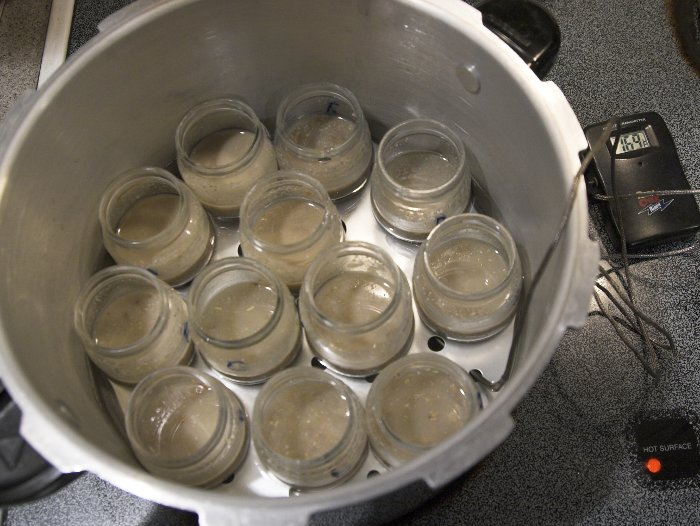

*Figure 1 — Relationship between beer color and optimal water residual alkalinity (Palmer). The upper RA curve is for beers whose color comes mainly from roasted malts; the lower curve is for beers colored by base and/or caramel/crystal malts.*

**DeLange** modeled the reaction between phosphate and calcium that releases protons and counteracts the pH-raising effect of alkalinity — the basis of Kolbach's residual alkalinity. He showed that calcium effectiveness depends on the phosphate concentration, mash pH and alkalinity itself.

**Palmer** proposed the chart in Figure 1 to guide brewers in estimating the required residual alkalinity for a given beer color. The relative affordability of reverse osmosis water systems now allows many homebrewers to build brewing water from scratch, creating a need for a better quantitative understanding of these effects.

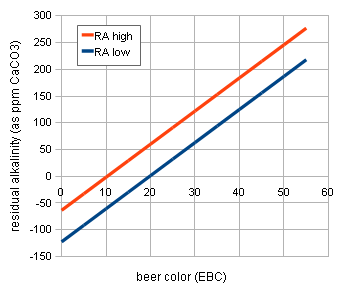

*Figure 2 — Mashing the mash samples in a water bath used for these experiments.*

---

## Methods and Materials

Experiments were small-scale mashes done in baby food jars set in a water bath, preheated to maintain a mash temperature between 60–65°C. Mash time was 10 minutes. After mashing, samples were cooled to 24–26°C in an ice bath and pH was measured with a Milwaukee SM101 pH meter, calibrated before each series with pH 4.00 and 7.00 buffer solutions at 25°C.

To minimize weighing errors, concentrated solutions of brewing salts were prepared and then diluted to the desired water profiles. The distilled water (tested at 0 TDS) was obtained from a drugstore.

Standard conditions unless otherwise noted:
- **Strike water**: 50 g
- **Mash thickness**: 4 l/kg (12.5 g grist)
- **Grist**: pulverized (using a coffee grinder on its finest setting)
- **Units**: SI throughout. Alkalinity expressed in mEq/l (1 mEq/l = 50 ppm as CaCO₃ = 2.81 dH)
- **EBC conversion**: °EBC = °L × 2.65 − 1.2

Titration experiments used 0.1 M NaOH (sodium hydroxide) or diluted muriatic acid (HCl, ~0.5% w/w). Alkalinity was determined by titration to pH 4.3.

---

## Results and Discussion

### 3.1 Distilled Water Mash pH of Base Malts

Base malts mashed with distilled water settle at a pH determined by the malt's acidity. Most malts have a natural buffer producing a distilled water mash pH of about **5.7–5.8**, which can be lowered by acidic melanoidins in more highly kilned malts.

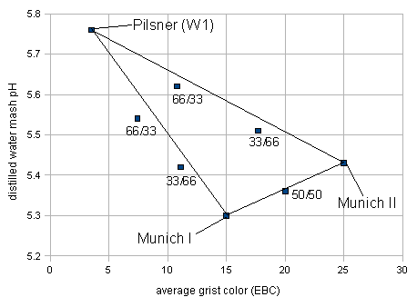

*Figure 5 — Distilled water mash pH for various base malts. (Pulverized grist, 4 l/kg, 10 min at 65°C)*

A loose correlation exists (R²=0.54) between malt color and distilled water mash pH, but there are notable exceptions. For example, Weyermann Munich I (half the color of Munich II) had a **lower** distilled water mash pH than the darker Munich II. Several lightly kilned malts (~4 EBC) showed pH values ranging from 5.56 to 6.04.

> **Conclusion:** The distilled water mash pH of a given base malt must be known for reasonably accurate mash pH prediction — it cannot be reliably inferred from color alone.

| Malt | Color (EBC) | Distilled Water pH |
|------|------------|-------------------|
| Pilsner (Weyermann) | 3.5 | 5.76 |
| Maris Otter Pale | 4.63 | 5.77 |
| 6-row (Briess) | 3.57 | 5.79 |
| Pilsner (Best Malz) | 3.8 | 5.73 |
| Wheat (Weyermann) | 4.0 | 6.04 |
| 2-row (Rahr) | 3.57 | 5.56 |
| Vienna (Weyermann) | 7.5 | 5.56 |
| Munich Light (Franco Belges) | 17.35 | 5.46 |
| Munich I (Weyermann) | 15 | 5.30 |
| Munich II (Weyermann) | 25 | 5.43 |

---

### 3.2 Mixing Base Malts

If malts behave like acids and distilled water mash pH is an indication of acid *quantity* (not strength), then the distilled water mash pH of a base malt mix should be the **weighted average** of the individual malt pHs:

```
pH_mix = Σ(pH_bi × g_bi)
```

Where **g_bi** = the grist fraction of base malt *i* (0–1).

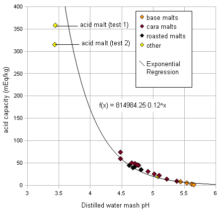

*Figure 6 — Distilled water mash pH for mashes made with up to two different malts. The triangle represents the arithmetic mean of the grist color and mash pH. (Pulverized grist, 4 l/kg, 10 min at 65°C)*

The measured mash pH for base malt mixes was slightly lower than expected from the weighted average, possibly due to uncontrolled factors between experiment series. For practical mash pH prediction, the weighted average is assumed to be a sufficient approximation.

---

### 3.3 The Acidity of Specialty Malts

Specialty malts are used in small amounts but contribute significant acidity. Their distilled water mashes were titrated to pH 5.7 with sodium hydroxide to determine **specific acidity** (mEq per kg of malt).

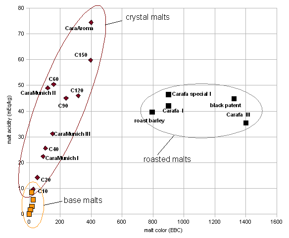

*Figure 3 — Acidity of various specialty malts. Orange points represent darker base malts. Note the distinct clustering of crystal and roasted malts. (Pulverized grist, 8 l/kg, 10 min at 65°C)*

Key findings:

- **Crystal malts** show specific acidity increasing at ~0.13 mEq·kg⁻¹·EBC⁻¹ (r²=0.77)
- **Roasted malts** have a specific acidity of ~40 mEq/kg **regardless of their color**
- Notable outliers exist: Weyermann CaraMunich II had higher acidity than the darker CaraMunich III

Formula to estimate crystal malt acidity:
```
a_i ≈ 1.4 × C_i   (mEq/kg, where C_i is color in EBC)
```

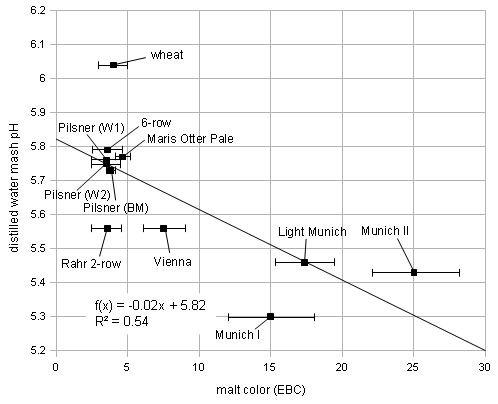

*Figure 4 — Correlation between the distilled water mash pH and specific acidity. The relationship is strong enough to use DI mash pH as a reliable proxy for specific acidity. (Pulverized grist, 8 l/kg, 10 min at 65°C)*

**Acidulated malt (Weyermann Sauermalz):** Two titration tests determined specific acidity of 315 mEq/kg and 358 mEq/kg, corresponding to ~2.85–3.22% lactic acid by weight, matching Weyermann's specification of ~3% (w/w).

---

### 3.4 Distilled Water Mash pH of Grists with Specialty Malts

When specialty malts are added to a grist, they lower the distilled water mash pH through acid addition. The pH drop was found to be a **linear function** of the acidity added per unit of strike water:

| Malt type | pH·l·mEq⁻¹ | r² |
|-----------|-----------|-----|
| Carafa I special | 0.12 | 0.99 |
| CaraMunich III | 0.15 | 0.99 |
| CaraAroma | 0.12 | 0.99 |
| All (average) | 0.14 | 0.97 |

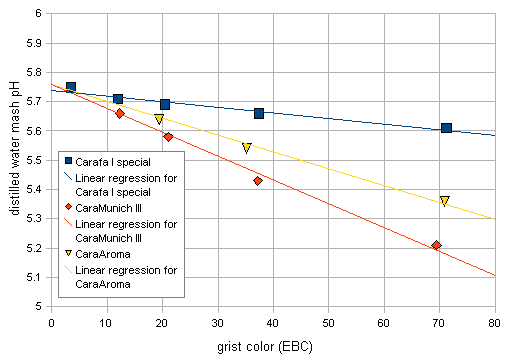

*Figure 7 — Distilled water mash pH of a grist with Pilsner malt and 3 different specialty malts at different grist percentages. Carafa malt has lower acidity per color than CaraMunich III and CaraAroma. (Pulverized grist, 4 l/kg, 10 min at 63°C)*

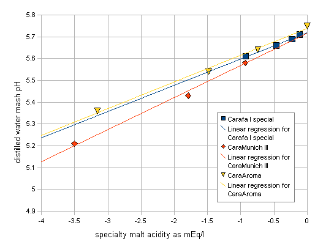

*Figure 8 — Distilled water mash pH vs. specialty malt acidity per unit of strike water (mEq/l). The linear relationship confirms that pH drop scales predictably with acidity. (Pulverized grist, 4 l/kg, 10 min at 63°C)*

The pH delta caused by specialty malts:
```
ΔpH = −0.14 × Σ(a_i × g_i) / R
```

Where **a_i** = specific acidity (mEq/kg), **g_i** = grist fraction (0–1), **R** = mash thickness (l/kg).

---

### 3.5 Distilled Water Mash pH of a Grist Containing Base and Specialty Malts

Combining the previous findings, the proposed formula for estimating the distilled water mash pH of a complete grist:

```
pH_grist = Σ(pH_bi × g_bi) + 5.7 × Σ(g_sj) − [0.14 × Σ(a_sj × g_sj)] / R
```

Where:
- **pH_bi** = distilled water mash pH of base malt *i*
- **g_bi** = grist fraction of base malt *i* (0–1)
- **g_sj** = grist fraction of specialty malt *j* (0–1)
- **a_sj** = specific acidity of specialty malt *j* (mEq/kg)
- **R** = mash thickness (l/kg)

In plain English: the weighted average of base malt DI pH values and the titration endpoint (5.7) for specialty malts is calculated, then adjusted downward by the pH shift from specialty malt acidity.

---

### 3.6 The Effect of Water Alkalinity

Brewing water is not distilled water — its mineral content, particularly bicarbonates, calcium and magnesium, also affects mash pH.

**Alkalinity** is a measure of the buffer capacity of the water's carbonate system and has a profound impact on mash pH. Three grists (single base malt, base malt mix, base malt + specialty malt) were evaluated over a wide alkalinity range, from negative (HCl addition) to positive (NaHCO₃ addition).

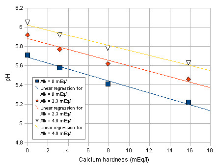

*Figure 9 — Mash pH as a function of water alkalinity for various grists. (Pulverized grist, 4 l/kg, 10 min at 63°C, general hardness 0 mEq/l)*

The mash pH values can be approximated with a linear function with slope **s_pH = 0.061 pH·l·mEq⁻¹** (r²=0.97):

```
pH_mash = pH_grist_DI + s_pH × Alk_water
```

Where **s_pH** ≈ 0.061 pH·l·mEq⁻¹ for 4 l/kg mashes.

> **Note:** Expressed as pH/dH, this slope is 0.022 pH/dH — different from the 0.03 pH/dH Kolbach found, because Kolbach measured the pH of the **cast-out wort** (equivalent to a much thinner mash). Later experiments show that s_pH increases as mash thickness decreases.

---

### 3.7 The Effect of Calcium and Magnesium

Calcium and magnesium affect mash pH through acidic reactions with malt phosphates — the basis of Kolbach's residual alkalinity concept. Two series of 12 mashes each were done with Pilsner malt at varying calcium and magnesium concentrations.

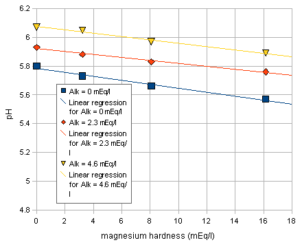

*Figure 10 — Mash pH as a function of the calcium content of the brewing water. (Pulverized grist, 4 l/kg, 10 min at 63°C)*

**Calcium results:** The average pH·l·mEq⁻¹ slope was −0.028 for calcium. Depending on water alkalinity, **2.6–3.1 equivalents of calcium** are needed to neutralize one equivalent of alkalinity. This is similar to Kolbach's finding of 3.5 equivalents.

| Alkalinity (mEq/l) | pH·l·mEq⁻¹ | r² | Ca to neutralize 1 mEq alk |
|--------------------|-----------|-----|---------------------------|
| 0 | −0.031 | 0.984 | 2.6 |
| 2.3 | −0.028 | 0.965 | 2.8 |
| 4.6 | −0.026 | 0.971 | 3.1 |

**Magnesium results:** The pH-lowering effect of magnesium is approximately **half that of calcium**. Depending on alkalinity, **4.8–6.7 equivalents of magnesium** are needed to neutralize one equivalent of alkalinity (Kolbach found 7).

| Alkalinity (mEq/l) | pH·l·mEq⁻¹ | r² | Mg to neutralize 1 mEq alk |
|--------------------|-----------|-----|---------------------------|
| 0 | −0.014 | 0.980 | 4.8 |
| 2.29 | −0.010 | 0.985 | 6.5 |
| 4.57 | −0.012 | 0.985 | 5.7 |

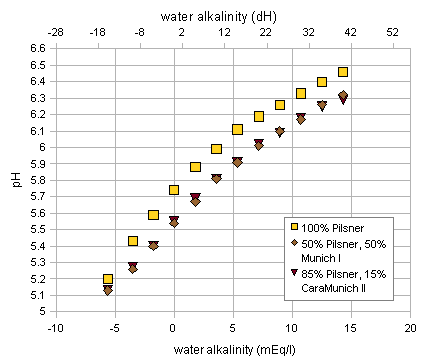

*Figure 11 — pH over the magnesium hardness of the brewing water for waters with 3 different alkalinities. (Pilsner malt, pulverized grist, 4 l/kg, 10 min at 63°C)*

> Kolbach's findings — that magnesium is about half as effective as calcium in neutralizing alkalinity — have been confirmed within measurement error.

---

### 3.8 Source of Alkalinity

Previous experiments used sodium bicarbonate (NaHCO₃) as the alkalinity source. This section evaluates **chalk (CaCO₃)** — both dissolved with CO₂ and suspended without CO₂.

**Dissolved chalk (CO₂ method):** Chalk dissolved in CO₂-pressurized water performs similarly to sodium bicarbonate water, producing a linear mash pH increase proportional to chalk concentration.

**Suspended chalk (undissolved):** Chalk added directly to brewing water or mash without CO₂ is much less effective. The mash pH **plateaus** above ~500 mg/l chalk addition; the ceiling correlates with the grist's distilled water mash pH, not the actual mash pH.

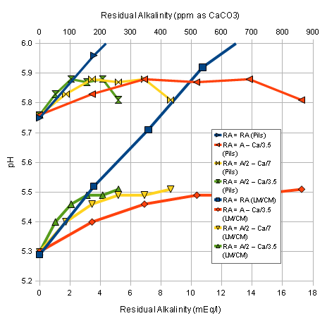

*Figure 12 — Mash pH as a function of chalk (CaCO₃) concentration in the brewing water for suspended and dissolved chalk with two grists. (Pulverized grist, 68°C, 25 min, 4 l/kg)*

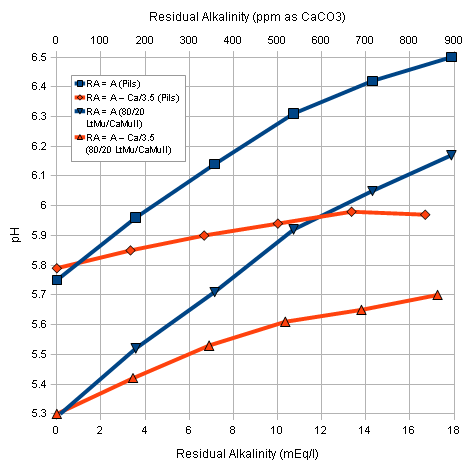

*Figure 13 — pH vs. residual alkalinity for sodium bicarbonate and dissolved chalk waters. (100% Weyermann Pilsner and 80%/20% Franco Belges Light Munich / Weyermann CaraMunich II, pulverized grist, 68°C, 25 min, 4 l/kg)*

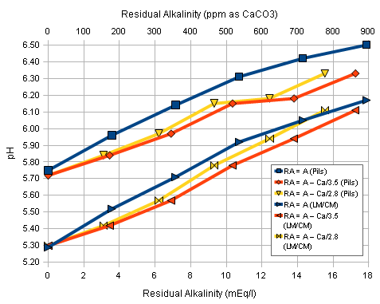

*Figure 14 — pH for waters prepared with sodium bicarbonate vs. suspended chalk. (Pulverized grist, 68°C, 25 min, 4 l/kg)*

There is ambiguity about the alkalinity contributed by undissolved chalk. Three residual alkalinity assumptions were compared for suspended chalk:

- **RA = A − Ca/3.5** — chalk contributes 100% of its alkalinity potential; all calcium reacts (Kolbach's formula)
- **RA = A/2 − Ca/7** — chalk contributes only 50% of its alkalinity; half its calcium reacts
- **RA = A/2 − Ca/3.5** — chalk contributes 50% alkalinity; all calcium still reacts (common homebrew assumption)

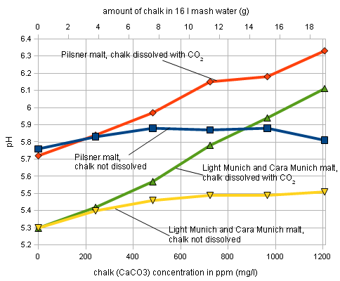

*Figure 15 — pH for mashes prepared with sodium bicarbonate or sodium bicarbonate + calcium chloride waters, simulating the calcium/alkalinity balance of chalk. (Pulverized grist, 68°C, 25 min, 4 l/kg)*

The data suggests that for suspended chalk contributions up to ~3–4 mEq/l, the formula **RA = A/2 − Ca/7** best describes the behavior — i.e. undissolved chalk contributes only half its alkalinity and half its calcium should be considered.

> **Practical implication:** To raise mash pH with chalk, dissolve it first with CO₂. Undissolved chalk additions above 500 ppm have little or no effect.

---

### 3.9 Mash Titration

A mash sample was titrated with 0.1 M NaOH. When expressed in mEq/l of strike water, the titration curve slope was **0.104 pH·l·mEq⁻¹**, approximately **twice as steep** as the pH-over-alkalinity slope (0.050 pH·l·mEq⁻¹) for the same mash.

This factor of ~2 relationship between titration slope and alkalinity slope was also observed for the pH-lowering effect of specialty malt acidity, and is consistent with the buffer theory of mash systems.

---

### 3.10 Mash Thickness

Mash thickness has a profound effect on mash pH. Thinner mashes contain more water per unit of malt and therefore more alkalinity per unit of malt, resulting in a **higher mash pH** for waters with the same alkalinity.

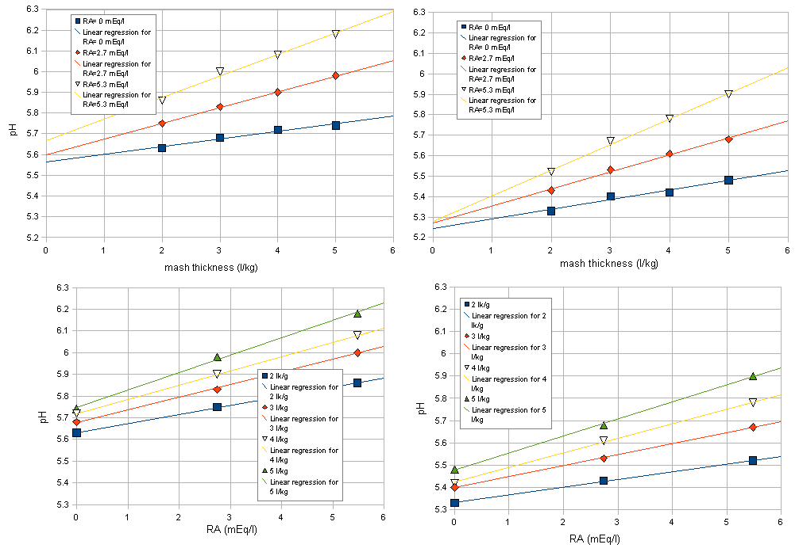

*Figure 18 — Mash thickness and pH for Pilsner malt (left) and Light Munich malt (right) at various residual alkalinities. Top graphs show pH vs. mash thickness for different RA waters; bottom graphs show pH vs. RA for different mash thicknesses. (Pulverized grist, 10 min at 63°C)*

The pH-over-alkalinity slope **s_pH** depends on mash thickness:

| Mash thickness (l/kg) | Pilsner (pH·l·mEq⁻¹) | Light Munich (pH·l·mEq⁻¹) |
|-----------------------|----------------------|--------------------------|
| 2 | 0.042 | 0.035 |
| 3 | 0.058 | 0.049 |
| 4 | 0.066 | 0.066 |
| 5 | 0.080 | 0.077 |

This can be approximated as:
```
s_pH = 0.013 × R + 0.013
```

Where **R** = mash thickness in l/kg.

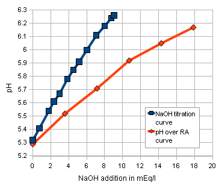

*Figure 17 — The pH/alkalinity slope (s_pH) as a function of mash thickness. (Pulverized grist, 10 min at 63°C)*

> Kolbach's slope of 0.03 pH/dH (0.084 pH·l·mEq⁻¹) corresponds to mashes of about 5 l/kg. His work measured 12°P **cast-out wort pH**, which is more dilute than a mash and equivalent to a much thinner effective mash.

---

### 3.11 Grist Preparation

Mill gap setting has a slight impact on s_pH — it is flatter for more finely ground grists and steeper for more coarsely ground grists.

| Mill gap (mm) | Pilsner (pH·l·mEq⁻¹) | Light Munich (pH·l·mEq⁻¹) |
|---------------|----------------------|--------------------------|
| 0 (pulverized) | 0.063 | 0.056 |
| 0.5 | 0.075 | 0.068 |
| 0.8 | 0.082 | 0.068 |
| 1.2 | 0.094 | 0.084 |

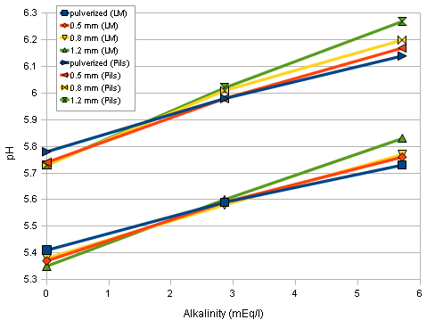

*Figure 19 — Mash pH over water alkalinity for malts milled at different mill gap settings. (NaHCO₃ water, 63°C, 10 min, 4 l/kg)*

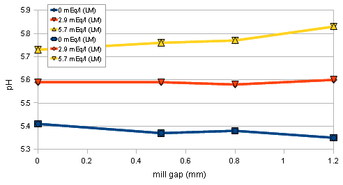

*Figure 20 — pH vs. mill gap setting for Franco Belges Light Munich at 3 alkalinity levels. (NaHCO₃ water, 63°C, 10 min, 4 l/kg)*

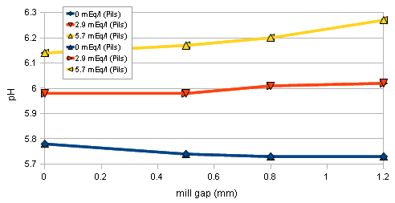

*Figure 21 — pH vs. mill gap setting for Weyermann Pilsner at 3 alkalinity levels. (NaHCO₃ water, 63°C, 10 min, 4 l/kg)*

These differences likely result from finely ground malt releasing more **buffering compounds** into the mash, making it more difficult for water alkalinity to raise the mash pH. Finely ground malt also tends to have a slightly higher distilled water mash pH, possibly because acidic compounds are more readily released than strongly buffering endosperm compounds.

---

## Conclusion

Investigation of parameters affecting mash pH showed that the relationships commonly used for predicting mash pH are based on a **misinterpretation of Kolbach's work** — he evaluated the effect of brewing water composition on a cast-out wort of 12°P, not the mash itself.

However, Kolbach's findings still apply qualitatively:

- Calcium and magnesium reduce mash pH through acidic reactions with malt phosphates. **Calcium is twice as effective as magnesium** in this reaction.
- The relationship between mash pH and alkalinity is **linear** over the brewing-relevant range, allowing prediction of pH change from water alkalinity, calcium and magnesium content.
- The slope of that linear function depends on **mash thickness** and, to a lesser extent, **grist preparation**.
- Chalk must be **dissolved with CO₂** to contribute its full alkalinity potential. Undissolved chalk additions above 500 ppm have little or no effect on mash pH.
- Grist composition: darker malts are generally more acidic, but exceptions exist. Crystal malts have more acidity per unit of color than roasted malts; all roasted malts tested showed nearly the same acidity despite a wide color range.

While additional work is needed to confirm these small-scale results in large-scale mashes, sufficient data is presented to give the interested brewer guidance in estimating mash pH from grist and water composition.

---

## Appendix — Data Tables

### Base Malts (Table 1 & 2)

| Malt | Maltster | Color (EBC) | DI Water pH |
|------|----------|------------|-------------|
| Pilsner (W1) | Weyermann | 3.5 | 5.76 |
| Maris Otter Pale | Thomas Fawcett & Son | 4.63 | 5.77 |
| Munich I | Weyermann | 15 | 5.30 |
| Munich II | Weyermann | 25 | 5.43 |
| 6-row | Briess | 3.57 | 5.79 |
| Pilsner (BM) | Best Malz | 3.8 | 5.73 |
| Wheat | Weyermann | 4.0 | 6.04 |
| 2-row | Rahr | 3.57 | 5.56 |
| Munich Light (FB) | Franco Belges | 17.35 | 5.46 |
| Vienna | Weyermann | 7.5 | 5.56 |

### Specialty Malts — Acidity (Table 4)

| Malt | Maltster | Color (EBC) | Acidity (mEq/kg) | DI pH | Type |
|------|----------|------------|-----------------|-------|------|
| CaraMunich III | Weyermann | 150 | 31.2 | 4.92 | crystal |
| CaraMunich II | Weyermann | 120 | 49.0 | 4.71 | crystal |
| CaraMunich I | Weyermann | 90 | 22.4 | 5.10 | crystal |
| CaraAroma | Weyermann | 400 | 74.4 | 4.48 | crystal |
| Crystal 10L | Briess | 25.3 | 9.6 | 5.38 | crystal |
| Crystal 20L | Briess | 51.8 | 14.2 | 5.22 | crystal |
| Crystal 40L | Briess | 104.8 | 25.6 | 5.02 | crystal |
| Crystal 60L | Briess | 157.8 | 50.4 | 4.66 | crystal |
| Crystal 90L | Briess | 237.3 | 45.0 | 4.77 | crystal |
| Crystal 120L | Briess | 316.8 | 46.0 | 4.75 | crystal |
| Crystal 150L | Briess | 396.3 | 59.8 | 4.48 | crystal |
| Roast Barley | Briess | 793.8 | 39.6 | 4.68 | roasted |
| Black Patent | Briess | 1323.8 | 44.8 | 4.62 | roasted |
| Carafa III | Weyermann | 1400 | 35.4 | 4.81 | roasted |
| Carafa I | Weyermann | 900 | 42.0 | 4.71 | roasted |
| Carafa I Special | Weyermann | 900 | 46.4 | 4.73 | roasted |
| Biscuit | unknown | unknown | 20.2 | 5.08 | other |
| Sauermalz | Weyermann | 5 | 315–358 | 3.43 | acidulated |

### Mash Thickness — pH/alk Slopes (Tables 15 & 16)

**Weyermann Pilsner (GH = 0 mEq/l):**

| Mash thickness (l/kg) | pH at RA=0 | pH at RA=2.7 | pH at RA=5.3 | s_pH (pH·l·mEq⁻¹) |
|-----------------------|-----------|-------------|-------------|------------------|
| 2 | 5.63 | 5.75 | 5.86 | 0.042 |
| 3 | 5.68 | 5.83 | 6.00 | 0.058 |
| 4 | 5.72 | 5.90 | 6.08 | 0.066 |
| 5 | 5.74 | 5.98 | 6.18 | 0.080 |

**Franco Belges Light Munich (GH = 0 mEq/l):**

| Mash thickness (l/kg) | pH at RA=0 | pH at RA=2.7 | pH at RA=5.3 | s_pH (pH·l·mEq⁻¹) |
|-----------------------|-----------|-------------|-------------|------------------|
| 2 | 5.33 | 5.43 | 5.52 | 0.035 |
| 3 | 5.40 | 5.53 | 5.67 | 0.049 |
| 4 | 5.42 | 5.61 | 5.78 | 0.066 |
| 5 | 5.48 | 5.68 | 5.90 | 0.077 |

---

*Source: Kai Troester, braukaiser.com, October 31, 2009. Some rights reserved — see [CC BY-NC 3.0](http://creativecommons.org/licenses/by-nc/3.0/) for license details.*
