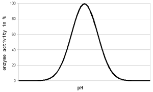
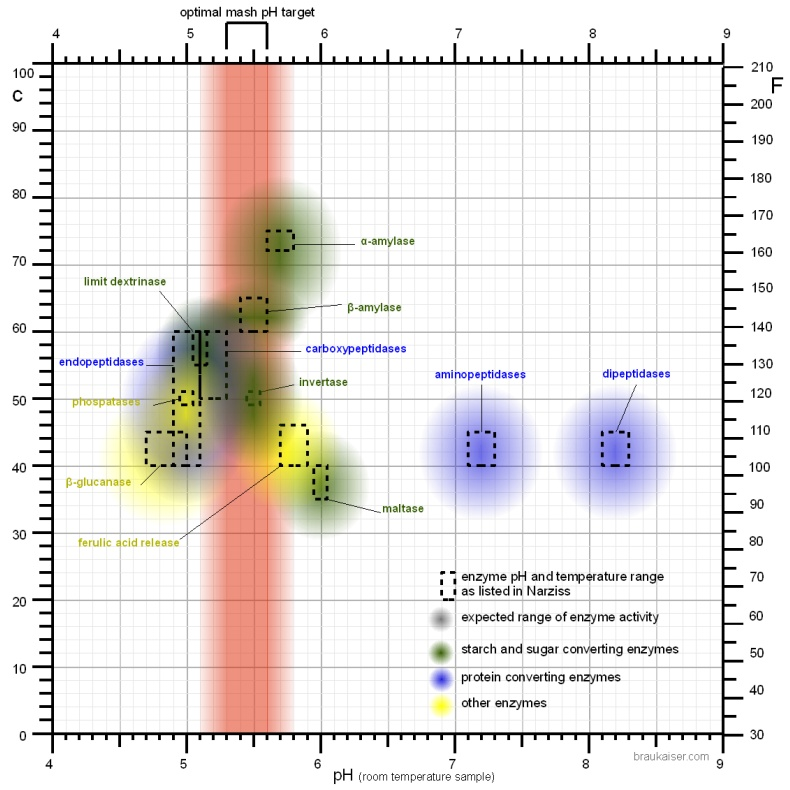
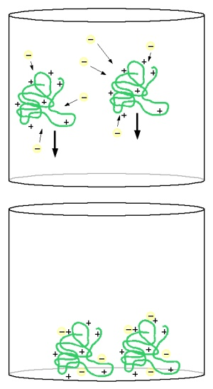
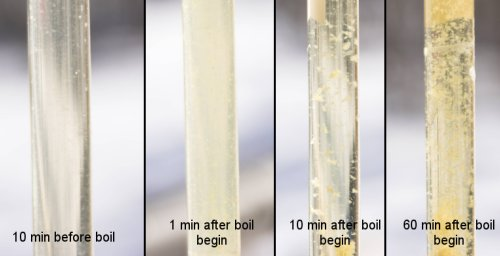
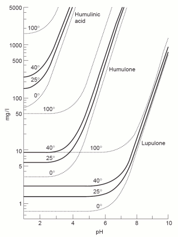
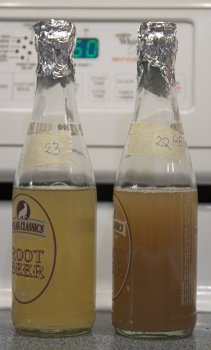

# How pH Affects Brewing

*From German brewing and more*

This is the second in a three-part series that takes the interested brewer through the topic of pH in brewing. The first part (*An Overview of pH*) explained the basics needed to understand this and the following part. This second part examines how pH affects various stages in the brewing process. The third part explains in detail how mash pH can be adjusted to reach the targeted level.

> As a word of caution, since the following details can be intimidating and cause unjust worries: pH is important during the brewing process, but in most cases the brewer does not have to worry about pH. If properly executed, brewing processes tend to settle at an adequate pH. As a result, pH is one of the last frontiers in brewing practice that homebrewers will encounter and worry about.

---

## Contents

1. [Enzymatic Activity](#enzymatic-activity)
   - 1.1 [pH Optima of Enzymes Other Than the Amylases](#ph-optima-of-enzymes-other-than-the-amylases)
   - 1.2 [Conclusion](#conclusion)
2. [Extraction of Tannins](#extraction-of-tannins)
3. [Protein Coagulation](#protein-coagulation)
4. [Hop Utilization](#hop-utilization)
5. [Maillard Reactions](#maillard-reactions)
6. [Nutrient Uptake by Yeast](#nutrient-uptake-by-yeast)
7. [Inhibition of Beer Spoilage Organisms](#inhibition-of-beer-spoilage-organisms)
8. [Clarifiers in Kettle and Fermenter](#clarifiers-in-kettle-and-fermenter)
9. [Beer Taste](#beer-taste)
10. [References](#references)

---

## Enzymatic Activity

All enzymes are proteins which rely on their shape for their function. This shape is primarily determined by the sequence of amino acids — the building blocks of proteins — and secondarily by interactions between those amino acids. The sequence of amino acids determines how the protein is folded into a shape that allows it to perform its function. That shape is also affected by electrostatic forces between electrically charged amino acids in the protein, causing charged amino acids to repel (same charge) or attract (opposite charge) each other.

As shown in the first part of this series, the distribution of electrical charges on a molecule depends on the pH of the environment. A high pH (low H⁺ concentration) will cause more amino acids to donate protons into the solution, leaving them negatively charged, whereas a low pH (high H⁺ concentration) has the opposite effect — other amino acids accept H⁺ and become positively charged. In order for enzymes to function, a proper balance of these charged amino acids must be present. That balance exists at and around the pH at which the enzyme is most effective.

*Figure 1 — For each enzyme there is an optimal pH at which it works best. The location and width of that optimum depends on the enzyme. The pH-dependent activity change is caused by changes of the enzyme's structure and electric charges, especially at or around the active sites which hold onto the substrate during the reaction.*

As long as the difference between the optimal and actual pH is low (1–2 pH units) the effect of pH on enzyme activity is **reversible**, since the enzyme is not permanently denatured. In practice this means pH can be corrected even after dough-in and few or no enzymes will be lost as a result of a suboptimal initial pH. However, once the pH is adjusted some enzymes may have already been denatured by heat before they got a chance to work at an optimal pH — particularly the more heat-labile **beta-amylase** and **limit dextrinase**.

In mashing we target mash pH to optimize the effectiveness of the most important mash enzymes: the **amylases**, which convert starch into sugar. In room-temperature tests the pH optimum for alpha-amylase has been found at 5.3, and for beta-amylase it is between 5.1 and 5.3 [Briggs, 2004]. When activity is evaluated at mashing temperatures and the pH of a cooled mash sample is measured, their optima appear at 5.7 and 5.4–5.6 respectively. This is the result of a pH shift in the mash when it is heated. At common starch conversion temperatures (65°C / 150°F) the pH of the mash appears **0.35 units lower** than that of a room-temperature mash sample [Briggs, 2004].

> When using a temperature-correcting pH meter to test mash samples at mash temperature and at room temperature, a pH shift of only ~−0.2 pH units was observed — less than the 0.35 reported by Briggs and other authors. The apparent 0.35 pH shift is assumed to be the combined result of an actual pH shift in the mash and a shift of the pH optimum of the enzyme itself.

Most homebrewers measure the pH of a **cooled mash sample** when checking pH. While pH meters can measure hot mash pH, doing so shortens the life of the probe. If colorpHast strips are used in the hot mash, their color reaction is the same or very close to their reaction in a room-temperature sample — but it should be noted that these strips report a pH approximately 0.3 lower than the actual pH.

A commonly accepted optimal range for mash pH is **5.2–5.7**, with 5.5 being optimal for starch conversion activity. However, many authors report wort and beer quality benefits if the pH is lowered into the 5.2–5.4 range [Kunze, 2007][Narziss, 2005]. Kunze lists the following benefits for a mash pH as low as 5.2:

- Enzymatic activity in the mash is increased as all important enzymes get activated (except alpha-amylase which starts to suffer below pH 5.6)
- More zinc — an essential yeast nutrient — goes into solution
- Extract yield (efficiency) is improved
- Protein coagulation and precipitation is improved (better break formation)
- Redox potential is improved, resulting in lower susceptibility to oxygen
- Run-off speed is improved
- Color increase during the wort boil is reduced
- Better trub precipitation and faster pH drop lead to faster fermentation and greater attenuation
- Lower viscosity improves filterability
- Beer taste is more rounded, fuller, and softer — crisper, fresher, with more character
- Hop bitterness is more pleasant and doesn't linger
- Foam is more stable and denser
- Beer color is lighter
- Mash oxidation is reduced since lipoxigenase enzyme doesn't work well at low mash pH
- Haze stability is improved
- Beer digestion is stimulated (a positive effect of lactic acid)
- Susceptibility to microbial spoilage is reduced through lower beer pH and higher attenuation

**The mash pH should not fall below 5.2.** At this point the activity of the amylase enzymes starts to suffer significantly. This is particularly important if sour mashing is used — just enough sour mash should be added to correct the pH, with the rest added towards the end of the mash when conversion of the main mash is complete.

Even a pH between 5.2–5.4 is already suboptimal for mashes with large amounts of enzymatically weak malts like **Munich-type malts**. Those mashes are better done above 5.4, closer to the pH optimum of alpha-amylase. Additionally, when **decoction mashing** is used, the mash pH should not be lower than 5.4 [Kunze, 2007] — boiling the decoctions lowers their pH which may lead to too low a mash pH for the already enzymatically weakened decoction mash.

---

### pH Optima of Enzymes Other Than the Amylases

The following is a collection of pH optimum data from Narziss' *Abriss der Bierbrauerei* [Narziss, 2005].

*Figure 2 — The temperature and pH optima of various mash enzymes as listed in [Narziss, 2005]. The fuzzy color spots are not based on specific data but are a crude illustration that enzymes are not only active within the dashed rectangles but also at pH and temperatures further from their optima.*

While the targeted mash pH is generally determined by the amylase enzymes, it also affects other enzymes that may be relevant in certain mashing schedules:

**Ferulic acid rest (35–40°C / 95–105°F):** The release of ferulic acid is reduced if the pH is below 5.7 [Narziss, 2005]. It is therefore advisable to add any acidulated malt — used for pH correction — after that rest has been completed.

**Phytase:** Very lightly kilned malts contain phytase, which releases phosphate from phytin present in the malt [deLange, 2004]. That phosphate release lowers the mash pH during the **acid rest** and also increases the buffer capacity of the mash, which may later make it more difficult for yeast to lower the beer pH [Kolbach, 1953]. Phytase has a pH optimum of about 5.0.

**β-Glucanase:** Most active between 40–50°C (104–122°F) and degrades beta-glucans. Its pH optimum is between 4.7 and 5.0 — slightly more acidic than the amylases.

**Proteases:** Four groups of protein-degrading enzymes exist in malt. Only **endopeptidases** (pH optimum 5.0) and **carboxypeptidases** (pH optimum 5.2) are active at mash pH levels. Dipeptidases (pH optimum 8.2) and aminopeptidases (pH optimum 7.2) require a more alkaline environment than mashing provides. The slightly more acidic preference of these active proteases explains the higher release of amino acids in lower-pH mashes.

High mash pH also favors the release of colored malt compounds into the mash [Lewis & Bamforth, 2006] — yet another reason to mash lighter beers at the lower end of the optimal pH range.

---

### Conclusion

Several enzymes are active in the mash with different pH optima, which can make it confusing to choose the proper mash pH. Some simple guidelines:

- Mash pH numbers are given for **room-temperature (20–25°C / 70–80°F)** mash samples
- Any mash pH between **5.3 and 5.8** should be sufficient for most mashes
- A mash pH between **5.2 and 5.5** is well suited for infusion mashes with enzymatically strong malts
- A mash pH **above 5.4** should be used for decoction mashes and/or enzymatically weak mashes (large amounts of Munich malt or adjuncts)

---

## Extraction of Tannins

**Tannins** are a chemical compound found in vegetative matter like grain husks, hops, grape skins, and tea leaves. In brewing the main source of tannins in wort is malt husks and hops. If present in excess they give the beer a dry, astringent, and sometimes puckering mouthfeel.

The solubility of tannins in water is affected by two factors: temperature and pH. The effect of temperature is straightforward — the higher the temperature, the more soluble most compounds (including tannins) generally are. But the effect of pH is more profound.

**Polyphenols** — which tannins are — are weak acids. They readily donate protons to their environment when the H⁺ concentration is low enough (i.e. the pH is high enough). Once a polyphenol molecule loses one or more protons it becomes negatively charged. Because of water's charged dipole nature, it is a great solvent for charged molecules — this is why tannin solubility increases as pH rises [Bogspot.com, 2009].

A generally accepted pH threshold is **5.8–6.0**. As a result, the mash pH is generally low enough to prevent excessive tannin extraction. However, sparging with high-alkalinity water can quickly consume the mash's buffer capacity and lead to pH levels above 6.0:

- High alkalinity water contains strong carbonate/bicarbonate buffers
- As sweet wort is diluted, the mash's ability to hold its pH weakens
- The sparge water's pH takes over and can raise pH above 6.0

**Ways to prevent pH rise during sparging:**

- **Limited sparging:** Stop sparging before the grain bed pH rises above 6.0. Lower the sparge water volume and increase the mash water volume. Pilsner beers are brewed with a mash thickness up to 5.5 L/kg (2.5 qt/lb) to limit sparge water volume [Narziss, 2005]. This method complies with the Reinheitsgebot.
- **Low-alkalinity sparge water:** Soft or RO water doesn't have enough buffer capacity to counteract the mash buffer even at high dilution rates. Add brewing salts to the kettle rather than the sparge water, and use plain water for sparging. (Not approved by the Reinheitsgebot.)
- **Sparge water acidification:** Lower the sparge water pH to 6.0 with acid — at that pH it will have only a weak buffer capacity and cannot significantly raise the mash pH. Compliant with the Reinheitsgebot if lactic acid derived from malt-based fermentation with malt-derived *Lactobacillus* is used.

---

## Protein Coagulation

As with enzyme activity and tannin extraction, a key effect of changing pH is its ability to change the electrical charges on molecules — and this is no different for proteins during wort boiling.

Proteins are chains of amino acids folded into a structure that allows them to function. Some amino acids are **hydrophilic** (react well with water) while others are **hydrophobic** (avoid water). In water-soluble proteins the hydrophobic amino acids face the center of the protein, allowing them to react with each other rather than with the surrounding water.

When a protein **coagulates**, its chain of amino acids is not broken but it loses its folded structure, causing some hydrophobic amino acids to face outward. Because hydrophobic amino acids prefer to react with other hydrophobic amino acids, they join with hydrophobic areas of other coagulated proteins. The proteins clump together to form the flocks we know as **hot and cold break**. Tannins from husks and hop material also attach to these hydrophobic areas through hydrogen bonds, bridging coagulated proteins.

pH affects this through the concept of the **isoelectric point (IEP)**. When the overall charge on proteins is neutral (at their IEP), they no longer repel each other — unlike at a pH lower or higher than the IEP where proteins are predominantly charged. When repulsion ceases, hydrophobic sections of denatured proteins can react more easily and clump together faster. Solubility is also at its minimum at the IEP since uncharged molecules don't react with water as effectively.

The isoelectric point of wort proteins is around **4.9** [BrewingTechniques, 1993]. A common boil pH of 5.2–5.4 (room-temperature sample) doesn't reach that low, so protein coagulation is not as good as it could theoretically be [Narziss, 2005]. While it is possible to lower the boil pH further through acid additions, it is generally not done because the level of coagulation achieved at pH 5.2 is sufficient, and further reduction also reduces hop alpha acid utilization.

During boiling, pH drops by about **0.1–0.2 pH units** (from 5.3–5.5 to about 5.2–5.3). This may be due to the addition of bitter acids from hops, formation of acidic Maillard products, precipitation of alkaline phosphates, or the reaction of polypeptides with calcium [Briggs, 2004].

*Figure 3 — Wort clarity and break formation before, at the beginning, during, and at the end of the boil. Starting boil pH was 5.35; cast-out wort pH was 5.30. Wort 10 min before boiling is still clear. At the beginning of the boil proteins coagulate to form a haze. Shortly after, they form flocks (hot break) which clear up the wort. At the end of the 60-min boil the flocks are larger while the wort is brilliantly clear.*

---

## Hop Utilization

Before hop bitter acids can be transformed into their iso-forms — which are more soluble — they must first be dissolved into the boiling wort. That solubility depends on both wort temperature and pH. Boil temperature is largely constant, but boil pH can easily vary. The solubility of hop acids **increases with pH** [Briggs, 2004], which is why bitterness extraction from hops is greater at higher boil pH. However, many brewers report that bitterness extracted at high boil pH is perceived as **harsher** compared to bitterness from a lower-pH boil.

The same mechanism that increases tannin solubility at higher pH increases the solubility of hop resins. Hop resins behave acidically — at higher pH they lose H⁺, leaving a charged molecule which is more water-soluble.

The reduction in solubility of hop acids is also visible during fermentation. After pitching, as yeast lower the pH, most un-isomerized hop resins come out of solution and form part of the brown foam that floats on top of the Kräusen. For a smooth bitterness, this should be removed via blow-off tube or skimming — do not allow it to fall back into the beer [Narziss, 2005][Kunze, 2007].

*Figure 4 — The solubility of various hop alpha acids based on temperature and pH. Taken from [Briggs, 2004].*

---

## Maillard Reactions

**Maillard reactions** (non-enzymatic browning) start with a reaction between an amino acid and a reducing sugar. The final products are melanoidins, responsible for the darkening of both malt during kilning and wort during boiling.

The rate of Maillard reactions is affected by wort concentration, temperature, and pH. **Higher pH → faster Maillard reactions.** This can be observed by comparing the color of wort from a 5.5 pH mash versus a 6.5 pH mash (see Figure 5) — the difference is dramatic even after just 15 minutes of boiling, despite pH 6.5 being well outside the normal range.

In general, aiming for a lower boil pH (**5.3–5.4** for a room-temperature sample at the beginning of the boil) will keep lighter beers from picking up too much color during boiling.

**Why does higher pH accelerate Maillard reactions?** Maillard reactions start with the reaction between a reducing sugar and an amino acid, yielding **Amadori products** (an important intermediate). This initial reaction happens at a much higher rate when the amino group of the amino acid becomes more nucleophilic — more likely to donate electrons to the bond with the reducing sugar. That happens when the amino group has lost a proton (H⁺) or is on the edge of losing it to counteract the low H⁺ concentration (high pH) of its environment [khymos.org].

In short: **high pH → more amino acids have lost a proton from their amino groups → they are more likely to donate an electron to the reducing sugar → more Amadori products → more melanoidins.**

*Figure 5 — Wort boiled for 15 min at pH 5.5 (left) and pH 6.5 (right). The increased color of the higher-pH wort is remarkable. It is a result of stronger Maillard reactions at higher pH.*

---

## Nutrient Uptake by Yeast

Shortly after being pitched into fresh wort, yeast will start lowering the pH of the surrounding medium. This is the result of:

- Ammonium ion and amino acid uptake
- Secretion of organic acids [Briggs, 2004]
- A **proton pump** — the most abundant protein in the yeast cell membrane — which moves H⁺ ions from the yeast cell into the beer, raising the yeast's internal pH

This proton pump is critical to the yeast. The resulting pH gradient through the cell wall facilitates the uptake of nutrients like maltose through **proton symport** — maltose "piggy-backs" on the natural flow of protons from outside (lower pH) to inside (higher pH) the cell. This is one reason yeast performs better in an acidic environment.

**The ability of yeast to lower beer pH is important for healthy, low-stress fermentation.** It is one reason why sufficient pitching rates matter and why it is better to step up starters rather than starting a small amount of yeast in a large starter — the more yeast cells working on lowering pH, the faster the pH will drop.

As yeast ages, starves, or otherwise loses vitality, it becomes increasingly difficult to pump H⁺ out of the cells against the natural concentration gradient. The result is a slight rise in beer pH after primary fermentation. The pH can rise more significantly if the beer is not removed from the yeast before a large number of cells begin to **autolyze**.

---

## Inhibition of Beer Spoilage Organisms

Besides alcohol and hop resins, the low pH of beer — generally below 4.5 — is one of the main reasons it provides a poor growth medium for many bacteria. There are no pathogens (E. coli, C. botulinum, etc.) that can grow in beer, making it safe to drink even infected beers.

Wort has a pH between **5.2 and 5.6** which does allow pathogen growth. Care should be taken if wort is stored unpitched and unrefrigerated for an extended period. The FDA requires that all canned food with pH greater than 4.6 be heat-treated under pressure (pressure canning) to eliminate pathogens and their spores — which is why wort must be pressure canned or frozen to be safely stored.

---

## Clarifiers in Kettle and Fermenter

Fining agents in the kettle and in finished beer aid the precipitation of proteins, yeast cells, or tannins to improve clarity and haze stability. Here we focus on clarifiers that work through **electrostatic forces**.

### Collagen (Gelatin and Isinglass)

**Collagen** is a very effective post-fermentation clarifier — the effective compound in isinglass and gelatin. Collagen is a protein with an isoelectric point of:
- ~5.5 for **isinglass** (from swim bladders of tropical fish)
- 7.0–9.0 for **type A gelatin** (from pig skin/feet)
- 4.7–5.4 for **type B gelatin** (from bovine parts)

For all these sources, the IEP is above beer pH, meaning the collagen molecules carry a **net positive charge** in beer. Yeast cells, however, are **negatively charged** (they actively pump positive H⁺ into the beer). The opposite charges cause yeast cells to be attracted to the collagen molecules. The large size of collagen molecules causes them to slowly settle to the bottom, carrying yeast with them.

Collagen also removes protein hazes: while beer proteins are largely positively charged (same as collagen) and are not directly attracted to it, **tannins** are negatively charged and collagen bonds with them. Settling collagen carries the protein-tannin complexes responsible for haze.

*Figure 6 — How gelatin settles yeast. At beer pH, gelatin's large molecules carry many positive charges. These attract the negatively charged yeast cells. The size of the gelatin molecules causes them to settle while taking the yeast cells with them.*

For homebrewing: use approximately **3–4 g (½ packet) Knox unflavored gelatin dissolved in 100–200 ml warm sanitary water** per 16–20 L (4–5 gal) batch. The mix cannot be boiled — add it to the beer and mix well. Gelatin should settle within a few days, after which clear beer can be drawn off.

### Carrageen (Irish Moss, Whirlfloc)

Carrageen is a polysaccharide that is strongly negatively charged over the pH range encountered in brewing [Martin, 2000]. At boil pH most proteins are at or near their isoelectric point (neutral to slightly negative charge) and are therefore not strongly attracted to carrageen. In practice, the use of Irish Moss in the boil does **not** increase protein precipitation — instead it causes the formation of **larger flocks** that settle more quickly and form better trub cones in the whirlpool [Lewis & Bamforth, 2006].

> The use of Irish Moss or Whirlfloc is not permitted by the German Reinheitsgebot. Isinglass is permitted if the beer is subsequently filtered [Narziss, 2005].

---

## Beer Taste

The pH of finished beer also affects taste perception. A **low beer pH** results in a crisper, more lively beer while a **high beer pH** is generally associated with dull flavor. However, there are limits — below a certain pH the beer's taste takes on sour notes.

For all-malt beers a beer pH range of **4.25–4.6** [Narziss, 2005] is generally accepted as optimal. Adjunct beers can be as low as **4.0** [Kunze, 2007] and sour beers will be even lower. The lower pH of adjunct beers results from the lower buffer capacity of adjuncts — yeast is able to lower the pH further because the beer doesn't offer as much buffering resistance as all-malt beers.

How pH changes taste becomes evident when comparing a post-boil wort sample to a very young beer at the beginning of fermentation. As fermentation begins, yeast lowers the pH while little or no alcohol has yet been produced. The sample with yeast will taste **sweeter and fresher** than the post-boil sample, which tastes more dull — even though both have nearly identical sugar profiles.

---

## References

- **[Briggs, 2004]** Dennis E. Briggs, Chris A. Boulton, Peter A. Brookes, Roger Stevens, *Brewing Science and Practice*, Woodhead Publishing, 2004
- **[Kunze, 2007]** Wolfgang Kunze, *Technologie Brauer und Mälzer*, 9. Auflage, VLB Berlin
- **[Narziss, 2005]** Prof. Dr. agr. Ludwig Narziss, Prof. Dr.-Ing. habil. Werner Back, *Abriss der Bierbrauerei*, Technische Universität München, WILEY-VCH Verlags GmbH Weinheim Germany, 2005
- **[deLange, 2004]** A.J. deLange, *Alkalinity, Hardness, Residual Alkalinity and Malt Phosphate: Factors in the Establishment of Mash pH*, 2004
- **[Lewis & Bamforth, 2006]** Michael J. Lewis, Charles W. Bamforth, *Essays in Brewing Science*, Springer, 2006
- **[Blogspot.com, 2009]** Tannins and icky beer, Eric W.
- **[BrewingTechniques, 1993]** Hot Trub: Formation and Removal, *Brewing Techniques*, 1993
- **[khymos.org]** Speeding up the Maillard reaction
- **[Alton]** Ray Alton, Murphy and Son Limited, isinglass
- **[GMIA]** Gelatin Manufacturers Institute of America, Edible Gelatins
- **[Kraftfoods]** Kraftfoods.com source for Knox unflavored gelatin
- **[Martin, 2000]** Roy E. Martin, Emily Paine Carter, *Marine and Freshwater Products Handbook*, 2000

---

*This text attempts to be a comprehensive list of the effects that pH has on brewing processes. Retrieved from braukaiser.com. Content available under Attribution-NonCommercial 3.0 Unported.*
