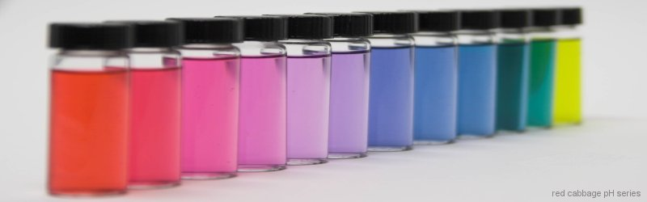
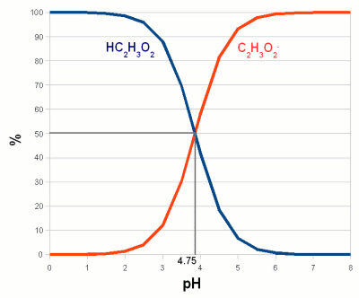
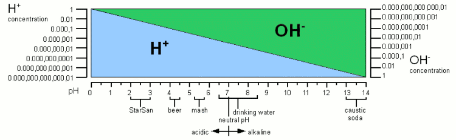
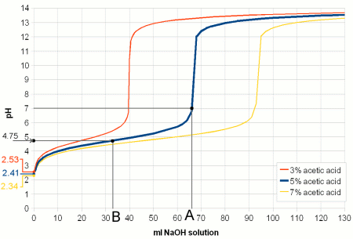
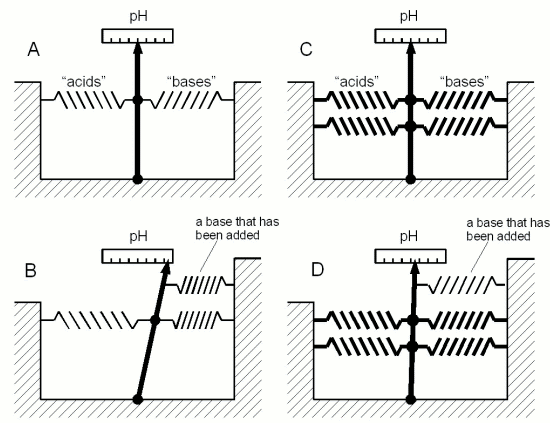
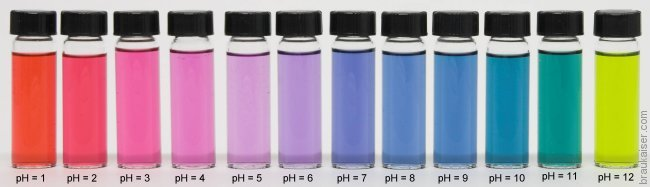
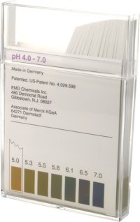
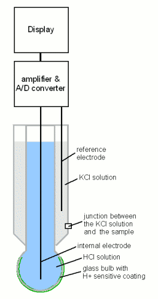

# An Overview of pH

*From German brewing and more*

This is the first article in a three article series intended to be an overview of pH, the importance of pH in brewing, how pH affects various brewing processes and how it can be measured and controlled. It tries to keep mathematical equations and equations for chemical reactions to a minimum in order to make the subject understandable for a wider audience.

---

## Contents

1. [What is pH?](#what-is-ph)
2. [Weak acids and bases](#weak-acids-and-bases)
3. [pH buffers](#ph-buffers)
4. [Isoelectric point (IEP)](#isoelectric-point-iep)
5. [Measuring pH](#measuring-ph)
   - [pH indicator solutions](#ph-indicator-solutions)
   - [Litmus paper and economy pH strips](#litmus-paper-and-economy-ph-strips)
   - [colorpHast strips](#colorphast-strips)
   - [pH meters](#ph-meters)
6. [References](#references)
7. [Acknowledgements](#acknowledgements)

---

## What is pH?

pH is a measure of the acidity of a solution. It is a measure of the concentration of hydrogen ions (H⁺; proton). The higher the concentration of hydrogen ions in a solution the more acidic it is and the lower their concentration the more alkaline it is. In pure water (H₂O) not all of the hydrogen (H) and oxygen (O) atoms are bound in water molecules. A small number of these molecules are broken up (disassociated) into protons (H⁺) and hydroxide (OH⁻) ions (see Figure 1). The H⁺ concentration of freshly distilled water, which is water that didn't have a chance to pick up any minerals or gases, corresponds to a pH of 7 which is the neutral pH. An acidic solution will have a pH below 7 and an alkaline solution will have a pH greater than 7. Once distilled water stands in air it will pick up CO₂ and the pH falls to about 6.5.

> Technically free protons (H⁺) don't exist in water. They react with water molecules to form a hydronium ion (H₃O⁺) but for the sake of simplicity in this article I will refer to them as protons, as all that matters is their concentration and their electrical charge.

The pH scale is not a linear measure of the proton concentration but a logarithmic one. In fact, the "p" in "pH" stands for the negative base 10 logarithm and "H" stands for the concentration of H⁺. This means that a change of 1 pH unit doesn't change the proton concentration by 1/7 of that of distilled water. Instead a solution with a pH of 6 has a 10 times higher proton concentration compared to distilled water. And a pH of 5 means it has a 100 (i.e. 10×10) times higher proton concentration. Likewise a solution with a pH of 8 has only 1/10 the proton concentration of distilled water. For each pH unit up the concentration is divided by 10 and for each pH unit down it is multiplied by 10.

*Figure 1 — The concentration of protons (H⁺) and hydroxide ions (OH⁻) over the 0–14 pH range. It also lists the pH of substances commonly encountered in brewing.*

An important law regarding the concentration of H⁺ and OH⁻ is that the product of their concentrations has to remain constant. This means if OH⁻ is added, through Sodium Hydroxide (NaOH) for example, the H⁺ concentration has to fall. This explains how the pH rises when OH⁻ is added even though pH is a measure of the H⁺ concentration and not the OH⁻. If the concentrations for H⁺ and OH⁻ are written as negative logarithms (pH for H⁺ and pOH for OH⁻) their relationship is simply:

**pH + pOH = 14**

---

## Weak acids and bases

When we later discuss the effects of pH we will come across one common theme: the disassociation of H⁺ and OH⁻ ions from larger molecules. A substance that donates H⁺ to or accepts OH⁻ ions from its environment is called an **acid** — it lowers the pH. A substance that accepts H⁺ or donates OH⁻ is called a **base** and it raises the pH. When acids and bases are brought together they neutralize each other by forming a salt and water.

When strong acids or bases are dissolved in water they readily dissolve and each molecule donates H⁺ or OH⁻. Depending on the concentration of the acid or base the result is a dramatic pH drop towards 0 or a pH rise towards 14. That's why they are used for titration (will be explained later): the number of added protons (H⁺) or hydroxide ions (OH⁻) depends only on the amount of strong acid or strong base that is added and not on the pH of the environment.

But most acids and bases we will deal with in brewing, especially when we talk about the effects of pH, are **weak acids**. A weak acid is an acid where only a portion of its molecules disassociate in water. The exact ratio depends on the pH of the solution, temperature and the type of acid. The same is true for weak bases.

When an acid dissociates it leaves behind a negatively charged remainder, called a **conjugate base**. It is called a base because once it has lost one or more protons it can accept them again, which is what bases do. Since the ratio between an acid and its conjugate base depends on pH, pH controls how many negatively charged conjugate bases are present. In case of weak bases the remainder (called a **conjugate acid**, because it can accept OH⁻ or donate H⁺) that is left after the dissociation of a hydroxide ion (OH⁻) or the acceptance of a proton is positively charged. pH controls their ratio as well.

*Figure 2 — The behavior of a weak acid at different pH. The relationship between the percentage of an acid (acetic acid/vinegar, HC₂H₃O₂) and its conjugate base (acetate, C₂H₃O₂⁻). The pH at which the concentration of acid and its conjugate base are equal is called pKa — an equilibrium constant between the acid and its conjugate base that depends on the type of acid and the temperature. For acetic acid at 20°C (68°F) it is 4.75.*

Later we will see how weak acids such as tannins and complex molecules built from many different weak acids and weak bases (proteins for example) are affected by the pH of their environment through the pH dependent disassociation of H⁺ and OH⁻.

---

## pH buffers

Another fundamental pH related chemistry phenomenon is pH buffers and their buffer capacity.

pH only tells us about the balance between protons (H⁺) and hydroxide ions (OH⁻) in a solution. It doesn't tell us how strongly it is held in place — i.e. it may take the addition of only little amounts of an acid or a base to change the pH or it may take a lot to change it. What is keeping the pH in place are weak acids, bases and their salts. They all act as **pH buffers**. pH buffers are solutions that can resist sudden or gradual pH changes, brought on by the addition of acids or bases.

We saw in the last section that the ratio between acid and conjugate base molecules depends on the pH and the type of acid or base itself. Let's look at a solution of acetic acid and acetate. At a pH of 4.75 half of the molecules are still acetic acid and the other half is its conjugate base acetate. When we now try to lower the pH by adding more H⁺ through the addition of a stronger acid, the ratio of acetic acid and acetate molecules shifts towards acetic acid. This means that some, if not the majority, of the H⁺ that is added will be consumed by creating more acetic acid molecules from the existing acetate molecules. This in turn reduces the number of protons available to lower the pH and as a result the pH doesn't fall as much as it would have if the acetic acid was not present. In other words, the vast majority of H⁺ added goes towards shifting the ratio of acetic acid and acetate and only very little is used to actually change the H⁺ concentration. The acetic acid and acetate mix **acted as a buffer**. The higher their concentration the more acid it takes to lower the pH and the stronger the buffering capacity of the solution is.

This also works in the other direction when a strong base is added. In this case the rise in pH requires that more acetic acid is converted into acetate, liberating protons which fight the pH rise.

*Figure 3 — Titration of vinegar. A strong base (sodium hydroxide, NaOH) is added to 100 ml of 3 different concentrations of acetic acid (vinegar). As the base is added it converts more and more of the acetic acid to acetate. At point B (in the case of the 5% acetic acid solution) 50% of the acetic acid has been converted to acetate and its pKa of 4.75 is reached. At point A all of the acetic acid has been converted and the pH shoots up — the buffering capacity has been consumed.*

*Figure 4 — A mechanical analogy to chemical buffers. The acids and bases in a solution are like the springs in this model. In both A and C the springs hold the needle in place at the same marks on the scale (same pH). But the strength with which the needle is held in place only becomes apparent when another spring is added — like adding more acid or base. In the weakly buffered model (B) the needle moves considerably, while in the strongly buffered model (D) it moves hardly at all.*

In mashing and in beer there is not a single acid or base that acts as a buffer, but rather a wide variety which have different pKa values. The combined effect of all these buffer systems determines the pH of the wort or beer. And when we talk about adjusting mash pH we will come back to the pH buffers that malt provides and how their amount determines how much acid it takes to move the mash pH into a favorable range for mashing.

Buffer solutions also provide a stable pH reference for the **calibration of pH meters**. These solutions have been mixed precisely from acids/bases and their salts to hold their pH steady even in the presence of small contamination with other acids or bases.

---

## Isoelectric point (IEP)

So far we have seen how pH controls the percentage of weak acids and weak bases that lose protons or accept them respectively. This creates a charged molecule. Many complex molecules (amino acids and proteins for example) contain a number of groups that can lose or accept protons depending on pH. The overall electrical charge of the molecule is the sum of all the charged groups.

If there are acidic and basic groups on the molecule — groups that can become negatively charged (acidic) and groups that can become positively charged (basic) — there will be a pH at which the sum of the electrical charges is zero and the molecule is electrically neutral. This pH is called the **isoelectric point (IEP or pI)** and it depends on the pH characteristics of the molecule's acidic and basic groups.

*Figure 5 — The isoelectric point of Glutamic acid. Glutamic acid has 3 groups that can lose or accept a proton and therefore change their electrical charge depending on pH. The relative concentration of the charged state of these groups is shown with the green, blue and red graphs. The yellow graph is the total charge of the amino acid. At pH 2.8, its isoelectric point, this charge is 0.*

At a pH below its IEP the net charge of a molecule is always positive because the higher concentration of H⁺ leads to more acceptance of H⁺ by the molecule's acidic and basic groups. The opposite is true at a pH above its IEP where the low H⁺ concentration causes the basic and acidic groups to donate H⁺ to the environment, leaving the net charge on the molecule negative.

We will see later how the IEP and the pH dependence of electrical charges of various substances are of importance in brewing.

---

## Measuring pH

Now that we have looked at the chemical effects that are important for understanding pH, let's have a look at how pH can be measured. For the home brewer 3 viable methods of testing pH exist: economy pH paper, colorpHast strips, and pH meters. In general the cheaper the means of pH testing the less accurate the result is.

### pH indicator solutions

pH indicators are substances that can exist in at least 2 different forms (more protons vs. fewer/no protons) which have different colors. Because the relative concentrations of these two or more forms change with pH, the color of the indicator also changes with pH. A number of different indicator substances have been discovered, each of which works best in its own pH range.

*Figure 6 — Red cabbage juice as pH indicator. While this is a neat science experiment, the pH sensitivity of red cabbage juice is too broad to be useful for pH measurements in brewing.*

A simple pH indicator can be made from red cabbage juice. The pH indicator in red cabbage juice (Anthocyanin) can actually lose more than one proton depending on the pH of the environment. The number of protons that a given molecule lost determines its color, resulting in a color change from red to blue and then to yellow. While this is great for illustrating pH indicators it has little practicality in brewing since the precision of pH readings is too low to be useful.

### Litmus paper and economy pH strips

When a pH indicator solution is applied to filter paper and dried, simple pH indicator strips can be made. These strips, sometimes called litmus paper, are the cheapest means of testing the pH of a solution.

To test the pH of a sample, a strip is dipped into the sample or a few drops of the sample are placed onto the test paper. After removing it from the sample the color reaction is compared to a color scale supplied with the strips.

Since the indicators themselves act as acids or bases they actually change the pH of the tested solution if it is not sufficiently buffered. Luckily most solutions that we test for pH in brewing are strongly buffered and we don't have to worry about this effect. The only one that is not strongly buffered is very soft or distilled water — here you can easily get false readings, but the pH of the brewing water is of little importance anyway when buffered only weakly.

### colorpHast strips

EMD chemicals make a range of pH test strips that are a significant improvement over litmus paper or other economy pH test strips. The product is called **colorpHast** and has these advantages:

- The indicator will not run and leach out of the test strip
- The testing range is narrow enough to read the strips with ±0.2 pH unit precision
- The strips are easily matched against the color scale
- They are designed to be used in samples that contain proteins and don't exhibit a protein error

*Figure 7 — colorpHast precision pH test strips. The type most suitable for brewing is the strips with a pH range of 4.0–7.0.*

Another important advantage is that they don't require calibration like a pH meter does. But their precision is limited to ~±0.2 pH unit which is sufficient for testing the mash pH.

> **Note:** In comparative tests between the colorpHast strips and a pH meter a constant error of about 0.3 pH units was noticed when they are used in the 5.0–6.0 pH range; i.e. the strips read about 0.3 pH units lower than the pH determined with a pH meter.

### pH meters

A completely different approach for taking pH readings is the use of an electronic pH meter. The heart of these meters is a glass electrode which converts the H⁺ concentration into a voltage that can be measured with a voltmeter. Since this voltage is proportional to the logarithm of the H⁺ concentration it is also proportional to the pH — the pH of the sample is a linear function of the voltage measured at the probe.

Every linear function is determined by 2 parameters: offset and slope. The slope can be calculated and is about 60 mV per pH unit but can change as the probe ages.

**Calibration:** A single point calibration uses a single solution of known pH (called a calibration buffer — common values are 4.00, 7.00, and 10.00). Since such a single point calibration can only determine the current offset of the probe, a better calibration procedure uses 2 buffers. Most brewing related samples have a pH below 7 and calibrating the pH meter with 4.00 and 7.00 pH buffers is recommended.

**Temperature considerations:** The temperature of the sample affects its H⁺ concentration and therefore its pH. For wort it has been reported that the pH at mash temperatures (65°C/150°F) is about 0.35 pH units lower than at room temperature, and at mash out temperatures (75°C/170°F) it is even 0.45 pH units lower. Any pH readings should be taken at a **standard temperature** and noted accordingly; 25°C/77°F or 20°C/68°F are common. Always measure cooled samples — testing hot liquids reduces the lifetime of the probe.

*Figure 8 — Schematic drawing of a pH meter. A pH meter consists of 3 parts: a pH probe that converts the pH of the solution into an electrical potential, an amplifier and analog-digital converter, and a display. The heart of the pH meter is the glass bulb at the tip of the probe, coated on both sides with an ion selective hydrated gel which acts like a weak acid — the pH of the surrounding medium determines how many of its molecules lost their protons.*

**Care tips for pH meters:**

- Always store the probe in pH meter storage solution recommended by the manufacturer — never in water, even distilled water
- Never let the probe dry out
- Thoroughly rinse the probe with distilled or deionized water between samples, calibration buffers, and before returning to storage solution
- Measure cooled samples only
- Move the probe around in the sample to avoid localized pH changes
- Don't scratch or rub the glass bulb — it is coated with a sensitive layer that is integral to its function

---

## References

- [Hydronium — Wikipedia](http://en.wikipedia.org/wiki/Hydronium)
- Pamela C. Champe, Richard A. Harvey, Denise R. Ferrier, *Lippincott's Illustrated Reviews: Biochemistry*, 2007
- [pH indicator — Wikipedia](http://en.wikipedia.org/wiki/PH_indicator)
- colorpHast data sheet, EMD Chemicals
- [Glass electrode — ktf-split.hr](http://www.ktf-split.hr/glossary/en_o.php?def=glass%20electrode)
- [pH meter — Wikipedia](http://en.wikipedia.org/wiki/PH_meter)
- Dennis E. Briggs, Chris A. Boulton, Peter A. Brookes, Roger Stevens, *Brewing Science and Practice*, Woodhead Publishing, 2004

---

## Acknowledgements

Thanks to the members of the Northern Brewer and HomeBrewTalk.com forums for reviewing and proof reading the article. Special thanks to analytical chemistry professor J. Schneider who took time to review the article and give it his professional blessing.

---

*Source: [Braukaiser.com](http://braukaiser.com/wiki/index.php?title=An_Overview_of_pH) — Last modified 15 March 2011. Content available under Attribution-NonCommercial 3.0 Unported.*

*Next: How pH affects brewing*
