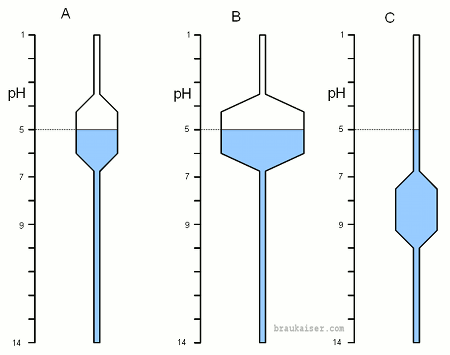
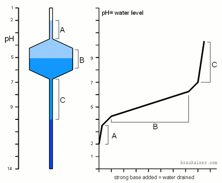
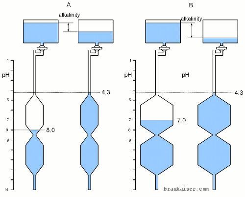
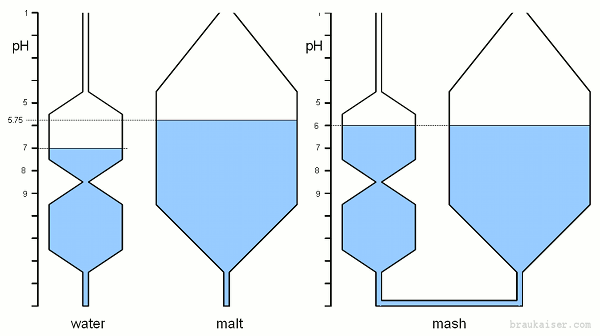
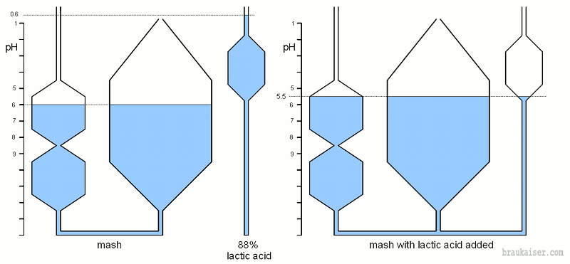

# A Simple Model for pH Buffers

*From German brewing and more*

The understanding of pH buffers is critical for making sense of pH changes in mash, wort and beer. To most brewers the fundamentals that are associated with pH are not as intuitive as they are for, say, temperature. Temperature is something we can feel and we have learned over time how it is affected and how changes can be predicted and controlled. This is not the case with pH, which we can neither feel nor see and for which we have developed little intuition. This article tries to illustrate the concept of pH buffers and how they interact with acids and bases through a simple visual model.

---

## Contents

1. [pH and Buffers](#ph-and-buffers)
2. [Visualizing pH and pH Buffers](#visualizing-ph-and-ph-buffers)
3. [Application of the Model](#application-of-the-model)
   - 3.1 [Titration](#titration)
   - 3.2 [Measuring Alkalinity](#measuring-alkalinity)
   - 3.3 [Mash pH and Adjustments](#mash-ph-and-adjustments)

---

## pH and Buffers

The chemical fundamentals of pH were discussed in *An Overview of pH*. There we saw that pH refers to the concentration of free hydrogen ions (H⁺) and that **pH buffers** are created by weak acids and bases which are able to donate or absorb hydrogen ions depending on the current concentration of these ions in the environment — i.e. the current pH.

---

## Visualizing pH and pH Buffers

The ability of a pH buffer to supply hydrogen ions when needed, or absorb them when there are too many, is best visualized as the water level in vertical tubes with differently shaped bulges that create reservoirs of varying capacity. The water level represents the pH and the size and location of each reservoir represents the **buffer capacity**, which is a property of the solution and depends on the weak acids and bases present.

When water is added the water level — as observed in a sight glass — rises. The amount by which it rises depends on two things: the amount of water added and the diameter of the vertical tube at the current water level. The wider the tube the more water it takes to achieve the same water level change. This is very similar to pH in buffered systems. The water level is the H⁺ concentration (expressed as pH), the diameter of the vertical tube is the buffer capacity, and adding water is analogous to adding hydrogen ions (i.e. adding acid).

**Figure 1-A** shows a system with a weak pH buffer buffered around a pH of 5. Once the water level is within the reservoir it takes a moderate amount of water to change the water level. When the level is above or below the reservoir it takes much less water to cause the same change. The same is true with pH buffers — once the buffer is "broken" its ability to consume or donate hydrogen ions is exhausted and all added hydrogen ions go directly towards changing the pH, resulting in a dramatic fall (strong acid) or rise (strong base).

> Note: in these models a falling pH means a **rising** water level.

**Figure 1-B** shows a system buffered at the same pH as A but with a stronger buffer. The solution may contain a higher concentration of the buffering substance, or simply more of it. At or around the buffered pH it takes more water (i.e. acid) to move the pH by the same amount as in example A.

**Figure 1-C** has the same buffer strength as A but at a higher pH. At the current pH it is not buffered at all and it takes very little water to change the pH.

*Figure 1 — Models for three different pH buffer systems. See text for explanation.*

---

## Application of the Model

### Titration

**Titration** is a process in which known amounts of a strong acid and/or base are added to a sample and the resulting pH change is recorded. That pH is then plotted over the amount of acid equivalents added (strong acid) or neutralized (strong base). This reveals where and how strong the sample buffers its pH. In our model, adding acids or bases is equivalent to adding or draining known amounts of water, respectively.

In section A only little amounts of water need to be drained for the pH to rise and the H⁺ level to fall. Once the level is in section B, the pH change for the same amount of water drained is much smaller and the curve flattens out until the buffer capacity of the substance is exhausted. At that point the pH once again changes easily when only small amounts of strong base are added.

> Actual titration curves will have smooth and gradual transitions, as opposed to the corners shown in this simplified model.

*Figure 2 — Titration on the simple pH buffer model.*

---

### Measuring Alkalinity

**Alkalinity** is the pH buffer capacity of water and it is measured by adding a strong acid until the sample's pH reaches 4.3. At that point virtually all carbonate and bicarbonate has been converted to carbonic acid and CO₂, and the amount of acid added is a measure of the water's bicarbonate and carbonate content — the substances that buffer pH when present.

In our model this means adding water until the water level represents a pH of 4.3. The amount of water added represents the "alkalinity." From Figure 3 it is clear that the pH of the water alone does not indicate how well it is buffered. System A has a current pH of 8.0 but is comparatively weakly buffered. System B has a lower pH (7.0) but is more strongly buffered — it will take more water (acid) to lower its pH to 4.3.

*Figure 3 — An illustration of water alkalinity testing using the model for pH buffers. See text for explanation.*

---

### Mash pH and Adjustments

In the mash, **malt is the dominant pH buffer** — not only because it represents the largest amount of pH-active substances, but also because the water's carbonate buffer has almost completely been exhausted at commonly found mash pH values. The pH buffers in malt are mainly phosphates, proteins, and amino acids.

Combining pH-active substances like malt, water salts, and additional acid is equivalent to connecting tubes of various shapes that represent the pH characteristics of those substances. Figure 4 brings together a grist that has a natural pH of 5.75 (Pilsner malt, for example) with high-alkalinity water. High alkalinity means the water can absorb many free hydrogen ions from the malt. The result is a mash pH that lies between the pH of the water and that of the grist. Since the malt is the more strongly buffered substance, the resulting mash pH (6.0) is closer to the malt pH (5.75) than to the water pH (7.0).

*Figure 4 — The combination of two buffered substances (water and malt) to form the mash. Adding lactic acid introduces a third tube whose reservoir sits higher (lower pH ~3.86), pulling the combined system — mash — to a more favorable pH.*

To lower this rather high mash pH, lactic acid can be added. This equates to connecting yet another tube to the system. The tube for lactic acid has a reservoir that sits higher (higher H⁺ concentration, lower pH) than that of the malt, because its buffer capacity is most efficient around pH 3.86. Once connected, the hydrogen ions from the lactic acid will drop the pH of the complete system — water, grist, and lactic acid — to a more favorable mashing pH.

---

*Retrieved from braukaiser.com — last modified 31 January 2011. Content available under Attribution-NonCommercial 3.0 Unported.*
