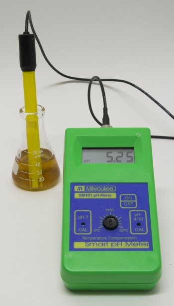

# pH Meter Buying Guide

*From German brewing and more*

When looking for pH meters you'll find a lot of different models with a variety of features and prices ranging from $50 to $500. Once you've justified the expense, you'll ask yourself: what meter should I get as a brewer?

---

## Contents

1. [How pH Meters Work](#how-ph-meters-work)
2. [Meter Types](#meter-types)
3. [Key Specs and Features](#key-specs-and-features)
   - 3.1 [Precision](#precision)
   - 3.2 [Calibration](#calibration)
   - 3.3 [Temperature Correction](#temperature-correction)
   - 3.4 [pH Probe Connection](#ph-probe-connection)
   - 3.5 [mV Read-out](#mv-read-out)
   - 3.6 [Price](#price)
4. [Recommendation](#recommendation)

---

## How pH Meters Work

pH meters are glorified voltmeters that measure the electrical potential produced by a special **pH probe**. What determines their quality and precision is the quality of the probe and the quality of the amplifier and analog-digital converter.

The probe wears over time and you should expect to replace it every 2–3 years with good care. The probe's response to pH is linear — there is a linear function between the voltage it produces and the pH of the solution it is in. This linear function has an **offset** and a **slope**, which are the parameters set when you calibrate it. When the probe ages the slope deteriorates and gets flatter, meaning you'll get less voltage difference for the same pH difference.

---

## Meter Types

pH meters generally come in three forms:

- **Pen-style** — compact, least precise
- **Portable hand-held** — good balance of portability and precision
- **Bench top** — generally the most precise, least mobile, and most expensive

---

## Key Specs and Features

### Precision

For brewing purposes you want at least **±0.01–0.02 pH units**. This is plenty for testing mash pH and good enough for detecting pH rises in beer that can be a sign of autolysis. Some meters provide only ±0.1 which is generally too little — you may quickly find you would like more resolution. However, if the meter is cheap enough and you are only interested in mash pH, ±0.1 may be acceptable.

### Calibration

Two concepts exist: **manual** and **automatic**.

- **Manual calibration** requires you to adjust two knobs (one for offset at pH 7.00 and one for slope at pH 4.00 or 10.00) after placing the probe in the appropriate calibration buffer.
- **Automatic calibration (ATC)** does this for you — it tells you which buffer to use and/or recognizes buffers on its own.

> A word of caution: automatic calibration can fail to recognize buffers as the meter ages. Manual calibration is more hands-on and the meter cannot refuse to calibrate.

### Temperature Correction

pH probes are affected by the temperature of the sample, so temperature needs to be known to determine pH accurately. pH meters come with **no**, **manual**, or **automatic temperature correction (ATC)**.

> **Important note for brewers:** Many brewers think ATC means you can test mash pH at any temperature within the meter's range. While this is technically true, you still need to know the temperature-dependent pH shift in order to correct the reading to the standard temperature at which optimal pH targets were published. Briggs and DeClerck cite a pH shift of −0.35 between room temperature and mash temperature samples; other experiments have shown only −0.18. Just because a meter has ATC does not make it more accurate if the sample's temperature-to-pH function is unknown.

The simplest approach is to **always measure pH at 25°C** — cool mash/wort samples before measuring. This eliminates the need for temperature compensation on the meter itself and ensures readings can be compared against published targets.

- Meters with **manual temp correction** have a dial or similar input for entering the sample temperature.
- Meters with **ATC** include a temperature probe (either integrated with the pH probe or separate). A separate temperature probe is useful for checking sample temp before submerging the pH probe in a hot sample.

### pH Probe Connection

The standard connector for pH probes is the **BNC connector**. Meters with BNC connections allow you to shop around for replacement probes rather than being locked into a specific proprietary design. BNC connectors are generally found on bench-top or portable meters, not pen-style ones.

### mV Read-out

Since the slope of a pH probe can be used to assess its age, a mV read-out is a useful diagnostic feature — but it is generally not found on entry-level meters in the price range attractive to homebrewers.

### Price

A decent pH meter suitable for brewing can be found between **$50 and $100**. You can pay more, but the added benefit may not justify the cost. That extra money might be better spent on another useful piece of testing equipment: a dissolved oxygen meter.

---

## Recommendation

*The Milwaukee SM101 is a reliable pH meter well suited for brewing, costing less than $100.*

The **Milwaukee SM101** offers:
- Accuracy of ±0.01 pH
- Manual calibration
- BNC probe connector
- Manual temperature correction

It can be found for approximately $80. After initial calibration only very slight drift is noticed over time, meaning you can trust the reading without constant recalibration. Calibrating occasionally when using it extensively is sufficient.

---

*Retrieved from braukaiser.com — last modified 23 September 2009. Content available under Attribution-NonCommercial 3.0 Unported.*
