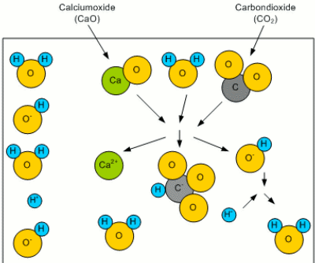
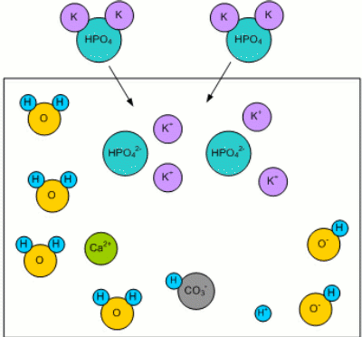
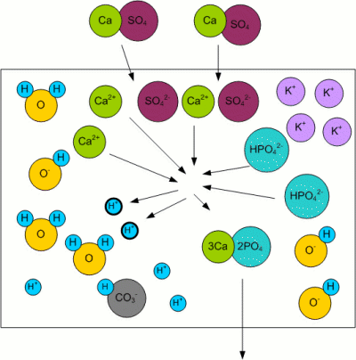

# Residual Alkalinity Illustrated

*From German brewing and more — Kai Troester, braukaiser.com*

A visual explanation of the concept of **residual alkalinity** and how water chemistry interacts with malt phosphates to determine mash pH.

> This article was part of the original "Understanding Mash pH" series. The concept of residual alkalinity it introduces is the foundation for mash pH prediction and water adjustment in brewing.

---

## Contents

- [Alkalinity](#alkalinity)
- [Adding Malt](#adding-malt)
- [Residual Alkalinity](#residual-alkalinity)

---

## Alkalinity

When rainwater falls from the atmosphere, it picks up CO₂ to form **carbonic acid**. Even more CO₂ is absorbed as the water trickles through the soil. This carbonic acid reacts with minerals like calcium to produce bicarbonate ions:

```
CaO + H₂O + CO₂ → Ca²⁺ + HCO₃⁻ + OH⁻
```

The result is a **bicarbonate** (HCO₃⁻) and a **hydroxide** (OH⁻) ion. Both can bind a proton (H⁺), reducing the number of free protons. This results in an increased pH (less acidic) and an increased **buffering capacity** — the ability of the solution to resist pH changes even when additional protons are added (e.g. through an acid addition). The bicarbonate ion reacts with added protons:

```
HCO₃⁻ + H⁺ → H₂O + CO₂
```

This buffering capacity is called the **alkalinity** of the water and can be expressed as either ppm HCO₃ or ppm CaCO₃. The latter is an equivalent concentration of dissolved chalk (CaCO₃) that provides the same alkalinity.



---

## Adding Malt

When malt is added to the mash water, the malt's phosphates — mainly potassium phosphate K₂HPO₄ — dissolve:

```
K₂HPO₄ → 2K⁺ + HPO₄²⁻
```



---

## Residual Alkalinity

Kolbach, a German brewing scientist, found that the malt's phosphates react with the calcium and magnesium ions from the mash water:

```
3Ca²⁺ + 2HPO₄²⁻ ↔ 2H⁺ + Ca₃(PO₄)₂
```

This reaction releases 2 protons (H⁺) and calcium phosphate (Ca₃(PO₄)₂), which is nearly insoluble in wort and precipitates. The key outcome is the **release of protons**, which react with the bicarbonate ions responsible for the water's alkalinity:

```
H⁺ + HCO₃⁻ → H₂O + CO₂
```

The result is a lowered alkalinity (buffering capacity) of the water. If no more bicarbonate ions remain, the pH falls due to accumulating free protons.



Kolbach's work showed that **not all** calcium and magnesium ions participate in this reaction:

- Only **2 out of 7** calcium ions react with malt phosphates to release protons
- Only **1 out of 7** magnesium ions do so

This led to the definition of **residual alkalinity (RA)** — the alkalinity remaining after the acidifying reactions between malt phosphates and the water's calcium and magnesium have been accounted for. Expressed in dH (German Hardness):

```
RA = KH − (CH + 0.5 × MH) / 3.5
```

Where:
- **RA** = residual alkalinity (dH)
- **KH** = carbonate hardness / alkalinity
- **CH** = calcium hardness
- **MH** = magnesium hardness

> To convert this formula for use with ppm units, the molar weights of the carbonate, calcium and magnesium ions must be taken into account. A water calculator spreadsheet handles these conversions automatically.

---

*Source: [braukaiser.com](http://braukaiser.com/wiki/index.php?title=Residual_Alkalinity_illustrated) — last modified 26 February 2011. Content available under Attribution-NonCommercial 3.0 Unported.*
