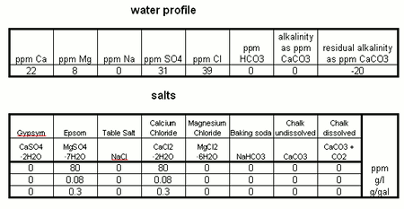
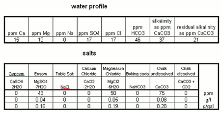
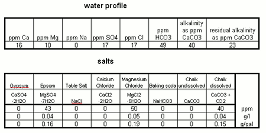
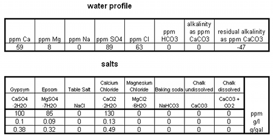
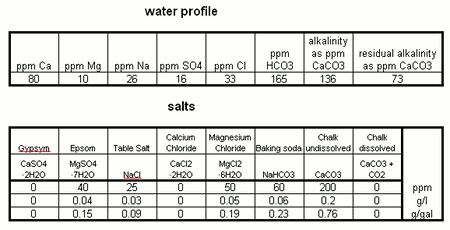
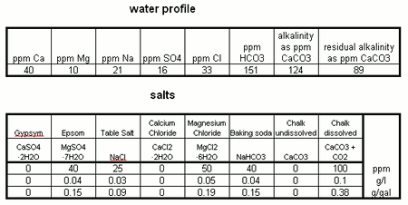
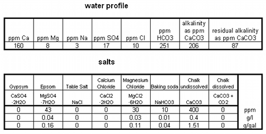
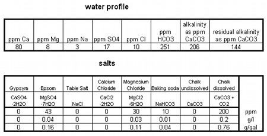

# Various Water Recipes

*From German brewing and more*

These water recipes are guidelines that brewers who build their own water can follow. None of these recipes have been optimized for a given style, but the **residual alkalinity** is chosen such that it should yield a satisfactory mash pH when used for the listed styles. Since the acidity of the grist can vary significantly even for a given style, additional adjustments might be necessary. All water recipes include a copy of a water calculation spreadsheet which can be used to make such adjustments. In that spreadsheet you may also enter a starting water profile if that is known.

Some of the recipes use magnesium chloride (MgCl₂). This salt can be sourced from aquarium supply shops. If you don't have access to MgCl₂, simply omit it or substitute with a little more Epsom salt.

Some recipes give options for the use of dissolved chalk. See the article on building brewing water with dissolved chalk if you want to go that route.

---

## Contents

1. [Very Soft Water](#very-soft-water)
2. [Brewing School Weihenstephan Water](#brewing-school-weihenstephan-water)
3. [Pilsner Water](#pilsner-water)
4. [Moderately Alkaline Water](#moderately-alkaline-water)
5. [Munich Water](#munich-water)

---

## Very Soft Water

This is a very soft water option for a Munich Helles or a Pilsner. Paulaner, for example, uses a deep well from which they get very soft (~2 °dH / 30 ppm CaCO₃ hardness) brewing water. It is very likely they do not add additional minerals when brewing their lighter beers.

This recipe works well with a 97% Pilsner malt and 3% acidulated malt (Sauermalz) grist, yielding a mash pH of about 5.3–5.4.

> Note: Despite the low calcium level, clarity issues have not been reported in practice with this profile.

**Works well for:**
- Munich Helles
- Weissbier Hell (light Bavarian wheat)
- Pilsner
- Kölsch-style ales

---

## Brewing School Weihenstephan Water

The water analysis data for this profile comes from Markus Hermann's dissertation on brewing Weissbier at the [Weihenstephan brewing school](http://deposit.d-nb.de/cgi-bin/dokserv?idn=978186087&dok_var=d1&dok_ext=pdf&filename=978186087.pdf) in Freising, Germany. While it makes a great water for Weissbier — the subject of that dissertation — it is not necessarily the water that the Weihenstephan brewery itself uses commercially.

**With undissolved chalk:**

**With chalk dissolved with CO₂:**

**Works well for:**
- Munich Helles (with 2–3% acid malt in the grist)
- Weissbier (light and amber varieties)

---

## Pilsner Water

This profile has been used successfully for both German and American Pilsner. It has no alkalinity and a calcium level of ~60 ppm. Combined with Pilsner malt and 2% acid malt in the grist, it should yield a mash pH of around 5.4.

**Works well for:**
- German Pilsner
- Classic American Pilsner
- Weissbier (lightly colored types)

---

## Moderately Alkaline Water

This profile is suited for dark German beers, in particular **Schwarzbier**. Both an undissolved and dissolved chalk option are provided.

**With undissolved chalk:**

**With chalk dissolved with CO₂:**

**Works well for:**
- Schwarzbier
- Doppelbock
- Weissbier (very dark varieties)

---

## Munich Water

This profile was built from the official water report of the Munich water department. It captures the essence of **Munich water**: high temporary hardness and low permanent hardness — meaning there are far more bicarbonate ions than chloride or sulfate. This makes it ideal for dark Bavarian beers.

> While this profile mimics the Munich city water, it is not confirmed how many Munich breweries use unmodified city water. Given that it works well for dark beers, a Munich brewer without a private water supply would likely use it as-is for these styles.

This recipe uses magnesium chloride (MgCl₂). If you don't have it, simply leave it out.

**With undissolved chalk:**

**With chalk dissolved with CO₂:**

**Works well for:**
- Traditional Bock
- Doppelbock
- Weissbier Dark
- Schwarzbier

---

*Source: [Braukaiser Wiki — Various water recipes](http://braukaiser.com/wiki/index.php?title=Various_water_recipes). Last modified 5 March 2011. Licensed under Attribution-NonCommercial 3.0 Unported.*
